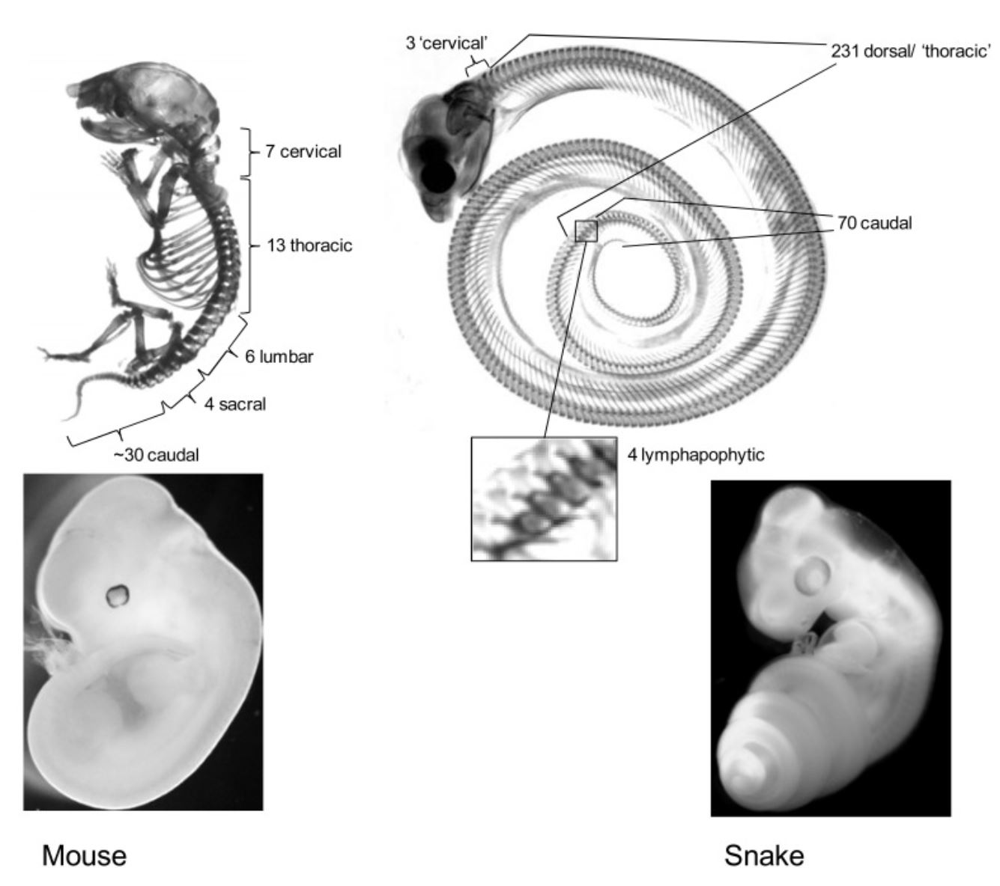
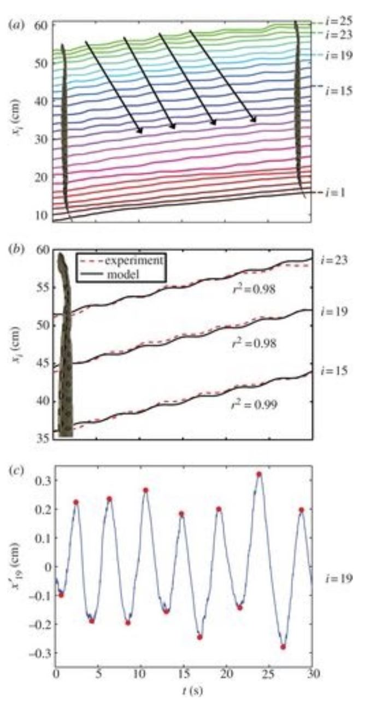
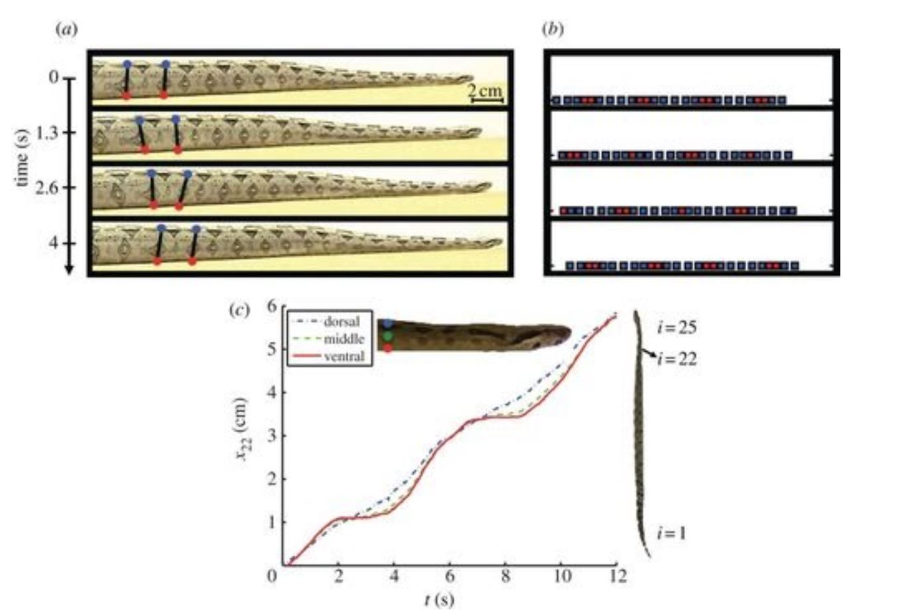
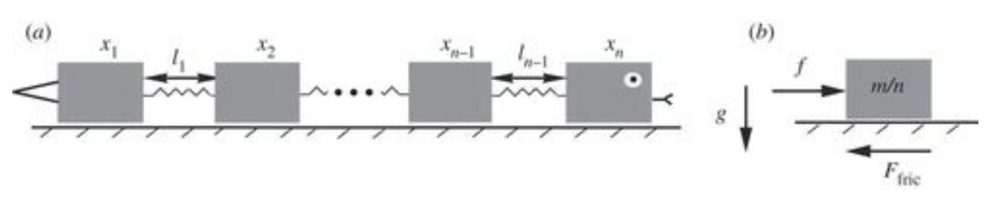
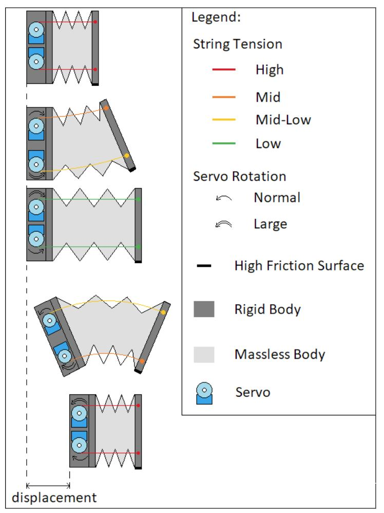

# EGR 557 Foldable Robotics

## Biomechanics Background and Initial Specifications

### Team 2: Kevin Julius, Romney Kellogg, Sanchit Singhal, Siddhaarthan Akila Dhakshinamoorthy

### Snake-like bio-inspired degradable Robot

### Procedure:

Candidate Organism: Snake
● Animal species: Red Tailed Boa Constrictor
● Body Plan: serpentiform
● Motion of Interest: Rectilinear locomotion - the ability to move through
tough terrain
● Locomotion: Rectilinear locomotion

The team has decided to use a juvenile Red Tailed Boa Constrictor as our candidate
organism on which we will focus on it’s biomechanics. The primary reason that this
animal was chosen is that boass use rectilinear locomotion, this allows them to traverse
over rough terrain. This particular motion seems to be most suitable for the team’s
project based off the following research:

**Animal and Motion of Interest:**

1. Snakes Mimic Earthworms: propulsion using rectilinear travelling waves [1]
1.1. Summary: This reference provides the team with a clear understanding of
how snakes use rectilinear locomotion. This reference compares the kinematic of
snake movements using wave frequency, amplitude, and speed. This reference
uses three different types of snakes in order to study rectilinear and provides
models, images, and graphically information about this movement. The team can
greatly benefit from this information to help create a robot with similar locomotion,
in addition to creating kinematic models of said robot.

2. Kinematics of Terrestrial Snake Locomotion [2]
2.1. Summary: This reference provides a good overview of some of the different
types of movement snakes use for locomotion, and which snakes use each type
of movement. These methods include lateral undulatory, concertina, and
sidewinder movement. Lateral undulatory movement is the type of movement
usually associated with snakes and involves snakes moving laterally pressing
against the ground to propel themselves forward. Concertina movement is
generally used when tunneling and involves snakes scrunching up against walls
of a tunnel to push itself forward. Sidewinding movement involves a snake
pressing up against the ground, losing contact with part of its body and moving
itself in a lateral direction instead of forward in the other movements methods.
This paper also provided insight on how different snakes use a combination of
these movements due to their adaptations to their environment and the mediums
within which they locomote. The understanding of snake locomotion that this
article provides will be very helpful to the team in designing a robot that could
possibly mimic one of these types of locomotion. While the team is selecting to
focus on rectilinear locomotion, other movements may need to be incorporated in
order to achieve the desired robot. Because of this, a good understanding of the
other types of snake is essential.

3. Rectilinear Locomotion in a Snake (Boa Occidentalis) [10]
3.1. Summary: This reference goes into further depth on the specifics of
rectilinear locomotion that will be mimicked while constructing our robot.
Rectilinear locomotion involves a snake pulling its body forward by contracting its
muscles and creating higher friction points of contact using its scales, while
relaxing muscles between to allow the snake to glide forward. Earthworms have
a similar method of locomotion, but unlike earthworms the boa in this reference
move at a constant rate even though their body moves with these step-like
movements. What is interesting about this type of locomotion compared to other
locomotion techniques is that it doesn’t involve lever actions of any skeletal
structures, making it a relatively unique form of locomotion in vertebrates. This
paper provides in depth description of rectilinear motion that the team decided
upon using for the designed robot.

4. From Lizard to Snake; Behind the Evolution of an Extreme Body Plan [4]

5. What Defines Different Modes of Snake Locomotion[7]

### Existing Bio-inspired Robots:

1. Study on rectilinear locomotion based on a snake robot with passive anchor [6]
1.1. Summary: This reference presents a n-segment kinematic model of the
snake robot based on an ideal anchor assumption followed by the relationships
between the motion performance and the gait patterns. A novel snake-like robot
prototype is used to verify theoretical analysis of kinematic models and predicted
average velocity. The robotic prototype contains unique one-direction wheels,
which generate sufficient backward friction force serving as anchoring force. This
work is very helpful for biological robot research, especially in lag-less crawlers.
This paper can provide in-depth knowledge about kinematics of snake motion.

2. Snake-like locomotion: Experimentations with a biologically inspired wheel-less
snake robot [8]
2.1. Summary: This paper describes an experimental study on the wheel-less
snake-like locomotion through lateral undulation and inchworm-like motion and
presents some qualitative analysis. The wheel-less snake-like mechanism has a
planar structure and is mainly dedicated to move through lateral undulation, the
most common limbless locomotion type observed in natural snakes. The
mechanical design, trajectory generation and control method used in this paper
are all biologically inspired. Here the closed-loop control succeeded in applying
the natural principles of lateral undulation in an autonomous manner excepting
for the power supply.

3. Conceptual design of a modular snake origami robot [3]
3.1. Summary: This reference shows the conceptual design of a modular
snake robot using modules built from a folded paper structure. In this paper, the
interconnection and folding procedure is explained keeping in mind proper
scaling and size. The main objective of this work is to seize the emerging
technology of programmable sheets, to produce a real soft robot application.

4. OrigamiBot-I: A thread-actuated origami robot for manipulation and locomotion
[5]

5. An Origami-Inspired Approach to Worm Robots [9]

### Table of Specifications:

Parameter|Unit|Value Range|Source
-|-|-|-
Total Mass|kg|.6±.1|[1]
Length|m|.3-.9|[1]
Average Speed|ft/s|0.33-0.197|[1]
/# of joints |/#|8|[4]
Forward sliding friction coefficient|unitless|.3±.06|[1]
Backward Sliding friction coefficient|unitless|.42±.05|[1]
Cost of Working (partial energy cost of movement)|J/(kg*m)|.5-1|[1]
Ground Friction Reaction Force|N|2.4±.05|[1]

### Assumptions from Biomechanics Investigation:

Peak Acceleration: Peak acceleration can be assumed using the ground reaction
forces and the mass of the snake to be F/m = 2.4N/.6kg~= 4m/s^2
External Forces involved:
Gravity
Friction
Thrust energy:
● Minimum Energy to move 1 m = Cost of Working * Mass * Distance =
.5J/(kg*m)*.6kg*1m = .3J
● Maximum Energy to move 1 m = Cost of Working * Mass * Distance =
1J/(kg*m)*.6kg*1m = .6J

### Figures from Literature:

Figure 1. Skeleton of a snake compared to the skeleton of a mouse [4]

Figure 2. Body kinematics of a snake [1]

Figure 3. Model of unidirectional contraction and extension of a snake, showing patterns of muscle strain at varying heights [1]

Figure 4. Mathematical model of rectilinear locomotion [1]

### Simple Engineering Representation of Proposed Mechanical System:

Figure 5. Simple engineering mechanical representation of proposed system

### Discussion:
**Rationale for Animal Selection:**

Snakes were chosen, specifically boas, as the animal of choice due to their
unique movement abilities with rectilinear locomotion. This type of motion poses an
interesting challenge to be adapted to foldable robotics, but if implemented correctly
could allow for a reliable and biological method of traversing rocky terrain. We chose
a juvenile red tail boa to model for multiple reasons. The size of the snake we
selected being 1-3 ft allows us to create a robot similar in size that can move using
rectilinear locomotion. It is feasible for the team to create a light robot this size that
can use affordable actuators and biodegradable foldable materials. Rectilinear
motion was chosen because it seemed like the most tractable snake locomotion
technique to transfer to a foldable robotics platform.

**Motor and Battery Selection:**

Almost all the mass of the robot would be concentrated on the rear end, where
the actuators and battery are placed, as shown in Fig. 5, the suggested engineering
representation above. The model would be such that this mass is moved across
during the tightening/tension of the strings (in red), hence the motor actively moves
the mass with power output. The massless structure would presumably be made out
of paper or cardboard, to form a Twisted Tower Origami structure [9]. Hence, when
the strings are loosened (in green), the massless structure would expand.

For simplicity, it is assumed that load on both servos are equal. Hence each servo
should be capable of moving more than half of the total mass of the system.

Duracell 9v Battery : 45 g
MG90S Micro servo : 12 g each

Total Mass of system = Battery + (2 x Servo) + Arduino + Electronics Buffer
= 45g + 24g + 25g + 30g (assumption)
= 125 g approx.

Each servo should be able to move at least 65 g. Let’s put a buffer to accommodate
any extra load due to assumptions for simplicity. So each servo should be capable of
moving 150g.

Battery capacity : ~310 mAh or 2.3 Wh @ 0.05 A load
Servo specifications : 360 degrees - Stall torque of 1.8 kgf·cm @ 4.8 V

From the specifications, we can see each servo would be capable of moving 1 kg @
1cm away at speeds which are ok with our application. A Duracell 9v battery is
chosen so the robot would be capable of operating for a very long duration.

### Bibliography:

1\. H. Marvi, J. Bridges, and D. L. Hu, “Snakes Mimic Earthworms: propulsion using
rectilinear travelling waves,” The Royal Society, vol. 10, no. 84, Jul. 2013.

2\. B. C. Jayne, “Kinematics of Terrestrial Snake Locomotion,” JSTOR, vol. 1986,
no. 4, pp. 915–927, Dec. 1986.

3\. L. Paez, M. Granados and K. Melo, "Conceptual design of a modular snake
origami robot," 2013 IEEE International Symposium on Safety, Security, and
Rescue Robotics (SSRR), Linkoping, pp. 1-2, 2013.

4\. J. M. Woltering, “From Lizard to Snake; Behind the Evolution of an Extreme Body
Plan,” Current Genomics, vol. 13, no. 4, pp. 289–299, Jul. 2012.

5\. E. Vander Hoff, Donghwa Jeong and Kiju Lee, "OrigamiBot-I: A thread-actuated
origami robot for manipulation and locomotion," 2014 IEEE/RSJ International
Conference on Intelligent Robots and Systems, Chicago, IL, pp. 1421-1426,
2014.

6\. W. Tang, F. Reyes and S. Ma, "Study on rectilinear locomotion based on a snake
robot with passive anchor," 2015 IEEE/RSJ International Conference on
Intelligent Robots and Systems (IROS), Hamburg, pp. 950-955, 2015.

7\. Bruce C Jayne, What Defines Different Modes of Snake Locomotion?, Integrative
and Comparative Biology, Volume 60, Issue 1, July 2020, Pages 156–170,

8\. Z.Y. Bayraktaroglu, Snake-like locomotion: Experimentations with a biologically
inspired wheel-less snake robot, Mechanism and Machine Theory, Volume 44,
Issue 3, 2009, Pages 591-602

9\. C. D. Onal, R. J. Wood and D. Rus, "An Origami-Inspired Approach to Worm
Robots," in IEEE/ASME Transactions on Mechatronics, vol. 18, no. 2, pp.
430-438, April 2013, doi: 10.1109/TMECH.2012.2210239.

10\. H. W. LISSMANN, Rectilinear Locomotion in a Snake (Boa Occidentalis) Journal
of Experimental Biology. 1950, 26, Pages 368-379

11\. “Celebrating Wildlife and Wild Places,” Welcome to the Racine Zoo. [Online].
Available: https://www.racinezoo.org/western-hognose-fact-sheet. [Accessed:
08-Feb-2021].
