# Data Collection and Experimental Validation
## Team 2
## Kevin Julius, Romney Kellogg, Sanchit Singhal, Siddhaarthan Akila Dhakshinamoorthy

## 1. Simulation Optimization Results:
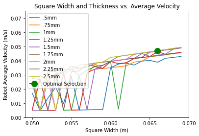

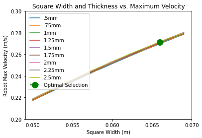

    Above are the simulation results for the experiment these led to a 1.5mm thickness selection and a 60x60mm square side length selection. (More depth is gone into on this process in the design optimization document). The experimental robot was constructed based on these results.

 Below is a plot of the displacement of the measured point on the system (in m) vs. time (in s) using the optimal results obtained above. This plot will be used to compare the displacements of the simulation and actual system.

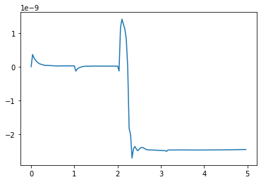

 Below is a plot of the velocity of the measured point on the system (in m/s) vs. time (in s) using the optimal results obtained above. This plot will be used to compare the velocities of the simulation and actual system.

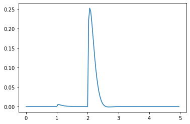

The maximum velocity was calculated to be 0.2527 and the average velocity was calculated to be 0.03938 from the performance function in the design optimization jupyter notebook.

## 2. Experimental Setup:

  This experiment was performed using the cardstock robot, an arduino nano, a 5V power source, a stepper motor, a camera, and tracking markers. Below is the procedure performed to conduct the experiment.

#### Procedure:

    1. Turn on Arduino Nano
    2. Place camera in stable recording location
    4. Begin recording
    5. Begin cycling arduino nano code
    6. Arduino nano cycles 5 times.
    7. Code finishes executing and stop recording.
    8. Upload video to tracker and gather data points using tracking points.

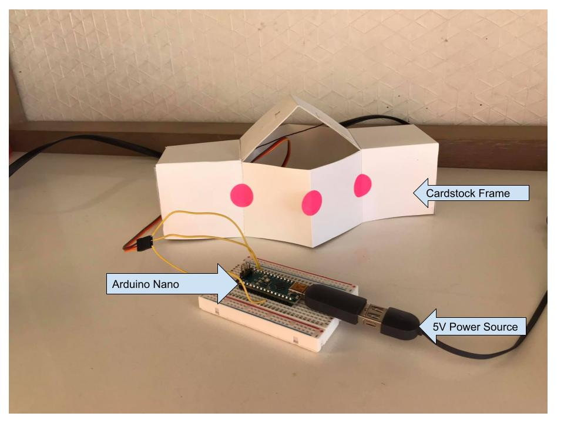

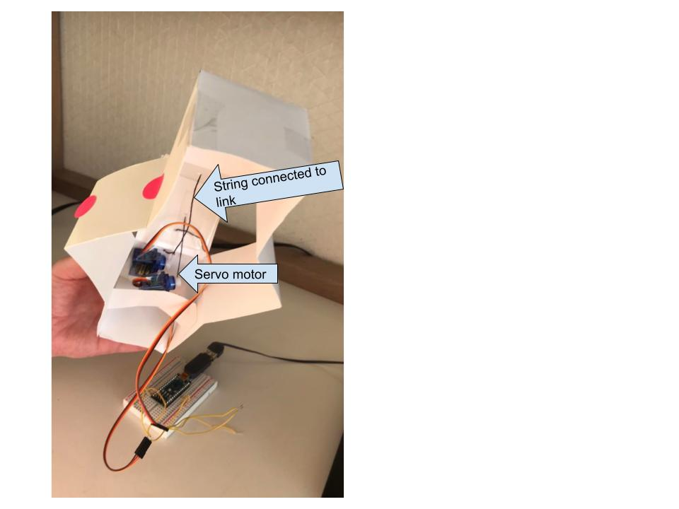

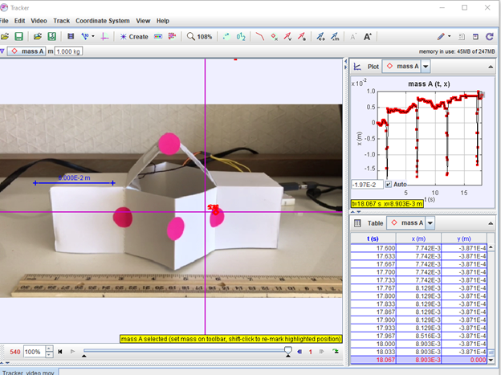

## 3. Experimental Results:


```python
from IPython.display import HTML

# Youtube
HTML('<iframe width="560" height="315" src="https://www.youtube.com/embed/kOxT-lkWv0E" title="YouTube video player" frameborder="0" allow="accelerometer; autoplay; clipboard-write; encrypted-media; gyroscope; picture-in-picture" allowfullscreen></iframe>')
```

    C:\Anaconda3\lib\site-packages\IPython\core\display.py:717: UserWarning: Consider using IPython.display.IFrame instead
      warnings.warn("Consider using IPython.display.IFrame instead")
    


<iframe width="560" height="315" src="https://www.youtube.com/embed/kOxT-lkWv0E" title="YouTube video player" frameborder="0" allow="accelerometer; autoplay; clipboard-write; encrypted-media; gyroscope; picture-in-picture" allowfullscreen></iframe>


```python
import pandas as pd
import numpy as np
import matplotlib.pyplot as plt
import scipy.interpolate as si
import csv

df = pd.read_csv('data4.csv')

plt.plot(df.t,-df.x)
plt.xlabel('Time (s)')
plt.ylabel('Displacement (m)')
plt.title('Prototype Test Displacement(m) vs. Time')

```


    Text(0.5, 1.0, 'Prototype Test Displacement(m) vs. Time')


    
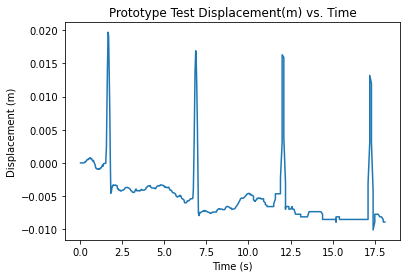
    


```python

dt = df.t[1]-df.t[0]
v = np.gradient(df.x, dt)
v=-v
plt.plot(df.t[:60],v[:60])
plt.xlabel('Time (s)')
plt.ylabel('Velocity (m/s)')
plt.title('Prototype Test Velocity vs. Time')
t=df.t;
```


    
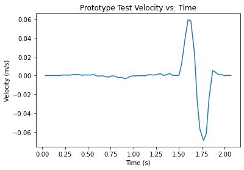
    


```python
# This code will be used at the end of the simulation to calculate the current system average velocity and maximum velocity
def performance(t,v):
    v_max = max(v)
    i=0
    vel_v=[]
    t_v=[]
    for vel in v:
        vel_v.append(v[40+i])
        t_v.append(t[40+i])
        if v[40+i]<=0:
            break
        i=i+1
    v_average=sum(vel_v)/sum(t_v)
    return [v_max,v_average]
```


```python
[v_max,v_average]=performance(t,v)

print(v_max)
print(v_average)
```

    0.06820461384152457
    0.011950888125369012
    

## 4. Comparison:

|                        | Simulation | Real-life Experiment |
|------------------------|------------|----------------------|
| Max Velocity (m/s)     | .2527      | .0682                |
| Average Velocity (m/s) | .03938     | .0120                |

    As shown above the real life experiment ended up having a much slower max velocity and average veloicty when compared to the simulation. The possible reasons for this will be discussed further in the discussion.

Simulation y axis Position (m) and x axis Time(s)


Experiment Position vs Time graph
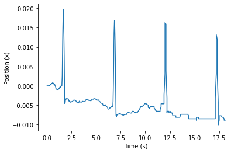

Simulation y axis Velocity (m/s) and x axis Time(s)


Experiment Velocity vs. Time graph

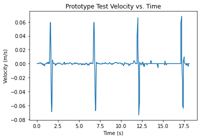

    It seems that the key differences in these graphs are that in the simulation the robot was able to employ stoppers so it moved from its starting location as seen in the simulation position vs time graph and its missing from the experimental version. Another big difference can be seen in the duration of the acuation of the system. The real life experiment seems to actuate much faster than the simulation. This will be discussed further in the discussion. 

## 5. Discussion:

#### a.) What do you consider the top five sources of error in your data collection experiment?

    There are multiple possible sources of error in the experiment, as there usually is when trying to derive values from real life experiments. The first source of error would likely come from any inaccuracies in the tracking software and its inability to exactly match the movement of the system. A second source of error could be in the system not having all electronics and stoppers fully integrated, not all masses were able to be integrated into the system for testing so this might change results. Another source of error could be in the lack of use of stoppers in the experiment, the team was unable to get the stoppers to work for the experiment and their inclusion would likely slightly alter the dynamics of the experiment. Friction forces were also not able to be calculated in the experiment, so these would be difficult to replicate in simulation, which would lead to errors between the simulation and the real life experiment. Lastly, the team used a stepper motor where a torque motor was modeled in simulation, which would likely lead to the differences in duration seen in the data.

#### b.) What steps did you take to reduce the error?

    To reduce tracking error we made sure to use contrasting markers to the system that tracker could easily indetify. To make sure the robot doesn't over or under extend there were rotation limits place on the stepper motor. The robot was also placed on a smooth surface to limit friction. To limit error due to compliance additional layers of material were added to limit the flexability of the links. The motor and interface with the link was attempted to be made as stable as possible to limit the error lost between the motor actuating the linkage.

#### c.) What was difficult to control?

    It was difficult to control the motor and the stoppers of the system at the same time due to the loss of the tension in strings that controlled the stoppers. It was also difficult to actuate the link closest to the motor as desired, due to the system bending too much, and it difficult to position the motor properly to actuate the closer link, this makes the actual location actuated quite a bit different than the simulation.

#### d.) How would you improve your testing setup or procedure next time?

    Hopefully in the next testing setup all masses would be within the robot and the stoppers would be included and tuned to work properly. Other than that the system would actually be able to locomote and move as desired. The system would also have a better mounted motor that would actuate the link adjecent to it as opposed to how it is currently mounted.

#### e.) How well does your data mirror your simulated results? What is similar, what is different?

    The experimental data was quite a bit off of the simulated results, but the shape of the graphs were similar. The magnitudes however were quite a bit off. This is likely due to the use of a stepper motor in the experimental results, but a torque motor in the simulated ressults. There are also other factors such as the mass of the system missing and lack of modeled friction that may have impacted the results for the simulation making it faster than the experimental result.

#### f.) Is it possible to add a modeling element which models/captures discrepencies between these two results? What element if added to your simulation what have the biggest impact on its fidelity?

    Adding a friction component to the modeling would have made it more accurate, but it is difficult to get an accurate model of frictiono n the system. Also adding a stopper component to the simulation with the mechanism controlling it would make it more accurate to the real life system. Likely friction woul dhave the biggest impact on the system fidelity.

#### g.) What additional equations and parameters would you need in order to add this element?

    Coefficient of friction between the robot and the ground, as well as the coefficient of friction between the stoppers and the ground. It would be useful to be able to record the coefficient of friction for multiple different mediums that the robot might move across. 
