# Design and Manufacturing Workflow
## Team 2
### 4/11/21

**Instructions**

Please include:

The picture of your paper mockup in its folded an flattened state

A Solidworks screenshot of your robot in its folded and flattened state

The dxf of your body and joint layers output by solidworks or designed by you.

Your jupyter notebook script consisting of the following elements, clearly labeled.

1-Layer Robot Design

5-Layer Robot Design

5-Layer Manufacturing Design

Final .dxf files

## Paper Mock Up
1.) Create a quick paper mockup of your final prototype design(You may use a prior prototype if it still applies, but you may destroy it.). Once you have arrived at your desired architecture, proceed to unfold the prototype in a way that makes sense from the perspective of optimizing material usage, staying within any boundary limitations (size of a piece of posterboard, size of the cutter you will be using).


Folded prototype


Flatten prototype

## Solidworks Screen Shot
Design the geometry of your robot in .dxf format

a.) Convert the flattened pattern to dimensioned a Solidworks sketch. Include any mounting holes for motors, springs, or connectors.

b.) Use the Solidworks tutorial to create a hinged assembly of all parts of the design.

c.) Take a screenshot of the robot in its folded & assembled state.

d.) Flatten the assembly back to its original flattened state.

e.) Create a drawing from the assembly and use the solidworks export macro to export a yaml file (generic).

f.) Use the solidworks support functionality in foldable robotics to convert to a dxf.


Screenshot of the robot in flattened state 


Solidworks screen shot of the paper mockup in folded state


Solidworks drawing from assembly.


Drawing converted into a dxf file.

## Full Design Pipeline Code 
Used to find 5-Layer Robot Manufacturing Design


```python
%matplotlib inline
```


```python
import foldable_robotics
import foldable_robotics.dxf 
import numpy
import shapely.geometry as sg
from foldable_robotics.layer import Layer
from foldable_robotics.laminate import Laminate
import foldable_robotics.manufacturing
import foldable_robotics.parts.castellated_hinge1
import idealab_tools.plot_tris
from math import pi, sin,cos,tan
import idealab_tools.text_to_polygons
foldable_robotics.display_height=200
foldable_robotics.line_width=.5

from foldable_robotics.layer import Layer
from foldable_robotics.laminate import Laminate
import foldable_robotics
import foldable_robotics.dxf 
import foldable_robotics.manufacturing
import foldable_robotics.parts.castellated_hinge1
foldable_robotics.display_height=200
foldable_robotics.line_width=.5
#import workflow_support as ws

import os
import foldable_robotics.solidworks_support
```


```python
def get_bodies(filename, layername, num_layers):
    body = foldable_robotics.dxf.read_lwpolylines(filename,layer=layername, arc_approx = 10)

    bodies = [Layer(sg.Polygon(item)) for item in body]
    body = bodies.pop(0)
    for item in bodies:
        body ^= item
    body = body.to_laminate(num_layers)
    return body
```


```python
def get_hinge_lines(filename,layername):
    hinge_lines1 = foldable_robotics.dxf.read_lines(filename,layer=layername)
    hinge_lines2 = foldable_robotics.dxf.read_lwpolylines(filename,layer=layername)
    hinge_lines3 = []
    for points in hinge_lines2:
        hinge_lines3.append(points[:2])
    hinge_lines = hinge_lines1 +hinge_lines3
    return hinge_lines
```


```python
def hinge_lines_to_hinges(hinge_lines,hinge):
    lam = Layer().to_laminate(len(hinge))
    all_hinges = []    
    for p3,p4 in hinge_lines:
        all_hinges.append(hinge.map_line_stretch((0,0),(1,0),p3,p4))
    all_hinges = lam.unary_union(*all_hinges)
    return all_hinges
```


```python
def get_cuts(filename,layername,thickness,num_layers):
    cut_lines = foldable_robotics.dxf.read_lines(filename,layer=layername)
    cut_lines += foldable_robotics.dxf.read_lwpolylines(filename,layer=layername, arc_approx = 10)
    
    cuts = []
    for item in cut_lines:
        cuts.append(Layer(sg.LineString(item)))
    cuts = Layer().unary_union(*cuts)
    cuts<<=thickness/2
    cuts = cuts.to_laminate(num_layers)
    return cuts   
```


```python
def get_holes(filename, layername,num_layers):
    holes = foldable_robotics.dxf.read_circles(filename,layer='holes')
    
    holes2 = []
    for center, radius in holes:
        holes2.append(sg.Point(*center).buffer(radius))
    holes_layer = Layer(*holes2)
    holes_lam = holes_layer.to_laminate(num_layers)  
    return holes_lam
```


```python
def hinge_width_calculator(desired_degrees,thickness):
    theta = (180-desired_degrees)*pi/180
    w=thickness/tan(theta)
    return w
def polys_to_layer(l1):
    l1 = [sg.Polygon(item) for item in l1]
    l11 = Layer(l1.pop(0))
    for item in l1:
        l11 ^= Layer(item)
    return l11
    
def output_pdf(filename,design2,x,y,layers_separate = True):
    design2 = design2.translate(x,y)
    design2=design2.scale(1/25.4,1/25.4)
    design2=design2.scale(foldable_robotics.pdf.ppi,foldable_robotics.pdf.ppi)
    if isinstance(design2,Laminate):
        if not layers_separate:
            p=foldable_robotics.pdf.Page(filename+'.pdf')
            for d in design2:
    #        d = design2[0]
                for item in d.exteriors()+d.interiors():
                    p.draw_poly(item)
            p.close()
        else:
            for ii,d in enumerate(design2):
                p=foldable_robotics.pdf.Page(filename+'{0:03f}.pdf'.format(ii))
                for item in d.exteriors()+d.interiors():
                    p.draw_poly(item)
                p.close()

    elif isinstance(design2,Layer):
        p=foldable_robotics.pdf.Page(filename+'.pdf')
        for item in design2.exteriors()+design2.interiors():
            p.draw_poly(item)
        p.close()
        
def build_layer_numbers(num_layers, text_size = None, prop=None):
    text_size = text_size or 1
    prop = prop or {'family':'Arial','size':text_size}
    layer_ids = []
    for ii in range(num_layers): 
    
        l = idealab_tools.text_to_polygons.text_to_polygons('Layer '+str(ii),prop=prop)
        layer_ids.append(l)
    
    layer_ids = [polys_to_layer(item) for item in layer_ids]
    layer_id = Laminate(*layer_ids)
    return layer_id
def build_web(design2,keepout,support_width,jig_diameter,jig_hole_spacing,is_adhesive):
    num_layers = len(design2)

    layer_id = build_layer_numbers(num_layers,text_size=jig_diameter)

    design_outer = foldable_robotics.manufacturing.unary_union(design2)
    bb1= (design_outer<<jig_hole_spacing/2).bounding_box()
    (x1,y1),p2 = bb1.bounding_box_coords()
    w,h = bb1.get_dimensions()
    w2 = round(w/jig_hole_spacing)*jig_hole_spacing
    h2 = round(h/jig_hole_spacing)*jig_hole_spacing
    
    points = []
    points.append(sg.Point(x1,y1))
    points.append(sg.Point(x1+w2,y1))
    points.append(sg.Point(x1,y1+h2))
    points.append(sg.Point(x1+w2,y1+h2))
    
    layer_id = layer_id.translate(x1+jig_diameter,y1-jig_diameter/2)
    placement_holes2 = Layer(*points)
    placement_holes2<<=(jig_diameter/2)
    sheet = (placement_holes2<<10).bounding_box()
    placement_holes2=placement_holes2.to_laminate(num_layers)
    sheet=sheet.to_laminate(num_layers)
    
    removable_scrap = calculate_removable_scrap(design2,sheet,support_width,is_adhesive)
    
    web = (removable_scrap-placement_holes2)-layer_id
    return web,sheet
def calculate_removable_scrap(design,sheet,width,is_adhesive):
    '''this computes all removable scrap given a sheet, a design, and a clearance width'''
    all_scrap = sheet-design

    ru = foldable_robotics.manufacturing.not_removable_up(design,is_adhesive)
    rd = foldable_robotics.manufacturing.not_removable_down(design,is_adhesive)
    
    removable_scrap_up = all_scrap-(ru<<width)
    removable_scrap_down = all_scrap-(rd<<width)

    removable_scrap = removable_scrap_up|removable_scrap_down
    return removable_scrap
```


```python
folder = 'Files\\'
input_filename = folder+'bro.yaml'
output_file_name = folder+'design2.dxf'
```


```python
round_digits = 2
prescale=1000
jig_diameter = 5
support_width = 1
kerf = .05
jig_hole_spacing=20
is_adhesive = [False,True,False,True,False]
arc_approx = 10
foldable_robotics.solidworks_support.process(input_filename,output_file_name,prescale,round_digits)
```


    (<foldable_robotics.layer.Layer at 0x2501ab51160>,
     <foldable_robotics.layer.Layer at 0x2501aa47eb0>,
     [<foldable_robotics.solidworks_support.Component at 0x2501b904670>,
      <foldable_robotics.solidworks_support.Component at 0x2501b9048e0>,
      <foldable_robotics.solidworks_support.Component at 0x2501b904520>,
      <foldable_robotics.solidworks_support.Component at 0x2501b9046d0>,
      <foldable_robotics.solidworks_support.Component at 0x2501b904580>,
      <foldable_robotics.solidworks_support.Component at 0x2501b904af0>,
      <foldable_robotics.solidworks_support.Component at 0x2501b904c70>,
      <foldable_robotics.solidworks_support.Component at 0x2501b904940>,
      <foldable_robotics.solidworks_support.Component at 0x2501b904a90>,
      <foldable_robotics.solidworks_support.Component at 0x2501b9049a0>,
      <foldable_robotics.solidworks_support.Component at 0x2501b904e80>,
      <foldable_robotics.solidworks_support.Component at 0x2501b904a00>,
      <foldable_robotics.solidworks_support.Component at 0x2501b904f10>,
      <foldable_robotics.solidworks_support.Component at 0x2501b904d30>])


### 1 - Layer Robot Design

1.)Using a single-layer design approach, compute the design of your device in one layer, plotting each step along the way. This should include:

   a.) a one-layer hinge design that fits your team’s need (with justification for material used, rotational needs, manufacturing method used, etc)
   
   b.) mapping the hinge design to each joint in your joints layer of the dxf
   
   c.) subtracting the one layer hinge design from your body layer
   
   d.) holes computed for any vertices

Justification for material used:
The material being used is cardstock because more rigid materials such as cardboard will not allow for a proper bend due to the material breaking under the stress of a small bend radii. 

Justification for rotational needs:
Because the robot will be using sarrus links, the robot structure will need to accomodate rotational movemement between 0-180 degrees. The 1- layer design will allow for those rotational needs. 

Justification for manufacturing method:
Using a laser cutter as the manufaturing method will allow the structure to be percise. This is important to the design because if the material is not precise, it could hinder the movement of the structure. Using the laser cutter for the 1 - Layer design will yield a percise cut that will allow for the 


```python
import shapely.geometry as sg
from foldable_robotics.layer import Layer
from foldable_robotics.laminate import Laminate
import numpy
```


```python
NUMLAYERS=1
body = get_bodies(output_file_name,'body',1)
body = foldable_robotics.manufacturing.cleanup(body,.001)
body.plot()
```


    
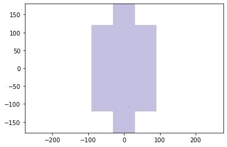
    


1.) a one-layer hinge design that fits your team’s need (with justification for material used, rotational needs, manufacturing method used, etc)

For our 1 layer body we chose a perforated hinge design because it allows us to use 1 material for our hinge, and the cardstock should provide enough support for this hinge to not break. It also meets our rotational needs by being able to rotate the required 180 degree. Lastly, it is easy to manufacture as all it requires is a few extra cuts within a laser cutter.


```python
radius = .01
num_perforations = 5
num_segments = num_perforations*2+1
num_points = num_segments+1
a=numpy.r_[0:1:num_points*1j]
lines = []
for ii in range(int(len(a)/2)-1):
    p1 = sg.Point(a[2*ii+1]+radius,0)
    p2 = sg.Point(a[2*ii+2]-radius,0)
    lines.append(sg.LineString((p1,p2)))
hinge<<=radius
hinge.plot()
```


    
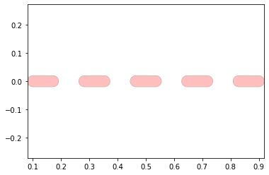
    


2.)mapping the hinge design to each joint in your joints layer of the dxf

Below the hinge design is mapped to each joint of the system.


```python
joint_lines= get_hinge_lines(output_file_name,'joints')
joints = hinge_lines_to_hinges(joint_lines,hinge)
joints = foldable_robotics.manufacturing.cleanup(joints,.1)
joints.plot()
```


    ---------------------------------------------------------------------------

    TypeError                                 Traceback (most recent call last)

    <ipython-input-57-2cf5580e65bf> in <module>
          1 joint_lines= get_hinge_lines(output_file_name,'joints')
    ----> 2 joints = hinge_lines_to_hinges(joint_lines,hinge)
          3 joints = foldable_robotics.manufacturing.cleanup(joints,.1)
          4 joints.plot()
    

    <ipython-input-5-be07b8d850aa> in hinge_lines_to_hinges(hinge_lines, hinge)
          1 def hinge_lines_to_hinges(hinge_lines,hinge):
    ----> 2     lam = Layer().to_laminate(len(hinge))
          3     all_hinges = []
          4     for p3,p4 in hinge_lines:
          5         all_hinges.append(hinge.map_line_stretch((0,0),(1,0),p3,p4))
    

    TypeError: object of type 'Layer' has no len()


```python
hinge = foldable_robotics.parts.castellated_hinge1.generate()
w=hinge_width_calculator(150,1.1) #1.1
hinge = hinge.scale(1,w)

```


```python
NUMLAYERS = len(hinge)
NUMLAYERS
```


    5


```python
body = get_bodies(output_file_name,'body',NUMLAYERS)
body = foldable_robotics.manufacturing.cleanup(body,.01)
body.plot()
```


    

    


3.) subtracting the one layer hinge design from your body layer

Here the hinge design is substracted from the body layer


```python
design_1layer=body-joints
design_1layer.plot()
```


    ---------------------------------------------------------------------------

    WrongNumLayers                            Traceback (most recent call last)

    <ipython-input-58-ceba1d7f55a6> in <module>
    ----> 1 design_1layer=body-joints
          2 design_1layer.plot()
    

    ~\anaconda3\lib\site-packages\foldable_robotics\class_algebra.py in __sub__(self, other)
         15     def __sub__(self,other):
         16         '''Subtract one object from another'''
    ---> 17         return self.difference(other)
         18 
         19     def __and__(self,other):
    

    ~\anaconda3\lib\site-packages\foldable_robotics\laminate.py in difference(self, other)
        240         :rtype: Laminate
        241         '''
    --> 242         return self.binary_operation('difference',other)
        243 
        244     def symmetric_difference(self,other):
    

    ~\anaconda3\lib\site-packages\foldable_robotics\laminate.py in binary_operation(self, function_name, other, *args, **kwargs)
        196 
        197         if len(self.layers)!=len(other.layers):
    --> 198             raise(WrongNumLayers())
        199         else:
        200             layers = []
    

    WrongNumLayers: 


4.) holes computed for any vertices

Below the holes are computed for each vertice then subtracted from the body layer to get a complete 1 layer design


```python
cuts = get_cuts(output_file_name,'cuts',.02,NUMLAYERS)
#cuts.plot()
holes = get_holes(output_file_name,'holes',NUMLAYERS)
#holes.plot()
hole,dummy = foldable_robotics.manufacturing.calc_hole(joint_lines,w)
hole = hole.to_laminate(NUMLAYERS)
hole<<=.2
hole.plot()
```


    
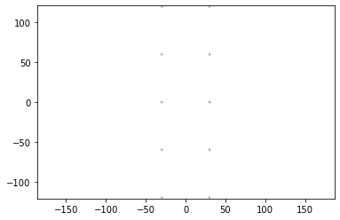
    


```python
design_1layer=design_1layer-holes
design_1layer.plot()
```


    ---------------------------------------------------------------------------

    NameError                                 Traceback (most recent call last)

    <ipython-input-60-52ce4aafee8d> in <module>
    ----> 1 design_1layer=design_1layer-holes
          2 design_1layer.plot()
    

    NameError: name 'design_1layer' is not defined


### 5 - Layer Robot Design
3.)Using a 5-layer design approach, compute the same design of your device in five layers, plotting each step along the way. This should include:

a.) a five-layer hinge design that fits your team’s need (with justification for material used, rotational needs, manufacturing method used, etc)

b.) mapping the hinge design to each joint in your joints layer of the dxf

c.) subtracting the 5-layer hinge design from the body laminate

d.) holes computed for any vertices

Justification for material used:
The material being used is cardstock because more rigid materials such as cardboard will not allow for a proper bend due to the material breaking under the stress of a small bend radii. 

Justification for rotational needs:
Because the robot will be using sarrus links, the robot structure will need to accomodate rotational movemement between 0-180 degrees.

Justification for manufacturing method:
Using a laser cutter as the manufaturing method will allow the structure to be percise. This is important to the design because if the material is not precise, it could hinder the movement of the structure. 


```python
joint_lines= get_hinge_lines(output_file_name,'joints')
joints = hinge_lines_to_hinges(joint_lines,hinge)
joints = foldable_robotics.manufacturing.cleanup(joints,.02)
joints.plot()
```


    

    


```python
cuts = get_cuts(output_file_name,'cuts',.02,NUMLAYERS)

holes = get_holes(output_file_name,'holes',NUMLAYERS)

hole,dummy = foldable_robotics.manufacturing.calc_hole(joint_lines,w)
hole = hole.to_laminate(NUMLAYERS)
hole<<=.2
hole.plot()
```


    

    


```python
design2 = body- hole - joints - cuts - holes
design2.plot()
```


    

    


### 5 - Layer Manufacturing Design
3.)Using the full design pipeline found on the website and discussed in class, compute the manufacturing geometry for a five-layer laminate, plotting each step along the way. This should include:

a.) Web design

b.)Support design

c.)Non-removable scrap

d.)Connection check of all parts that result from the second-pass cut.

e.)Similarity check between design and removed final part.


```python
hinge = foldable_robotics.parts.castellated_hinge1.generate()
w=hinge_width_calculator(150,1.1)
hinge = hinge.scale(1,w)
hinge.plot()
```


    

    


```python
NUMLAYERS = len(hinge)
body = get_bodies(output_file_name,'body',NUMLAYERS)
body = foldable_robotics.manufacturing.cleanup(body,.01)
body.plot()
```


    

    


```python
joint_lines= get_hinge_lines(output_file_name,'joints')
joints = hinge_lines_to_hinges(joint_lines,hinge)
joints = foldable_robotics.manufacturing.cleanup(joints,.02)
joints.plot()
```


    
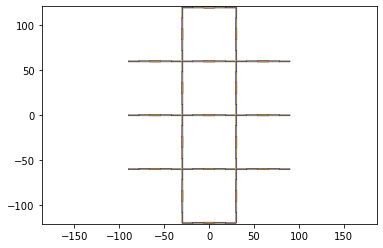
    


```python
cuts = get_cuts(output_file_name,'cuts',.02,NUMLAYERS)
#cuts.plot()
holes = get_holes(output_file_name,'holes',NUMLAYERS)
#holes.plot()
hole,dummy = foldable_robotics.manufacturing.calc_hole(joint_lines,w)
hole = hole.to_laminate(NUMLAYERS)
hole<<=.2
hole.plot()
```


    

    


```python
design2 = body- hole - joints - cuts - holes
design2.plot()
```


    

    


```python
keepout =  foldable_robotics.manufacturing.keepout_laser(design2)
keepout.plot()
```


    
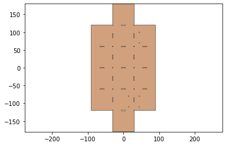
    


```python
web,sheet=build_web(design2,keepout,support_width,jig_diameter,jig_hole_spacing,is_adhesive)
web.plot()
```


    
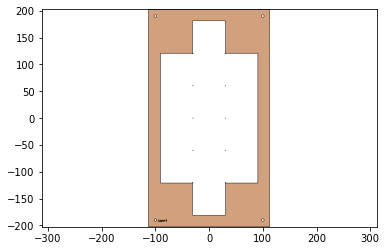
    


```python
sheet.plot()
```


    
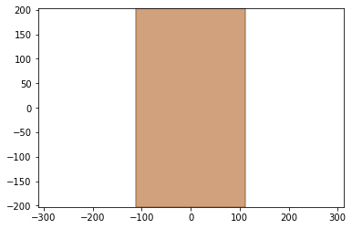
    


```python
second_pass_scrap = sheet-keepout
first_pass_scrap = sheet - design2-second_pass_scrap
first_pass_scrap = foldable_robotics.manufacturing.cleanup(first_pass_scrap,.00001)
first_pass_scrap.plot()
```


    
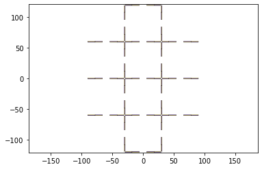
    


```python
support = foldable_robotics.manufacturing.support(design2,foldable_robotics.manufacturing.keepout_laser,support_width,support_width/2)
support.plot()
```


    
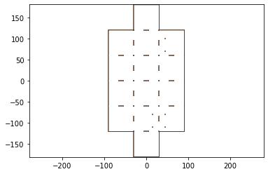
    


```python
#Calculate the web by using only the material which can be cut, minus a gap determined by the support width.  Is that the only material you can use?
supported_design = web|design2|support
supported_design.plot()
```


    
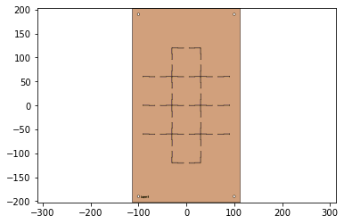
    


```python
#cut_line = keepout<<kerf
cut_material = (keepout<<kerf)-keepout
cut_material.plot()
```


    
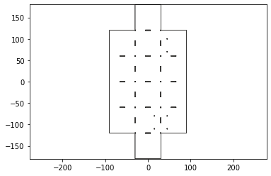
    


```python
final_cut = sheet - keepout
final_cut = final_cut[0]
final_cut.plot()
```


    

    


```python
remaining_material = supported_design-cut_material
remaining_material.plot()
```


    
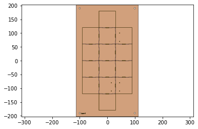
    


```python
remaining_parts = foldable_robotics.manufacturing.find_connected(remaining_material,is_adhesive)
for item in remaining_parts:
    item.plot(new=True)
```

    C:\Users\romnk\anaconda3\lib\site-packages\foldable_robotics\laminate.py:91: RuntimeWarning: More than 20 figures have been opened. Figures created through the pyplot interface (`matplotlib.pyplot.figure`) are retained until explicitly closed and may consume too much memory. (To control this warning, see the rcParam `figure.max_open_warning`).
      plt.figure()
    


    

    


    
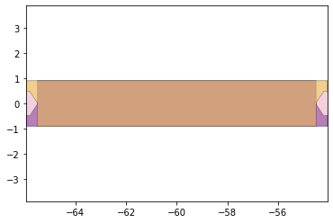
    


    

    


    
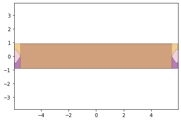
    


    
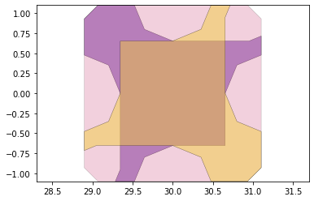
    


    

    


    
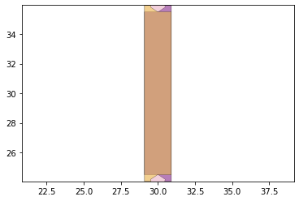
    


    

    


    
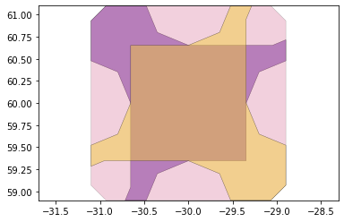
    


    
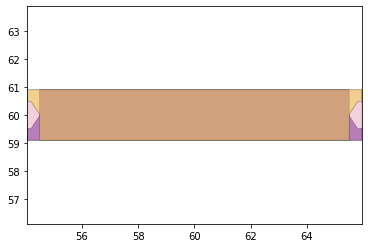
    


    
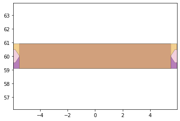
    


    
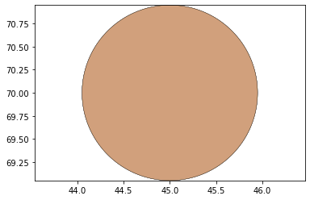
    


    
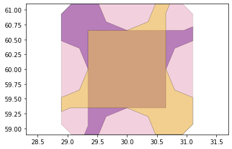
    


    
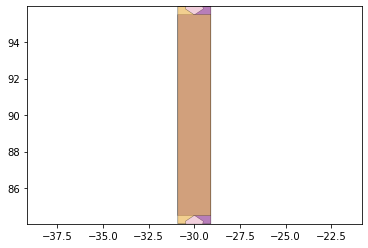
    


    
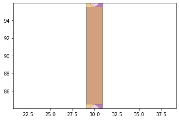
    


    
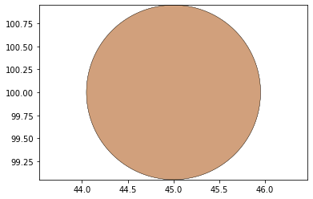
    


    
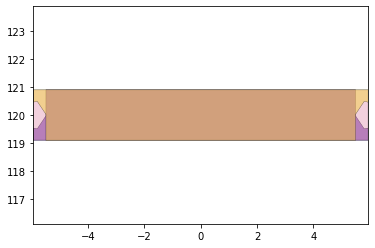
    


    
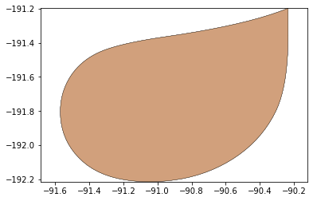
    


    
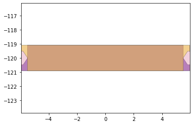
    


    

    


    
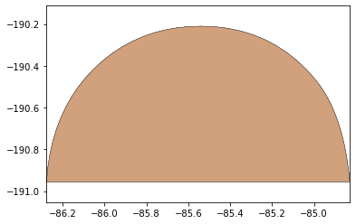
    


    
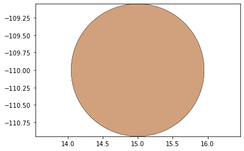
    


    

    


    

    


    

    


    

    


    
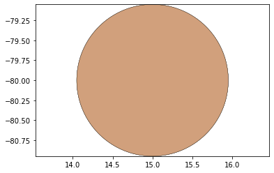
    


    
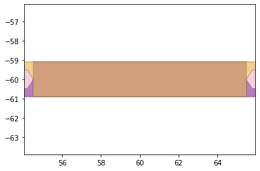
    


    

    


    
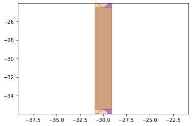
    


    
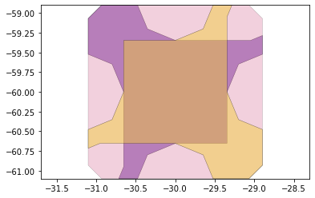
    


    
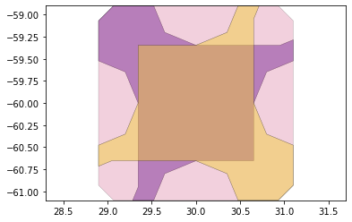
    


    
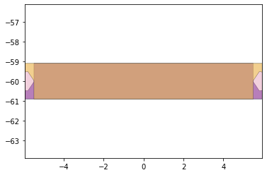
    


    
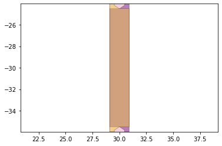
    


    
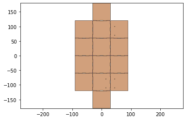
    


```python
d3=design2>>1
for item in remaining_parts:
    if not (item&d3).is_null():
        break
check = (item^design2)
print(check.is_null())
```

    False
    

The rigid layers:


```python
w,h = supported_design.get_dimensions()
p0,p1 = supported_design.bounding_box_coords()

rigid_layer = supported_design[0] | (supported_design[-1].translate(w+10,0))
rigid_layer.plot()
```


    

    


The adhesive layers:


```python
l4 = supported_design[3].scale(-1,1)
p2,p3 = l4.bounding_box_coords()
l4 = l4.translate(p0[0]-p2[0]+10+w,p0[1]-p2[1])

adhesive_layer = supported_design[1] | l4
adhesive_layer.plot()
```


    
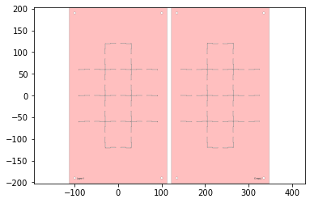
    


```python
first_pass = Laminate(rigid_layer,adhesive_layer,supported_design[2])
if check.is_null():
    first_pass.export_dxf('first_pass')
    final_cut.export_dxf('final_cut')
```


```python
remaining_parts[5].symmetric_difference(design2)
```


    
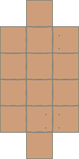
    


```python
result = remaining_parts[5]
```


```python
result2 = foldable_robotics.manufacturing.cleanup(result,.00001)
result2.plot()
```


    

    


```python

```
