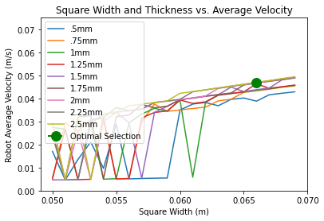
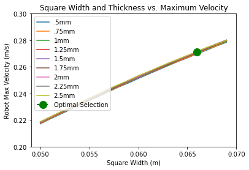
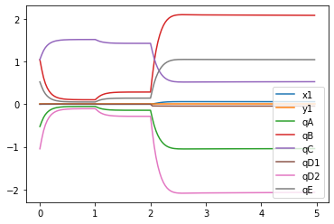
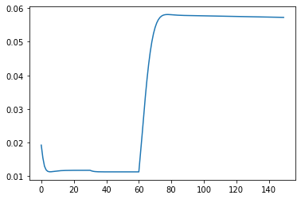
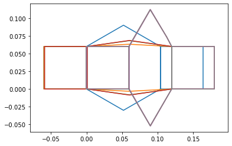
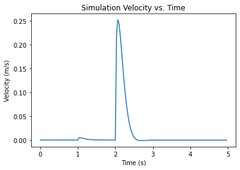

# Design Optimization
## Team 2
## Kevin Julius, Romney Kellogg, Sanchit Singhal, Siddhaarthan Akila Dhakshinamoorthy


## 1. Performance Measurement

#### a. Explain, in words, how your team will evaluate the success of your robot’s design. This could be by measuring the forces produced by your design, the speed at which it walks, its thrust:weight ratio, the height it can jump, etc. Explain, in words, how you will measure performance in simulation. How will you measure performance in experiments?

The design's preformance will be measure by its forward velocity. This will be measured in simulation by the average velocity of the lagging edge (link F) of the sarrus linkage over one cycle, as this approximation should be close the the average velocity of the whole robot. This can easily be measured because the velocity is already a state in the system measured by x1 and its derivative vx1.

In experiments motion capture with a grid background will be used to measure the velocity of the robot. The lagging component (link A) will be used to measure the velocity of the robot.

#### b. Are experimental vs. simulation metrics similar or vastly different? If different, how will you equate A and B?

The experimental and simulation metrics will be somewhat different, but should be proportional. This means that any optimization completed in the simulation should still apply to the prototype because the systems are analagous. They will be equated by a conversion factor calculated by running some simulation tests and experimental tests with simlar tests to calculated the proportional performance different.

This difference mainly comes from the simulation being 2-D and the experimental prototype having 3-D components that are not simulated, mainly the 3rd set of links in the saurus linkage. 

#### c. Do you have more than one performance metric you must use as for design goals? If so, either identify the most important one or explain how you will balance two competing criteria.

The main design goal will be robot velocity, but energy efficiency would also be a good performance metric to look at to see the tradeoffs of increasing robot velocity. But the optimization will be performed only on the robot average and maximum velocity as it is our main goals, with average velocity as a priority.

#### d. Explain, in math, the measurable performance metric(s) by which your team can estimate performance.

The math is relatively simple for the performance metric. The velocity of a point pNA will be measured in the simulation at a different times within one cycle at a timestep t_step=.033s. The time when the robot will be waiting (due to the simulation breaking if too many forces are being changed at once) will be left out, so the only times measured will be during the retraction of the robot. The average velocity and maximum velocity achieve will be measured . These can be compared to obtain the optimal parameters to achieve the maximum velocity and average velocity robot.

                           The velocity vector used will begin then the reverse torque is applied and end when the velocity returns to zero, giving an average velocity of the linkage.
                           t begin = 2s
                           t end = when velocity falls below zero
                           v=v(t begin,t end)
                           v_average= sum(v)/length(v)
                           v_max= max(v)

#### e. Write, in code, a function that will evaluate the performance of your current system (as simulated in System Dynamics II).


```python
# This code will be used at the end of the simulation to calculate the current system average velocity and maximum velocity
def performance(t,states):
    v_max = max(states[:,8])
    i=0
    vel_v=[]
    t_v=[]
    for vel in states[60:,8]:
        vel_v.append(states[60+i,8])
        t_v.append(t[60+i])
        if states[60+i,8]<=0:
            break
        i=i+1
    v_average=sum(vel_v)/sum(t_v)
    return [v_max,v_average]

```


```python
#[v_max,v_average]=performance(t,states)

```


```python
#v_max
```


```python
#v_average
```

## 2. Constraints

#### a. Brainstorm and describe your team’s design constraints. Constraints are aspects of your design that are “bounded” by some physical limit (eg, the size of robot you can cut on a given laser cutter, the range of motion of a typical foldable hinge joint)

For the saurus linkage a single piece of cardstock is going to be folded to create the majority of the robot this leads to a maximum size of 216 x 279 mm for the robot or 69mmx69mm per square that make up the sides and links in the sarrus linkage. The robot needs to be big enough to hold all of the necessary components determined to be a minimum of 50mmx50mm. 

Using the cardstock we have a minimum thickness of one layer (roughly .5mm) and no maximum thickness for for the sake of practicallity we will bound the maximum at 5 layers (roughly 2.5 or 3 mm). 


#### b. Explain, in words, how you will track violation of design constraints. For example, lets say your optimization routine suggests a design that cannot be made in a single sheet of paper. Will you
    
    a. parameterize your design space in such a way that  translates to a bounded design range?
    
    b. penalize design performance when design parameters are outside of that range
    
    c. explicitly bound your parameter space?
    
 For our optimization routine we will explicitly bound our parameter space to our design constraints (c), as any violations to our parameter minimums and maximums will be impossible to manufacture or create a functional robot. So for this optimization routine the bounds for square size will be 50x50mm to 68x68mm and for thickness will be .5mm-2.5mm.

## 3. Execute Full Optimization Routine

1. permits you to parameterize your design space in one or more variable

Design is parameterized  by changing parameters L_var (link length and width) and t_var (link thickness) which are used to create the dynamics of the system. This is complete by using a two for loops and the dynamics simulation shown below as a seperate .py script.

2. generates a scalar performance metric that implements your goal as stated above.

Scalar performance metrics are average velocity and also maximum velocity will be measured to compare. Generated using performance function method shown above.

3. selects an optimization approach based on your decisions above. This may be a global search or use one of the many optimization routines available in Python.

The optimization approach will be done using a for loop run of simulations at different combinations of conditions shown below for thickness and length. The optimal solution was chosen based on highest average and max velocity. A total of 171 simulations were ran.

4. bounds or penalizes designs outside of a permissable range

The parameters are bound with .5mm to 2.5 mm thickness and 50mm to 68mm side length, these were used to create the values the for loops run through.

5. Run your optimization and determine the optimal parameter value(s)
171 simulation ran to determine optimal values listed further below.


```python
i=0
j=0
import numpy as np

thick_v=np.arange(.0005,.00275,.00025)
width_v=np.arange(.05,.069,.001)
avgv_mat=np.empty((len(thick_v),len(width_v)))
maxv_mat=np.empty((len(thick_v),len(width_v)))
for thick in thick_v:
    i=0
    for width in width_v:
        L_var=width
        t_var=thick
        %run -i "Design_Optimization.py"
        avgv_mat[j,i]=v_average
        print(v_average)
        maxv_mat[j,i]=v_max
        print(v_max)
        i=i+1
    j=j+1

#%run -i "Design_Optimization.py" {L_var} {t_var}


```

    2021-04-21 12:39:39,128 - pynamics.system - INFO - getting dynamic equations
    2021-04-21 12:39:39,767 - pynamics.system - INFO - solving a = f/m and creating function
    2021-04-21 12:39:39,781 - pynamics.system - INFO - substituting constrained in Ma-f.
    2021-04-21 12:39:43,010 - pynamics.system - INFO - done solving a = f/m and creating function
    2021-04-21 12:39:43,010 - pynamics.system - INFO - calculating function for lambdas
    2021-04-21 12:39:43,126 - pynamics.integration - INFO - beginning integration
    2021-04-21 12:39:43,127 - pynamics.system - INFO - integration at time 0000.00
    2021-04-21 12:39:46,807 - pynamics.system - INFO - integration at time 0001.00
    2021-04-21 12:39:50,394 - pynamics.system - INFO - integration at time 0002.01
    2021-04-21 12:39:53,515 - pynamics.system - INFO - integration at time 0002.01
    2021-04-21 12:39:56,642 - pynamics.system - INFO - integration at time 0002.09
    2021-04-21 12:39:58,526 - pynamics.integration - INFO - finished integration
    

    0.0170089453677878
    0.21712171863573615
    

    2021-04-21 12:39:58,806 - pynamics.system - INFO - getting dynamic equations
    2021-04-21 12:39:59,581 - pynamics.system - INFO - solving a = f/m and creating function
    2021-04-21 12:39:59,592 - pynamics.system - INFO - substituting constrained in Ma-f.
    2021-04-21 12:40:02,109 - pynamics.system - INFO - done solving a = f/m and creating function
    2021-04-21 12:40:02,111 - pynamics.system - INFO - calculating function for lambdas
    2021-04-21 12:40:02,112 - pynamics.integration - INFO - beginning integration
    2021-04-21 12:40:02,114 - pynamics.system - INFO - integration at time 0000.00
    2021-04-21 12:40:05,072 - pynamics.system - INFO - integration at time 0001.00
    2021-04-21 12:40:07,801 - pynamics.system - INFO - integration at time 0002.00
    2021-04-21 12:40:10,605 - pynamics.system - INFO - integration at time 0002.07
    2021-04-21 12:40:12,079 - pynamics.integration - INFO - finished integration
    

    0.004638595664449409
    0.22077388571295495
    

    2021-04-21 12:40:12,443 - pynamics.system - INFO - getting dynamic equations
    2021-04-21 12:40:13,159 - pynamics.system - INFO - solving a = f/m and creating function
    2021-04-21 12:40:13,170 - pynamics.system - INFO - substituting constrained in Ma-f.
    2021-04-21 12:40:15,136 - pynamics.system - INFO - done solving a = f/m and creating function
    2021-04-21 12:40:15,137 - pynamics.system - INFO - calculating function for lambdas
    2021-04-21 12:40:15,139 - pynamics.integration - INFO - beginning integration
    2021-04-21 12:40:15,141 - pynamics.system - INFO - integration at time 0000.00
    2021-04-21 12:40:18,003 - pynamics.system - INFO - integration at time 0001.00
    2021-04-21 12:40:20,850 - pynamics.system - INFO - integration at time 0002.00
    2021-04-21 12:40:23,686 - pynamics.system - INFO - integration at time 0002.03
    2021-04-21 12:40:26,444 - pynamics.system - INFO - integration at time 0002.08
    2021-04-21 12:40:29,316 - pynamics.system - INFO - integration at time 0004.37
    2021-04-21 12:40:29,377 - pynamics.integration - INFO - finished integration
    

    0.01353779874778798
    0.22419962499845708
    

    2021-04-21 12:40:29,587 - pynamics.system - INFO - getting dynamic equations
    2021-04-21 12:40:30,218 - pynamics.system - INFO - solving a = f/m and creating function
    2021-04-21 12:40:30,232 - pynamics.system - INFO - substituting constrained in Ma-f.
    2021-04-21 12:40:32,192 - pynamics.system - INFO - done solving a = f/m and creating function
    2021-04-21 12:40:32,193 - pynamics.system - INFO - calculating function for lambdas
    2021-04-21 12:40:32,193 - pynamics.integration - INFO - beginning integration
    2021-04-21 12:40:32,194 - pynamics.system - INFO - integration at time 0000.00
    2021-04-21 12:40:35,050 - pynamics.system - INFO - integration at time 0001.00
    2021-04-21 12:40:37,874 - pynamics.system - INFO - integration at time 0002.00
    2021-04-21 12:40:40,837 - pynamics.system - INFO - integration at time 0002.04
    2021-04-21 12:40:43,849 - pynamics.system - INFO - integration at time 0002.10
    2021-04-21 12:40:45,726 - pynamics.integration - INFO - finished integration
    

    0.021145528232276636
    0.227677052607381
    

    2021-04-21 12:40:45,930 - pynamics.system - INFO - getting dynamic equations
    2021-04-21 12:40:46,567 - pynamics.system - INFO - solving a = f/m and creating function
    2021-04-21 12:40:46,578 - pynamics.system - INFO - substituting constrained in Ma-f.
    2021-04-21 12:40:48,522 - pynamics.system - INFO - done solving a = f/m and creating function
    2021-04-21 12:40:48,523 - pynamics.system - INFO - calculating function for lambdas
    2021-04-21 12:40:48,524 - pynamics.integration - INFO - beginning integration
    2021-04-21 12:40:48,526 - pynamics.system - INFO - integration at time 0000.00
    2021-04-21 12:40:51,335 - pynamics.system - INFO - integration at time 0001.00
    2021-04-21 12:40:54,194 - pynamics.system - INFO - integration at time 0002.00
    2021-04-21 12:40:57,050 - pynamics.system - INFO - integration at time 0002.06
    2021-04-21 12:40:58,735 - pynamics.integration - INFO - finished integration
    2021-04-21 12:40:58,926 - pynamics.system - INFO - getting dynamic equations
    

    0.00964450474143895
    0.2313164401497209
    

    2021-04-21 12:40:59,506 - pynamics.system - INFO - solving a = f/m and creating function
    2021-04-21 12:40:59,516 - pynamics.system - INFO - substituting constrained in Ma-f.
    2021-04-21 12:41:01,335 - pynamics.system - INFO - done solving a = f/m and creating function
    2021-04-21 12:41:01,336 - pynamics.system - INFO - calculating function for lambdas
    2021-04-21 12:41:01,336 - pynamics.integration - INFO - beginning integration
    2021-04-21 12:41:01,337 - pynamics.system - INFO - integration at time 0000.00
    2021-04-21 12:41:04,118 - pynamics.system - INFO - integration at time 0001.00
    2021-04-21 12:41:06,876 - pynamics.system - INFO - integration at time 0002.00
    2021-04-21 12:41:09,459 - pynamics.system - INFO - integration at time 0002.03
    2021-04-21 12:41:12,064 - pynamics.system - INFO - integration at time 0002.13
    2021-04-21 12:41:13,422 - pynamics.integration - INFO - finished integration
    

    0.02874768941377357
    0.23470855720686887
    

    2021-04-21 12:41:13,627 - pynamics.system - INFO - getting dynamic equations
    2021-04-21 12:41:14,191 - pynamics.system - INFO - solving a = f/m and creating function
    2021-04-21 12:41:14,201 - pynamics.system - INFO - substituting constrained in Ma-f.
    2021-04-21 12:41:16,111 - pynamics.system - INFO - done solving a = f/m and creating function
    2021-04-21 12:41:16,112 - pynamics.system - INFO - calculating function for lambdas
    2021-04-21 12:41:16,112 - pynamics.integration - INFO - beginning integration
    2021-04-21 12:41:16,113 - pynamics.system - INFO - integration at time 0000.00
    2021-04-21 12:41:18,983 - pynamics.system - INFO - integration at time 0001.00
    2021-04-21 12:41:21,848 - pynamics.system - INFO - integration at time 0002.00
    2021-04-21 12:41:24,760 - pynamics.system - INFO - integration at time 0002.03
    2021-04-21 12:41:27,589 - pynamics.system - INFO - integration at time 0002.19
    2021-04-21 12:41:28,542 - pynamics.integration - INFO - finished integration
    2021-04-21 12:41:28,737 - pynamics.system - INFO - getting dynamic equations
    

    0.0051092395832289
    0.23789627029838323
    

    2021-04-21 12:41:29,361 - pynamics.system - INFO - solving a = f/m and creating function
    2021-04-21 12:41:29,371 - pynamics.system - INFO - substituting constrained in Ma-f.
    2021-04-21 12:41:31,312 - pynamics.system - INFO - done solving a = f/m and creating function
    2021-04-21 12:41:31,314 - pynamics.system - INFO - calculating function for lambdas
    2021-04-21 12:41:31,314 - pynamics.integration - INFO - beginning integration
    2021-04-21 12:41:31,315 - pynamics.system - INFO - integration at time 0000.00
    2021-04-21 12:41:34,197 - pynamics.system - INFO - integration at time 0001.00
    2021-04-21 12:41:37,072 - pynamics.system - INFO - integration at time 0002.00
    2021-04-21 12:41:40,075 - pynamics.system - INFO - integration at time 0002.04
    2021-04-21 12:41:42,980 - pynamics.system - INFO - integration at time 0002.12
    2021-04-21 12:41:45,286 - pynamics.integration - INFO - finished integration
    

    0.005273735158232209
    0.24144034706242715
    

    2021-04-21 12:41:45,491 - pynamics.system - INFO - getting dynamic equations
    2021-04-21 12:41:46,144 - pynamics.system - INFO - solving a = f/m and creating function
    2021-04-21 12:41:46,159 - pynamics.system - INFO - substituting constrained in Ma-f.
    2021-04-21 12:41:48,242 - pynamics.system - INFO - done solving a = f/m and creating function
    2021-04-21 12:41:48,242 - pynamics.system - INFO - calculating function for lambdas
    2021-04-21 12:41:48,243 - pynamics.integration - INFO - beginning integration
    2021-04-21 12:41:48,244 - pynamics.system - INFO - integration at time 0000.00
    2021-04-21 12:41:51,251 - pynamics.system - INFO - integration at time 0001.00
    2021-04-21 12:41:54,124 - pynamics.system - INFO - integration at time 0002.00
    2021-04-21 12:41:57,022 - pynamics.system - INFO - integration at time 0002.11
    2021-04-21 12:41:59,572 - pynamics.integration - INFO - finished integration
    2021-04-21 12:41:59,767 - pynamics.system - INFO - getting dynamic equations
    

    0.005411534906481606
    0.24484643585822624
    

    2021-04-21 12:42:00,400 - pynamics.system - INFO - solving a = f/m and creating function
    2021-04-21 12:42:00,417 - pynamics.system - INFO - substituting constrained in Ma-f.
    2021-04-21 12:42:02,427 - pynamics.system - INFO - done solving a = f/m and creating function
    2021-04-21 12:42:02,427 - pynamics.system - INFO - calculating function for lambdas
    2021-04-21 12:42:02,428 - pynamics.integration - INFO - beginning integration
    2021-04-21 12:42:02,428 - pynamics.system - INFO - integration at time 0000.00
    2021-04-21 12:42:05,493 - pynamics.system - INFO - integration at time 0001.00
    2021-04-21 12:42:08,495 - pynamics.system - INFO - integration at time 0002.00
    2021-04-21 12:42:11,333 - pynamics.system - INFO - integration at time 0002.05
    2021-04-21 12:42:14,198 - pynamics.system - INFO - integration at time 0002.23
    2021-04-21 12:42:15,587 - pynamics.integration - INFO - finished integration
    2021-04-21 12:42:15,777 - pynamics.system - INFO - getting dynamic equations
    

    0.005476494063590194
    0.24792194998857756
    

    2021-04-21 12:42:16,377 - pynamics.system - INFO - solving a = f/m and creating function
    2021-04-21 12:42:16,388 - pynamics.system - INFO - substituting constrained in Ma-f.
    2021-04-21 12:42:18,281 - pynamics.system - INFO - done solving a = f/m and creating function
    2021-04-21 12:42:18,283 - pynamics.system - INFO - calculating function for lambdas
    2021-04-21 12:42:18,285 - pynamics.integration - INFO - beginning integration
    2021-04-21 12:42:18,286 - pynamics.system - INFO - integration at time 0000.00
    2021-04-21 12:42:21,028 - pynamics.system - INFO - integration at time 0001.00
    2021-04-21 12:42:23,750 - pynamics.system - INFO - integration at time 0002.00
    2021-04-21 12:42:26,474 - pynamics.system - INFO - integration at time 0002.10
    2021-04-21 12:42:29,156 - pynamics.system - INFO - integration at time 0002.40
    2021-04-21 12:42:29,838 - pynamics.integration - INFO - finished integration
    2021-04-21 12:42:30,020 - pynamics.system - INFO - getting dynamic equations
    

    0.034968958051706814
    0.25126184858880357
    

    2021-04-21 12:42:30,607 - pynamics.system - INFO - solving a = f/m and creating function
    2021-04-21 12:42:30,617 - pynamics.system - INFO - substituting constrained in Ma-f.
    2021-04-21 12:42:32,439 - pynamics.system - INFO - done solving a = f/m and creating function
    2021-04-21 12:42:32,439 - pynamics.system - INFO - calculating function for lambdas
    2021-04-21 12:42:32,440 - pynamics.integration - INFO - beginning integration
    2021-04-21 12:42:32,440 - pynamics.system - INFO - integration at time 0000.00
    2021-04-21 12:42:35,376 - pynamics.system - INFO - integration at time 0001.00
    2021-04-21 12:42:38,133 - pynamics.system - INFO - integration at time 0002.00
    2021-04-21 12:42:41,061 - pynamics.system - INFO - integration at time 0002.02
    2021-04-21 12:42:44,223 - pynamics.system - INFO - integration at time 0002.14
    2021-04-21 12:42:45,776 - pynamics.integration - INFO - finished integration
    2021-04-21 12:42:45,974 - pynamics.system - INFO - getting dynamic equations
    

    0.03756424118781517
    0.254429537165507
    

    2021-04-21 12:42:46,673 - pynamics.system - INFO - solving a = f/m and creating function
    2021-04-21 12:42:46,683 - pynamics.system - INFO - substituting constrained in Ma-f.
    2021-04-21 12:42:48,901 - pynamics.system - INFO - done solving a = f/m and creating function
    2021-04-21 12:42:48,902 - pynamics.system - INFO - calculating function for lambdas
    2021-04-21 12:42:48,904 - pynamics.integration - INFO - beginning integration
    2021-04-21 12:42:48,904 - pynamics.system - INFO - integration at time 0000.00
    2021-04-21 12:42:52,113 - pynamics.system - INFO - integration at time 0001.00
    2021-04-21 12:42:55,173 - pynamics.system - INFO - integration at time 0002.00
    2021-04-21 12:42:58,125 - pynamics.system - INFO - integration at time 0002.08
    2021-04-21 12:43:00,997 - pynamics.system - INFO - integration at time 0004.64
    2021-04-21 12:43:01,039 - pynamics.integration - INFO - finished integration
    

    0.03823900615740362
    0.2575995383955803
    

    2021-04-21 12:43:01,256 - pynamics.system - INFO - getting dynamic equations
    2021-04-21 12:43:01,981 - pynamics.system - INFO - solving a = f/m and creating function
    2021-04-21 12:43:01,994 - pynamics.system - INFO - substituting constrained in Ma-f.
    2021-04-21 12:43:03,963 - pynamics.system - INFO - done solving a = f/m and creating function
    2021-04-21 12:43:03,964 - pynamics.system - INFO - calculating function for lambdas
    2021-04-21 12:43:03,966 - pynamics.integration - INFO - beginning integration
    2021-04-21 12:43:03,967 - pynamics.system - INFO - integration at time 0000.00
    2021-04-21 12:43:06,855 - pynamics.system - INFO - integration at time 0001.00
    2021-04-21 12:43:09,718 - pynamics.system - INFO - integration at time 0002.00
    2021-04-21 12:43:12,623 - pynamics.system - INFO - integration at time 0002.06
    2021-04-21 12:43:14,429 - pynamics.integration - INFO - finished integration
    

    0.036828541828490706
    0.2607585685822633
    

    2021-04-21 12:43:14,679 - pynamics.system - INFO - getting dynamic equations
    2021-04-21 12:43:15,304 - pynamics.system - INFO - solving a = f/m and creating function
    2021-04-21 12:43:15,315 - pynamics.system - INFO - substituting constrained in Ma-f.
    2021-04-21 12:43:17,397 - pynamics.system - INFO - done solving a = f/m and creating function
    2021-04-21 12:43:17,398 - pynamics.system - INFO - calculating function for lambdas
    2021-04-21 12:43:17,402 - pynamics.integration - INFO - beginning integration
    2021-04-21 12:43:17,403 - pynamics.system - INFO - integration at time 0000.00
    2021-04-21 12:43:20,275 - pynamics.system - INFO - integration at time 0001.00
    2021-04-21 12:43:23,233 - pynamics.system - INFO - integration at time 0002.00
    2021-04-21 12:43:25,988 - pynamics.system - INFO - integration at time 0002.06
    2021-04-21 12:43:28,582 - pynamics.system - INFO - integration at time 0002.12
    2021-04-21 12:43:29,943 - pynamics.integration - INFO - finished integration
    2021-04-21 12:43:30,129 - pynamics.system - INFO - getting dynamic equations
    

    0.03960318754777986
    0.2638451327848675
    

    2021-04-21 12:43:30,695 - pynamics.system - INFO - solving a = f/m and creating function
    2021-04-21 12:43:30,706 - pynamics.system - INFO - substituting constrained in Ma-f.
    2021-04-21 12:43:32,506 - pynamics.system - INFO - done solving a = f/m and creating function
    2021-04-21 12:43:32,507 - pynamics.system - INFO - calculating function for lambdas
    2021-04-21 12:43:32,507 - pynamics.integration - INFO - beginning integration
    2021-04-21 12:43:32,508 - pynamics.system - INFO - integration at time 0000.00
    2021-04-21 12:43:35,198 - pynamics.system - INFO - integration at time 0001.00
    2021-04-21 12:43:37,873 - pynamics.system - INFO - integration at time 0002.00
    2021-04-21 12:43:40,560 - pynamics.system - INFO - integration at time 0002.07
    2021-04-21 12:43:43,219 - pynamics.system - INFO - integration at time 0002.35
    2021-04-21 12:43:43,738 - pynamics.integration - INFO - finished integration
    

    0.04018612977280711
    0.2667438924791551
    

    2021-04-21 12:43:43,963 - pynamics.system - INFO - getting dynamic equations
    2021-04-21 12:43:44,692 - pynamics.system - INFO - solving a = f/m and creating function
    2021-04-21 12:43:44,704 - pynamics.system - INFO - substituting constrained in Ma-f.
    2021-04-21 12:43:46,844 - pynamics.system - INFO - done solving a = f/m and creating function
    2021-04-21 12:43:46,846 - pynamics.system - INFO - calculating function for lambdas
    2021-04-21 12:43:46,848 - pynamics.integration - INFO - beginning integration
    2021-04-21 12:43:46,850 - pynamics.system - INFO - integration at time 0000.00
    2021-04-21 12:43:49,714 - pynamics.system - INFO - integration at time 0001.00
    2021-04-21 12:43:52,453 - pynamics.system - INFO - integration at time 0002.00
    2021-04-21 12:43:55,256 - pynamics.system - INFO - integration at time 0002.05
    2021-04-21 12:43:58,165 - pynamics.system - INFO - integration at time 0002.15
    2021-04-21 12:43:59,883 - pynamics.integration - INFO - finished integration
    

    0.03883117031568134
    0.26978889796455996
    

    2021-04-21 12:44:00,108 - pynamics.system - INFO - getting dynamic equations
    2021-04-21 12:44:00,782 - pynamics.system - INFO - solving a = f/m and creating function
    2021-04-21 12:44:00,792 - pynamics.system - INFO - substituting constrained in Ma-f.
    2021-04-21 12:44:02,763 - pynamics.system - INFO - done solving a = f/m and creating function
    2021-04-21 12:44:02,763 - pynamics.system - INFO - calculating function for lambdas
    2021-04-21 12:44:02,764 - pynamics.integration - INFO - beginning integration
    2021-04-21 12:44:02,764 - pynamics.system - INFO - integration at time 0000.00
    2021-04-21 12:44:05,641 - pynamics.system - INFO - integration at time 0001.00
    2021-04-21 12:44:08,478 - pynamics.system - INFO - integration at time 0002.00
    2021-04-21 12:44:11,447 - pynamics.system - INFO - integration at time 0002.01
    2021-04-21 12:44:14,387 - pynamics.system - INFO - integration at time 0002.16
    2021-04-21 12:44:16,135 - pynamics.integration - INFO - finished integration
    2021-04-21 12:44:16,325 - pynamics.system - INFO - getting dynamic equations
    

    0.041598396707600564
    0.2726450133561438
    

    2021-04-21 12:44:16,905 - pynamics.system - INFO - solving a = f/m and creating function
    2021-04-21 12:44:16,915 - pynamics.system - INFO - substituting constrained in Ma-f.
    2021-04-21 12:44:18,880 - pynamics.system - INFO - done solving a = f/m and creating function
    2021-04-21 12:44:18,881 - pynamics.system - INFO - calculating function for lambdas
    2021-04-21 12:44:18,882 - pynamics.integration - INFO - beginning integration
    2021-04-21 12:44:18,882 - pynamics.system - INFO - integration at time 0000.00
    2021-04-21 12:44:21,587 - pynamics.system - INFO - integration at time 0001.00
    2021-04-21 12:44:24,294 - pynamics.system - INFO - integration at time 0001.99
    2021-04-21 12:44:27,014 - pynamics.system - INFO - integration at time 0002.03
    2021-04-21 12:44:29,668 - pynamics.system - INFO - integration at time 0002.25
    2021-04-21 12:44:30,973 - pynamics.integration - INFO - finished integration
    2021-04-21 12:44:31,167 - pynamics.system - INFO - getting dynamic equations
    

    0.042252481787194866
    0.27569615235097
    

    2021-04-21 12:44:31,737 - pynamics.system - INFO - solving a = f/m and creating function
    2021-04-21 12:44:31,747 - pynamics.system - INFO - substituting constrained in Ma-f.
    2021-04-21 12:44:33,557 - pynamics.system - INFO - done solving a = f/m and creating function
    2021-04-21 12:44:33,558 - pynamics.system - INFO - calculating function for lambdas
    2021-04-21 12:44:33,558 - pynamics.integration - INFO - beginning integration
    2021-04-21 12:44:33,560 - pynamics.system - INFO - integration at time 0000.00
    2021-04-21 12:44:36,247 - pynamics.system - INFO - integration at time 0001.00
    2021-04-21 12:44:38,947 - pynamics.system - INFO - integration at time 0002.00
    2021-04-21 12:44:41,663 - pynamics.system - INFO - integration at time 0002.03
    2021-04-21 12:44:44,345 - pynamics.system - INFO - integration at time 0002.11
    2021-04-21 12:44:45,797 - pynamics.integration - INFO - finished integration
    2021-04-21 12:44:45,988 - pynamics.system - INFO - getting dynamic equations
    

    0.04288363850768425
    0.2784751014959727
    

    2021-04-21 12:44:46,548 - pynamics.system - INFO - solving a = f/m and creating function
    2021-04-21 12:44:46,558 - pynamics.system - INFO - substituting constrained in Ma-f.
    2021-04-21 12:44:48,447 - pynamics.system - INFO - done solving a = f/m and creating function
    2021-04-21 12:44:48,447 - pynamics.system - INFO - calculating function for lambdas
    2021-04-21 12:44:48,448 - pynamics.integration - INFO - beginning integration
    2021-04-21 12:44:48,448 - pynamics.system - INFO - integration at time 0000.00
    2021-04-21 12:44:51,131 - pynamics.system - INFO - integration at time 0001.00
    2021-04-21 12:44:53,821 - pynamics.system - INFO - integration at time 0002.00
    2021-04-21 12:44:56,434 - pynamics.system - INFO - integration at time 0002.03
    2021-04-21 12:44:59,359 - pynamics.system - INFO - integration at time 0002.05
    2021-04-21 12:45:02,181 - pynamics.system - INFO - integration at time 0002.16
    2021-04-21 12:45:03,273 - pynamics.integration - INFO - finished integration
    

    0.004661977780662875
    0.21742932154072347
    

    2021-04-21 12:45:03,535 - pynamics.system - INFO - getting dynamic equations
    2021-04-21 12:45:04,248 - pynamics.system - INFO - solving a = f/m and creating function
    2021-04-21 12:45:04,267 - pynamics.system - INFO - substituting constrained in Ma-f.
    2021-04-21 12:45:06,289 - pynamics.system - INFO - done solving a = f/m and creating function
    2021-04-21 12:45:06,289 - pynamics.system - INFO - calculating function for lambdas
    2021-04-21 12:45:06,290 - pynamics.integration - INFO - beginning integration
    2021-04-21 12:45:06,291 - pynamics.system - INFO - integration at time 0000.00
    2021-04-21 12:45:09,296 - pynamics.system - INFO - integration at time 0001.00
    2021-04-21 12:45:12,360 - pynamics.system - INFO - integration at time 0002.00
    2021-04-21 12:45:15,363 - pynamics.system - INFO - integration at time 0002.04
    2021-04-21 12:45:18,075 - pynamics.system - INFO - integration at time 0002.14
    2021-04-21 12:45:20,019 - pynamics.integration - INFO - finished integration
    2021-04-21 12:45:20,212 - pynamics.system - INFO - getting dynamic equations
    

    0.029447835120070636
    0.22103420449531117
    

    2021-04-21 12:45:20,853 - pynamics.system - INFO - solving a = f/m and creating function
    2021-04-21 12:45:20,863 - pynamics.system - INFO - substituting constrained in Ma-f.
    2021-04-21 12:45:22,848 - pynamics.system - INFO - done solving a = f/m and creating function
    2021-04-21 12:45:22,848 - pynamics.system - INFO - calculating function for lambdas
    2021-04-21 12:45:22,849 - pynamics.integration - INFO - beginning integration
    2021-04-21 12:45:22,850 - pynamics.system - INFO - integration at time 0000.00
    2021-04-21 12:45:25,618 - pynamics.system - INFO - integration at time 0001.00
    2021-04-21 12:45:28,376 - pynamics.system - INFO - integration at time 0002.00
    2021-04-21 12:45:31,052 - pynamics.system - INFO - integration at time 0002.06
    2021-04-21 12:45:33,719 - pynamics.system - INFO - integration at time 0002.14
    2021-04-21 12:45:35,716 - pynamics.integration - INFO - finished integration
    2021-04-21 12:45:35,895 - pynamics.system - INFO - getting dynamic equations
    

    0.025863053111553697
    0.22454983385327335
    

    2021-04-21 12:45:36,455 - pynamics.system - INFO - solving a = f/m and creating function
    2021-04-21 12:45:36,465 - pynamics.system - INFO - substituting constrained in Ma-f.
    2021-04-21 12:45:38,297 - pynamics.system - INFO - done solving a = f/m and creating function
    2021-04-21 12:45:38,298 - pynamics.system - INFO - calculating function for lambdas
    2021-04-21 12:45:38,299 - pynamics.integration - INFO - beginning integration
    2021-04-21 12:45:38,299 - pynamics.system - INFO - integration at time 0000.00
    2021-04-21 12:45:41,073 - pynamics.system - INFO - integration at time 0001.00
    2021-04-21 12:45:43,787 - pynamics.system - INFO - integration at time 0001.54
    2021-04-21 12:45:46,572 - pynamics.system - INFO - integration at time 0002.02
    2021-04-21 12:45:49,268 - pynamics.system - INFO - integration at time 0002.17
    2021-04-21 12:45:50,996 - pynamics.integration - INFO - finished integration
    2021-04-21 12:45:51,196 - pynamics.system - INFO - getting dynamic equations
    

    0.030657343210358966
    0.22824831071996438
    

    2021-04-21 12:45:51,842 - pynamics.system - INFO - solving a = f/m and creating function
    2021-04-21 12:45:51,857 - pynamics.system - INFO - substituting constrained in Ma-f.
    2021-04-21 12:45:54,024 - pynamics.system - INFO - done solving a = f/m and creating function
    2021-04-21 12:45:54,024 - pynamics.system - INFO - calculating function for lambdas
    2021-04-21 12:45:54,025 - pynamics.integration - INFO - beginning integration
    2021-04-21 12:45:54,025 - pynamics.system - INFO - integration at time 0000.00
    2021-04-21 12:45:57,024 - pynamics.system - INFO - integration at time 0001.00
    2021-04-21 12:46:00,157 - pynamics.system - INFO - integration at time 0002.00
    2021-04-21 12:46:03,040 - pynamics.system - INFO - integration at time 0002.08
    2021-04-21 12:46:05,900 - pynamics.system - INFO - integration at time 0002.19
    2021-04-21 12:46:06,665 - pynamics.integration - INFO - finished integration
    

    0.03128708426480938
    0.23169449456953822
    

    2021-04-21 12:46:06,863 - pynamics.system - INFO - getting dynamic equations
    2021-04-21 12:46:07,467 - pynamics.system - INFO - solving a = f/m and creating function
    2021-04-21 12:46:07,480 - pynamics.system - INFO - substituting constrained in Ma-f.
    2021-04-21 12:46:09,714 - pynamics.system - INFO - done solving a = f/m and creating function
    2021-04-21 12:46:09,718 - pynamics.system - INFO - calculating function for lambdas
    2021-04-21 12:46:09,719 - pynamics.integration - INFO - beginning integration
    2021-04-21 12:46:09,720 - pynamics.system - INFO - integration at time 0000.00
    2021-04-21 12:46:12,947 - pynamics.system - INFO - integration at time 0001.00
    2021-04-21 12:46:15,828 - pynamics.system - INFO - integration at time 0002.00
    2021-04-21 12:46:18,602 - pynamics.system - INFO - integration at time 0002.03
    2021-04-21 12:46:21,312 - pynamics.system - INFO - integration at time 0002.15
    2021-04-21 12:46:22,948 - pynamics.integration - INFO - finished integration
    

    0.0050663174830870425
    0.23507643478165033
    

    2021-04-21 12:46:23,190 - pynamics.system - INFO - getting dynamic equations
    2021-04-21 12:46:23,855 - pynamics.system - INFO - solving a = f/m and creating function
    2021-04-21 12:46:23,864 - pynamics.system - INFO - substituting constrained in Ma-f.
    2021-04-21 12:46:25,632 - pynamics.system - INFO - done solving a = f/m and creating function
    2021-04-21 12:46:25,634 - pynamics.system - INFO - calculating function for lambdas
    2021-04-21 12:46:25,636 - pynamics.integration - INFO - beginning integration
    2021-04-21 12:46:25,637 - pynamics.system - INFO - integration at time 0000.00
    2021-04-21 12:46:28,395 - pynamics.system - INFO - integration at time 0001.00
    2021-04-21 12:46:31,154 - pynamics.system - INFO - integration at time 0002.00
    2021-04-21 12:46:33,892 - pynamics.system - INFO - integration at time 0002.07
    2021-04-21 12:46:36,549 - pynamics.system - INFO - integration at time 0002.18
    2021-04-21 12:46:37,666 - pynamics.integration - INFO - finished integration
    2021-04-21 12:46:37,856 - pynamics.system - INFO - getting dynamic equations
    

    0.005334203346412499
    0.23849420135223826
    

    2021-04-21 12:46:38,446 - pynamics.system - INFO - solving a = f/m and creating function
    2021-04-21 12:46:38,456 - pynamics.system - INFO - substituting constrained in Ma-f.
    2021-04-21 12:46:40,303 - pynamics.system - INFO - done solving a = f/m and creating function
    2021-04-21 12:46:40,304 - pynamics.system - INFO - calculating function for lambdas
    2021-04-21 12:46:40,305 - pynamics.integration - INFO - beginning integration
    2021-04-21 12:46:40,305 - pynamics.system - INFO - integration at time 0000.00
    2021-04-21 12:46:43,090 - pynamics.system - INFO - integration at time 0001.00
    2021-04-21 12:46:45,861 - pynamics.system - INFO - integration at time 0002.01
    2021-04-21 12:46:48,593 - pynamics.system - INFO - integration at time 0002.01
    2021-04-21 12:46:51,385 - pynamics.system - INFO - integration at time 0002.07
    2021-04-21 12:46:54,069 - pynamics.system - INFO - integration at time 0002.54
    2021-04-21 12:46:54,450 - pynamics.integration - INFO - finished integration
    

    0.029924592319650355
    0.2417413559491082
    

    2021-04-21 12:46:54,658 - pynamics.system - INFO - getting dynamic equations
    2021-04-21 12:46:55,284 - pynamics.system - INFO - solving a = f/m and creating function
    2021-04-21 12:46:55,294 - pynamics.system - INFO - substituting constrained in Ma-f.
    2021-04-21 12:46:57,205 - pynamics.system - INFO - done solving a = f/m and creating function
    2021-04-21 12:46:57,206 - pynamics.system - INFO - calculating function for lambdas
    2021-04-21 12:46:57,206 - pynamics.integration - INFO - beginning integration
    2021-04-21 12:46:57,207 - pynamics.system - INFO - integration at time 0000.00
    2021-04-21 12:46:59,925 - pynamics.system - INFO - integration at time 0001.00
    2021-04-21 12:47:02,720 - pynamics.system - INFO - integration at time 0002.00
    2021-04-21 12:47:05,512 - pynamics.system - INFO - integration at time 0002.03
    2021-04-21 12:47:08,164 - pynamics.system - INFO - integration at time 0002.08
    2021-04-21 12:47:10,218 - pynamics.integration - INFO - finished integration
    2021-04-21 12:47:10,404 - pynamics.system - INFO - getting dynamic equations
    

    0.03756694793042721
    0.24504346772728447
    

    2021-04-21 12:47:10,967 - pynamics.system - INFO - solving a = f/m and creating function
    2021-04-21 12:47:10,978 - pynamics.system - INFO - substituting constrained in Ma-f.
    2021-04-21 12:47:12,897 - pynamics.system - INFO - done solving a = f/m and creating function
    2021-04-21 12:47:12,898 - pynamics.system - INFO - calculating function for lambdas
    2021-04-21 12:47:12,898 - pynamics.integration - INFO - beginning integration
    2021-04-21 12:47:12,899 - pynamics.system - INFO - integration at time 0000.00
    2021-04-21 12:47:15,745 - pynamics.system - INFO - integration at time 0001.00
    2021-04-21 12:47:18,630 - pynamics.system - INFO - integration at time 0001.72
    2021-04-21 12:47:21,539 - pynamics.system - INFO - integration at time 0002.02
    2021-04-21 12:47:24,281 - pynamics.integration - INFO - finished integration
    2021-04-21 12:47:24,476 - pynamics.system - INFO - getting dynamic equations
    

    0.03439815459461083
    0.2484389641769237
    

    2021-04-21 12:47:25,047 - pynamics.system - INFO - solving a = f/m and creating function
    2021-04-21 12:47:25,062 - pynamics.system - INFO - substituting constrained in Ma-f.
    2021-04-21 12:47:26,932 - pynamics.system - INFO - done solving a = f/m and creating function
    2021-04-21 12:47:26,933 - pynamics.system - INFO - calculating function for lambdas
    2021-04-21 12:47:26,933 - pynamics.integration - INFO - beginning integration
    2021-04-21 12:47:26,934 - pynamics.system - INFO - integration at time 0000.00
    2021-04-21 12:47:29,616 - pynamics.system - INFO - integration at time 0001.00
    2021-04-21 12:47:32,282 - pynamics.system - INFO - integration at time 0002.00
    2021-04-21 12:47:34,934 - pynamics.system - INFO - integration at time 0002.07
    2021-04-21 12:47:37,577 - pynamics.system - INFO - integration at time 0002.31
    2021-04-21 12:47:38,065 - pynamics.integration - INFO - finished integration
    2021-04-21 12:47:38,258 - pynamics.system - INFO - getting dynamic equations
    

    0.03501394054477111
    0.25177524273882235
    

    2021-04-21 12:47:38,855 - pynamics.system - INFO - solving a = f/m and creating function
    2021-04-21 12:47:38,871 - pynamics.system - INFO - substituting constrained in Ma-f.
    2021-04-21 12:47:40,704 - pynamics.system - INFO - done solving a = f/m and creating function
    2021-04-21 12:47:40,705 - pynamics.system - INFO - calculating function for lambdas
    2021-04-21 12:47:40,706 - pynamics.integration - INFO - beginning integration
    2021-04-21 12:47:40,707 - pynamics.system - INFO - integration at time 0000.00
    2021-04-21 12:47:43,470 - pynamics.system - INFO - integration at time 0001.01
    2021-04-21 12:47:46,191 - pynamics.system - INFO - integration at time 0002.00
    2021-04-21 12:47:49,118 - pynamics.system - INFO - integration at time 0002.06
    2021-04-21 12:47:50,453 - pynamics.integration - INFO - finished integration
    2021-04-21 12:47:50,641 - pynamics.system - INFO - getting dynamic equations
    

    0.035618263251139
    0.2548869603478311
    

    2021-04-21 12:47:51,257 - pynamics.system - INFO - solving a = f/m and creating function
    2021-04-21 12:47:51,267 - pynamics.system - INFO - substituting constrained in Ma-f.
    2021-04-21 12:47:53,135 - pynamics.system - INFO - done solving a = f/m and creating function
    2021-04-21 12:47:53,135 - pynamics.system - INFO - calculating function for lambdas
    2021-04-21 12:47:53,136 - pynamics.integration - INFO - beginning integration
    2021-04-21 12:47:53,136 - pynamics.system - INFO - integration at time 0000.00
    2021-04-21 12:47:55,851 - pynamics.system - INFO - integration at time 0001.00
    2021-04-21 12:47:58,503 - pynamics.system - INFO - integration at time 0002.00
    2021-04-21 12:48:01,168 - pynamics.system - INFO - integration at time 0002.03
    2021-04-21 12:48:03,941 - pynamics.system - INFO - integration at time 0003.19
    2021-04-21 12:48:04,159 - pynamics.integration - INFO - finished integration
    2021-04-21 12:48:04,342 - pynamics.system - INFO - getting dynamic equations
    

    0.03624889946380072
    0.25802937086162764
    

    2021-04-21 12:48:04,910 - pynamics.system - INFO - solving a = f/m and creating function
    2021-04-21 12:48:04,921 - pynamics.system - INFO - substituting constrained in Ma-f.
    2021-04-21 12:48:06,719 - pynamics.system - INFO - done solving a = f/m and creating function
    2021-04-21 12:48:06,720 - pynamics.system - INFO - calculating function for lambdas
    2021-04-21 12:48:06,720 - pynamics.integration - INFO - beginning integration
    2021-04-21 12:48:06,721 - pynamics.system - INFO - integration at time 0000.00
    2021-04-21 12:48:09,410 - pynamics.system - INFO - integration at time 0001.00
    2021-04-21 12:48:12,139 - pynamics.system - INFO - integration at time 0002.00
    2021-04-21 12:48:14,941 - pynamics.system - INFO - integration at time 0002.04
    2021-04-21 12:48:17,666 - pynamics.system - INFO - integration at time 0002.18
    2021-04-21 12:48:18,886 - pynamics.integration - INFO - finished integration
    2021-04-21 12:48:19,080 - pynamics.system - INFO - getting dynamic equations
    

    0.03894295609228028
    0.26108888339049696
    

    2021-04-21 12:48:19,671 - pynamics.system - INFO - solving a = f/m and creating function
    2021-04-21 12:48:19,684 - pynamics.system - INFO - substituting constrained in Ma-f.
    2021-04-21 12:48:21,574 - pynamics.system - INFO - done solving a = f/m and creating function
    2021-04-21 12:48:21,575 - pynamics.system - INFO - calculating function for lambdas
    2021-04-21 12:48:21,576 - pynamics.integration - INFO - beginning integration
    2021-04-21 12:48:21,576 - pynamics.system - INFO - integration at time 0000.00
    2021-04-21 12:48:24,433 - pynamics.system - INFO - integration at time 0001.00
    2021-04-21 12:48:27,143 - pynamics.system - INFO - integration at time 0002.00
    2021-04-21 12:48:29,816 - pynamics.system - INFO - integration at time 0002.03
    2021-04-21 12:48:32,505 - pynamics.system - INFO - integration at time 0002.15
    2021-04-21 12:48:33,582 - pynamics.integration - INFO - finished integration
    2021-04-21 12:48:33,767 - pynamics.system - INFO - getting dynamic equations
    

    0.03965413476932847
    0.2640289207243339
    

    2021-04-21 12:48:34,335 - pynamics.system - INFO - solving a = f/m and creating function
    2021-04-21 12:48:34,347 - pynamics.system - INFO - substituting constrained in Ma-f.
    2021-04-21 12:48:36,136 - pynamics.system - INFO - done solving a = f/m and creating function
    2021-04-21 12:48:36,137 - pynamics.system - INFO - calculating function for lambdas
    2021-04-21 12:48:36,137 - pynamics.integration - INFO - beginning integration
    2021-04-21 12:48:36,138 - pynamics.system - INFO - integration at time 0000.00
    2021-04-21 12:48:38,836 - pynamics.system - INFO - integration at time 0001.00
    2021-04-21 12:48:41,579 - pynamics.system - INFO - integration at time 0002.00
    2021-04-21 12:48:44,296 - pynamics.system - INFO - integration at time 0002.03
    2021-04-21 12:48:46,960 - pynamics.system - INFO - integration at time 0002.16
    2021-04-21 12:48:48,963 - pynamics.integration - INFO - finished integration
    2021-04-21 12:48:49,147 - pynamics.system - INFO - getting dynamic equations
    

    0.04263529491849298
    0.2669878410815305
    

    2021-04-21 12:48:49,724 - pynamics.system - INFO - solving a = f/m and creating function
    2021-04-21 12:48:49,734 - pynamics.system - INFO - substituting constrained in Ma-f.
    2021-04-21 12:48:51,578 - pynamics.system - INFO - done solving a = f/m and creating function
    2021-04-21 12:48:51,579 - pynamics.system - INFO - calculating function for lambdas
    2021-04-21 12:48:51,579 - pynamics.integration - INFO - beginning integration
    2021-04-21 12:48:51,580 - pynamics.system - INFO - integration at time 0000.00
    2021-04-21 12:48:54,523 - pynamics.system - INFO - integration at time 0001.00
    2021-04-21 12:48:57,368 - pynamics.system - INFO - integration at time 0002.00
    2021-04-21 12:49:01,013 - pynamics.system - INFO - integration at time 0002.04
    2021-04-21 12:49:04,045 - pynamics.system - INFO - integration at time 0002.19
    2021-04-21 12:49:06,593 - pynamics.integration - INFO - finished integration
    

    0.04333381421452909
    0.2700680971692546
    

    2021-04-21 12:49:06,850 - pynamics.system - INFO - getting dynamic equations
    2021-04-21 12:49:07,494 - pynamics.system - INFO - solving a = f/m and creating function
    2021-04-21 12:49:07,518 - pynamics.system - INFO - substituting constrained in Ma-f.
    2021-04-21 12:49:09,647 - pynamics.system - INFO - done solving a = f/m and creating function
    2021-04-21 12:49:09,648 - pynamics.system - INFO - calculating function for lambdas
    2021-04-21 12:49:09,648 - pynamics.integration - INFO - beginning integration
    2021-04-21 12:49:09,649 - pynamics.system - INFO - integration at time 0000.00
    2021-04-21 12:49:12,759 - pynamics.system - INFO - integration at time 0001.00
    2021-04-21 12:49:15,740 - pynamics.system - INFO - integration at time 0002.00
    2021-04-21 12:49:18,459 - pynamics.system - INFO - integration at time 0002.03
    2021-04-21 12:49:21,132 - pynamics.system - INFO - integration at time 0002.06
    2021-04-21 12:49:23,900 - pynamics.system - INFO - integration at time 0002.92
    2021-04-21 12:49:24,392 - pynamics.integration - INFO - finished integration
    2021-04-21 12:49:24,575 - pynamics.system - INFO - getting dynamic equations
    

    0.04400629281018439
    0.2731127754073992
    

    2021-04-21 12:49:25,136 - pynamics.system - INFO - solving a = f/m and creating function
    2021-04-21 12:49:25,146 - pynamics.system - INFO - substituting constrained in Ma-f.
    


```python
import pandas as pd
print(pd.DataFrame(avgv_mat))

```


```python
import matplotlib.pyplot as plt
plt.plot(width_v,avgv_mat[0,:])
plt.plot(width_v,avgv_mat[1,:])
plt.plot(width_v,avgv_mat[2,:])
plt.plot(width_v,avgv_mat[3,:])
plt.plot(width_v,avgv_mat[4,:])
plt.plot(width_v,avgv_mat[5,:])
plt.plot(width_v,avgv_mat[6,:])
plt.plot(width_v,avgv_mat[7,:])
plt.plot(width_v,avgv_mat[8,:])
plt.legend(['.5mm', '.75mm', '1mm','1.25mm', '1.5mm', '1.75mm','2mm','2.25mm','2.5mm'])
plt.xlabel('Square Width (m)')
plt.ylabel('Robot Average Velocity (m/s)')
plt.title('Square Width and Thickness vs. Average Velocity')
plt.xticks([0.05, .055, .06, .065, .07])
plt.ylim([0, .075])


```


```python
print(pd.DataFrame(maxv_mat))
```


```python
plt.plot(width_v,maxv_mat[0,:])
plt.plot(width_v,maxv_mat[1,:])
plt.plot(width_v,maxv_mat[2,:])
plt.plot(width_v,maxv_mat[3,:])
plt.plot(width_v,maxv_mat[4,:])
plt.plot(width_v,maxv_mat[5,:])
plt.plot(width_v,maxv_mat[6,:])
plt.plot(width_v,maxv_mat[7,:])
plt.plot(width_v,maxv_mat[8,:])
plt.legend(['.5mm', '.75mm', '1mm','1.25mm', '1.5mm', '1.75mm','2mm','2.25mm','2.5mm'])
plt.xlabel('Square Width (m)')
plt.ylabel('Robot Max Velocity (m/s)')
plt.title('Square Width and Thickness vs. Maximum Velocity')
plt.xticks([0.05, .055, .06, .065, .07])
plt.ylim([0.2, .3])

```

Using the figures above it is clear that thickness has little relationship with max velocity and square size has a large impact on max velocity. Material thickness also does have a slight impact on average velocity, but only to a certain point ~1.5mm before becoming not significant. Here the Square width increase seems to correspond with a proportional increase in average velocity.

Optimal Values Chosen: 1.5mm thickness, 66mm square length/width. A value of 66mm was chosen for square length because the larger the square length/width the better the max and average robot velocity, 66mm will leave some room for tolerance in manufacturing. A thickness of 1.5mm was chosen because it had similar performance to thicker simulations, and it would preferable to decrease the amount of material used and need for lamination.

#### Values: 1.5mm thickness (~2-3 sheets) and 66mm square length/width

## 4. Optimization Figure

Generate a figure that shows that your parameter value is at or very near the optimal value.


```python
import matplotlib.pyplot as plt
plt.plot(width_v,avgv_mat[0,:])
plt.plot(width_v,avgv_mat[1,:])
plt.plot(width_v,avgv_mat[2,:])
plt.plot(width_v,avgv_mat[3,:])
plt.plot(width_v,avgv_mat[4,:])
plt.plot(width_v,avgv_mat[5,:])
plt.plot(width_v,avgv_mat[6,:])
plt.plot(width_v,avgv_mat[7,:])
plt.plot(width_v,avgv_mat[8,:])
plt.plot(width_v[16],avgv_mat[5,16], 'go--', linewidth=2, markersize=12)
plt.legend(['.5mm', '.75mm', '1mm','1.25mm', '1.5mm', '1.75mm','2mm','2.25mm','2.5mm','Optimal Selection'])
plt.xlabel('Square Width (m)')
plt.ylabel('Robot Average Velocity (m/s)')
plt.title('Square Width and Thickness vs. Average Velocity')
plt.xticks([0.05, .055, .06, .065, .07])
plt.ylim([0, .075])
```


```python
plt.plot(width_v,maxv_mat[0,:])
plt.plot(width_v,maxv_mat[1,:])
plt.plot(width_v,maxv_mat[2,:])
plt.plot(width_v,maxv_mat[3,:])
plt.plot(width_v,maxv_mat[4,:])
plt.plot(width_v,maxv_mat[5,:])
plt.plot(width_v,maxv_mat[6,:])
plt.plot(width_v,maxv_mat[7,:])
plt.plot(width_v,maxv_mat[8,:])
plt.plot(width_v[16],maxv_mat[5,16], 'go--', linewidth=2, markersize=12)
plt.legend(['.5mm', '.75mm', '1mm','1.25mm', '1.5mm', '1.75mm','2mm','2.25mm','2.5mm','Optimal Selection'])
plt.xlabel('Square Width (m)')
plt.ylabel('Robot Max Velocity (m/s)')
plt.title('Square Width and Thickness vs. Maximum Velocity')
plt.xticks([0.05, .055, .06, .065, .07])
plt.ylim([0.2, .3])
```

## 5. Dynamics Simulation Code, below is the code used for the dynamics simulation: (Extracted to attached .py file)

### 1.2 Dynamics Figure:
Below are 2 figures. The first of which is a detailed diagram of the dynamics of the system, the second of which is a simplified diagram showing what aspects of the dynamics were modeled. 


```python
%matplotlib inline
```


```python
#Importing Libraries
import pynamics
from pynamics.frame import Frame
from pynamics.variable_types import Differentiable,Constant,Variable
from pynamics.system import System
from pynamics.body import Body
from pynamics.dyadic import Dyadic
from pynamics.output import Output,PointsOutput
from pynamics.particle import Particle
import pynamics.integration
import pynamics.tanh

import sympy
import numpy
import matplotlib.pyplot as plt
plt.ion()
from math import pi

from math import degrees, radians
from pynamics.constraint import Constraint
import scipy.optimize
```

## 2. Constants

### 2.1 Link Lengths:

All link lengths in the saurus linkage are the same length of 60mm or 0.06m. lDi1 (.02m) and lDi2 (.04m) are lengths that makeup link D, that has been given a virtual joint that will be discussed below.


```python
# Initializing Pynamics
system = System()
pynamics.set_system(__name__,system)
# Defining Link Constants
#Optimization 1
L_var=.06
#Optimization 2
t_var=.0015

lAi=L_var #all in m
lBi=L_var
lCi=L_var
lDi1=L_var/4
lDi2=L_var*3/4
lEi=L_var
lFi=L_var

lA = Constant(lAi,'lA',system)
lB = Constant(lBi,'lB',system)
lC = Constant(lCi,'lC',system)
lD1 = Constant(lDi1,'lD1',system)
lD2 = Constant(lDi2,'lD2',system)
lE = Constant(lEi,'lE',system)
lF = Constant(lFi,'lF',system)

```

### 2.2 Rigid Body Lengths:

The below lengths makeup the two endcaps on the left and right side of the robot housing mechanical and electrical components. Left Endcap = G>H>I, Right Endcap =  J>K>L


```python
lGi=L_var #all in m
lHi=L_var
lIi=L_var
lJi=L_var
lKi=L_var
lLi=L_var

lG = Constant(lGi,'lG',system)
lH = Constant(lHi,'lH',system)
lI = Constant(lIi,'lI',system)
lJ = Constant(lJi,'lJ',system)
lK = Constant(lKi,'lK',system)
lL = Constant(lLi,'lL',system)
```

### 2.3 Link Masses:

Below are the dimensions of each link of .06mx.06mx.004m. These measurements were used to calculate volume and multiplied by the density of the cardstock to determine the mass of each link. Once again link D has been split into two masses that will be discussed further below.


```python
#mass calculated using density of cardstock and volume
a=L_var #m
b2=L_var#m
c=t_var #m
rho=689 #kg/m^3
m=a*b2*c*rho


#links
mA = Constant(m,'mA',system) #in kg
mB = Constant(m,'mB',system)
mC = Constant(m,'mC',system)
mD1 = Constant(m/4,'mD1',system)
mD2 = Constant(3*m/4,'mD2',system)
mE = Constant(m,'mE',system)
mF = Constant(m,'mF',system)
```

### 2.4 Component and Endcap Lumped Masses:

Below are the masses of the endcaps and all components within each side summed into a lump mass on each side. This simplification can be performed because the components on each rigid end of the robot should not experience rotation, therefor their moment of inertia will be irrelevant to the motion of the robot.

Table of Masses:

| Item | Mass(kg) |
| --- | --- | 
| Overall System | .1101 |
| Endcap x2 | .00121 |
| Saurus Links x6 | .0003 |
| Power Supply + Microcontroller | .045 | 
| Motor 1 | .009 |
| Motor 2 | .009 |
| Stopper 1 | .0033 |
| Stopper 2 | .0041 |


```python
#other parts
endcap=.00121
psmc=.045
motor=.009
stop1=.0033
stop2=.0041
mlefts=endcap+stop1
mrights=endcap+motor+stop2+motor+psmc
mleft = Constant(mlefts,'mleft',system)
mright = Constant(mrights,'mright',system)
```

### 2.5 Joint Stiffness:

These values were calculated using motion tracking of a prototype joint that will be used in the construction fo the system. The method that these values were calculated can be seen further in the damping.pdf document

It is important to include joint stiffness because each joint has an inherent elasticity to it that needs to be modeled.

Unfortantely data was collected, but was the joint stiffness value was unable to be calculated from the data after attempting different methods.


```python
k = Constant(.01,'k',system)
```

### 2.6 Joint Damping:

These values were calculated using motion tracking of a prototype joint that will be used in the construction fo the system. The method that these values were calculated can be seen further in the damping.pdf document

It is important to include this because each joint has an inherent damping to it that needs to be modeled to calculate energy lost through the joints in the system.

Unfortantely data was collected, but was the damping value was unable to be calculated from the data after attempting different methods.


```python
b = Constant(0.001,'b',system)
```

### 2.7 Adding Compliance:

Compliance was added to link D because it is to be actuated by a rigid link connected to the motor. This will cause link D to likely experience more force than the other links and a good candidate to study the effect of compliance on the system.

One can see further calculations within the ComplianceRK.ipynb document.

The damping constant was found to be 0/negligable
The stiffness/spring constant was found to be 6.05656 N/m

The location that the link was to be placed at was found to be .25 along the length of the beam which was represented in the constants defined above. lD=.06 lD1=lD*.25=.015 lD2=lD-lD2=.045


```python
bD = Constant(0,'bD',system)
kD = Constant(6.05656*t_var/.005,'kD',system)
```

### 2.8 Preloading:

The system is to be fold to be relaxed at the current initial condition so all preload values were set to zero.

If an alternative initial condition was used for the rotational states, these preloads would be altered to represent the change in those states from the current initial position states.


```python
preload1 = Constant(0*pi/180,'preload1',system)
preload2 = Constant(0*pi/180,'preload2',system)
preload3 = Constant(0*pi/180,'preload3',system)
preload41 = Constant(0*pi/180,'preload41',system)
preload42 = Constant(0*pi/180,'preload42',system)
preload5 = Constant(0*pi/180,'preload5',system)
preload6 = Constant(0*pi/180,'preload6',system)
```

## 3. Defining Frames and State/Differential Variables

### 3.1 Defining Time Frame, Time Step, and Integration Tolerance:

The time frame is set to end once the system has maintained a Steady State. Time step is set to be 1 step per frame at 30 frames a second (1/30).
Integration Tolerance is set to 1e-4 to keep some integration accuracy, while allowing a quicker integration time. 


```python
tinitial = 0
tfinal = 5
fps = 30
tstep = 1/fps
t = numpy.r_[tinitial:tfinal:tstep]
tol = 1e-4
```

### 3.2 Establishing State Variables and Their Derivatives:

Below a state variable and their derivatives are created for each link/frame. Link D has an added virtual joint for compliance requiring two differential variables.

Additional variables x1 and y1 (and their derivatives) are created to break free from the Newtonian Frame and create a moving system. These measure the distance of the joint of links A and F (pNA) from the origin in the Nx and Ny direction.


```python
# Defining State Variables and their derivatives
x1,x1_d,x1_dd = Differentiable('x1',system)
y1,y1_d,y1_dd = Differentiable('y1',system)
qA,qA_d,qA_dd = Differentiable('qA',system)
qB,qB_d,qB_dd = Differentiable('qB',system)
qC,qC_d,qC_dd = Differentiable('qC',system)
qD1,qD1_d,qD1_dd = Differentiable('qD1',system)
qD2,qD2_d,qD2_dd = Differentiable('qD2',system)
qE,qE_d,qE_dd = Differentiable('qE',system)
#qF,qF_d,qF_dd = Differentiable('qF',system)
```

### 3.3 Creating Frames and Their Relationships:
Below the Newtonian frame is declared along with one frame for each link within the saurus linkage A-F. Liink D once again has two frames due to the virtual joint within link D

Afterwards the Newtonian frame is set.

Sequentially after the Newtonian frame the frames are defined by a z rotation equal to each state variable.
A is rotated qA from N

B is rotated qB from A

C is rotated qC from B
"
D1 is rotated qD1 from C

D2 is rotated qD2 from D1

E is rotated qE from D2

F is rotated qF from E


```python
# Declaring Frames
N = Frame('N')
A = Frame('A')
B = Frame('B')
C = Frame('C')
D1 = Frame('D1')
D2 = Frame('D2')
E = Frame('E')
#F = Frame('F')

```


```python
# Placing Newtonian Frame
system.set_newtonian(N)
```


```python
# Establishing Frame Rotation Relationships
A.rotate_fixed_axis_directed(N,[0,0,1],qA,system)
B.rotate_fixed_axis_directed(A,[0,0,1],qB,system)
C.rotate_fixed_axis_directed(B,[0,0,1],qC,system)

E.rotate_fixed_axis_directed(N,[0,0,1],qE,system)
D2.rotate_fixed_axis_directed(E,[0,0,1],qD2,system)
D1.rotate_fixed_axis_directed(D2,[0,0,1],qD1,system)

```

## 4. Defining Robot Kinematic Relationships and Masses

### 4.1 Defining Location of Saurus Linkage Points using Kinematic Relationships
Here the point/joint locations are defined.

The point NA is defined by a displacement x1 and y1 from the origin.

The points that follow are all defined by the previous point and the lenght and orientation of each link in the order:

pNA> (Link A) >pAB> (Link B) >pBC> (Link C) >pCD1> (Link D1) >pD1D2> (Link D2) >pD2E> (Link E) >pEF> (Link F) > pFtip = pNA


```python
# Defining Point Locations based on kinematics of the system
pN = 0*N.x+0*N.y+0*N.z
pNA = x1*N.x+y1*N.y
pAB = pNA + lA*A.x
pBC = pAB + lB*B.x
pCtip = pBC + lC*C.x

pNF = x1*N.x+y1*N.y+lF*N.y
pD2E = pNF + lE*E.x
pD1D2 = pD2E + lD2*D2.x
pD2tip = pD1D2 + lD1*D1.x

points = [pNA,pAB,pBC,pCtip,pNF,pD2E,pD1D2,pD2tip]
```

### 4.2 Defining Location of Links Forming Rigid Endcap:

Below are the points defining the corner of the two rigid end caps. These are defined by: 

Left: pEF> (Link G) >pGH> (Link H) >pHI> (Link I) >pNA

Right: pBC> (Link J) >pJK> (Link K) >pKL> (Link L) >pCDD1

These links do not have frames as they are rigidly defined by the F and C frames for the left and right endcap respectively.


```python
# Points used for graphical representation end caps holding components
pGH = pNF-lG*N.x
pHI = pGH-lH*N.y
pJK = pBC-lJ*C.y
pKL = pJK+lK*C.x
```

### 4.3 Defining Center of Mass of Saurus Linkage Links:

Here the center of masses are defined for each link to be at the center of each link.


```python
#Center of Masses of Links
pAcm=pNA+lA/2*A.x
pBcm=pAB+lB/2*B.x
pCcm=pBC+lC/2*C.x

pFcm=pNF-lF/2*N.y
pEcm=pNF+lE/2*E.x
pD2cm=pD2E+lD2/2*D2.x
pD1cm=pD1D2+lD1/2*D1.x
```

### 4.4 Defining Center of Mass of Lumped Masses:

Below the center of masses of the components within and links composing the endcaps are placed at the center of the left and right endcap boxes. This is an approximation, but as long as the center of mass is within the boxes and these masses are't experiencing large amount of rotation this approximation should hold true.


```python
#Center of Masses Each Endcap Holding Components
pmright=(pNA+pNF)*.5-.03*N.x
pmleft= (pBC+pCtip)*.5+.03*N.x
```

### 4.5 Creating Particles Using Center of Masses and Masses:

Particles masses were used to model all bodies in the system to limit complexity and computation time. This idealization should have little effect on results due to the incredibly small moment of inertia of the links, and the lack of rotation of the large masses in each end cap (saurus linkage leads to linear actuation of both lumped masses).

Below how the moment of inertia would be calculate for each link is listed, but these rotational inertias were not implemented in the final model due to the use of particles because of their small size shown below. (Izz was shown because it would be the most impactful moment, since it is along the links only axis of rotation).


```python
#6 equal size links have same Ixx,Iyy,Izz
Ixx=(1/12)*m*(b2**2+c**2)
Iyy=(1/12)*m*(a**2+c**2)
Izz=(1/12)*m*(a**2+b2**2)
```


```python
PA = Particle(pAcm,mA,'PA',system)
PB = Particle(pBcm,mB,'PB',system)
PC = Particle(pCcm,mC,'PC',system)
PD1 = Particle(pD1cm,mD1,'PD1',system)
PD2 = Particle(pD2cm,mD2,'PD2',system)
PE = Particle(pEcm,mE,'PE',system)
PF = Particle(pFcm,mF,'PF',system)

Pright= Particle(pmright,mright,'Pright',system)
Pleft=  Particle(pmleft,mleft,'Pleft',system)
```

### 4.6 Defining Valid Initial Condition of System:

Below is a defined valid initial condition for the system, this was retrieved from angle measurements within the solidworks model of the system and confirmed using the kinematics code within the zip folder this was submitted alongside.

The system starts at rest at the origin x1,x1_d=0, y1,y1_d=0

An additional initial condition was added that not in the solidworks model of qD2/qD2_d = 0 because the virtual joint will begin alined like the original link D.


```python
statevariables = system.get_state_variables()
# Initial "Guess" for state values
initialvalues = {}
initialvalues[x1]=0
initialvalues[x1_d]=0
initialvalues[y1]=0
initialvalues[y1_d]=0
initialvalues[qA]=-30*pi/180
initialvalues[qA_d]=0*pi/180
initialvalues[qB]=60*pi/180
initialvalues[qB_d]=0*pi/180
initialvalues[qC]=60*pi/180
initialvalues[qC_d]=0*pi/180
initialvalues[qD1]=0*pi/180   
initialvalues[qD1_d]=0*pi/180
initialvalues[qD2]=-60*pi/180   
initialvalues[qD2_d]=0*pi/180
initialvalues[qE]=30*pi/180
initialvalues[qE_d]=0*pi/180
ini = [initialvalues[item] for item in statevariables]
```

### 4.7 Defining Angular Velocities based on Frame Relationships:

Here the angular velocities are defined similarly to how each frame is related to eachother.

A is rotated at angular velocity wNA from N

B is rotated at angular velocity wAB  from A

C is rotated at angular velocity wBC from B
"
D1 is rotated at angular velocity wCD1 from C

D2 is rotated at angular velocity wD1D2 from D1

E is rotated at angular velocity wD2E from D2

F is rotated at angular velocity wEF from E


```python
#Angular Velocities
wNA = N.getw_(A)
wAB = A.getw_(B)
wBC = B.getw_(C)
wCD1= C.getw_(D1)

wEF = N.getw_(E)
wD2E = E.getw_(D2)
wD1D2 = D2.getw_(D1)

```

## 5. Adding Forces:

### 5.1 Creating Joint Stiffness/Spring Forces:

Spring forces are added to each joint to model the inherent elasticity and energy storage of each joint, this is calculated using the displacement of the state q"" minus the preload applied initially.

A different spring force is applied between the virtual joint between D1 D2 to mimic the inherent stiffness and compliance of the material.


```python
#Adding Spring/Joint Stiffness Forces
system.add_spring_force1(k,(qA-preload1)*N.z,wNA) 
system.add_spring_force1(k,(qB-preload2)*A.z,wAB)
system.add_spring_force1(k,(qC-preload3)*B.z,wBC)
system.add_spring_force1(k,(qD1-preload41)*C.z,wCD1)
system.add_spring_force1(k,(qE-preload6)*N.z,wEF)
system.add_spring_force1(k,(qD2-preload5)*E.z,wD2E)
#system.add_spring_force1(k,(qF-preload6)*E.z,wEF)
#Virtual Joint Stiffness
system.add_spring_force1(kD,(qD1-preload42)*D2.z,wD1D2)
```


    (<pynamics.force.Force at 0x206c93393d0>,
     <pynamics.spring.Spring at 0x206c9339610>)


### 5.2 Creating Joint Damping Forces:

Below the damping forces are added for each joint proportional to the angular velocity of each joint.

There is a separate damping value for the virtual joint wD1D2 used when applying the damping force.


```python
#Adding Dampers
system.addforce(-b*wNA,wNA)
system.addforce(-b*wAB,wAB)
system.addforce(-b*wBC,wBC)
system.addforce(-b*wCD1,wCD1)
system.addforce(-b*wD2E,wD2E)
system.addforce(-b*wEF,wEF)
#Adding Damper for Virtual Joint
system.addforce(-bD*wD1D2,wD1D2)
```


    <pynamics.force.Force at 0x206c93d2f40>


### 5.3 Adding Time Dependent Static Friction Force on Stoppers: (Actuator 1)

Here the stoppers raising and lowering causing static static friction are simulated by a large force damping the system at the stoppers locations. The static friction of the rubber on the stoppers will be high enough to prevent movement so this model should true.

For the code there is a force applied at the midpoint of pNA and PEF restricting movement until cutoff time tswitch. Then this force is released and a force is added at the then (fully extended) midpoint of pBC and pCD1 restricting movement.

This is used in combination with the torques discussed further below to create a "snake-like" rectilinear movement by:

Left Grabbing >Extending > Right Grabbing > Contracting

This is to be controlled by a motor actuating a string pulling up and down the stopped, but this would be difficult to model in this 2-D simulation, and wouldn't impact the robots motion.


```python
#Add static Friction force
bfrs= Constant(1000,'bfrs',system)

v1=((pNA+pNF)*.5).time_derivative(N,system)


tswitch = system.t-1
on = (tswitch+abs(tswitch))/(2*tswitch+1e-3)
off= abs(1-on)

v2 = ((pBC+pCtip)*.5).time_derivative(N,system)

system.addforce(-bfrs*v1*off,v1)
system.addforce(-bfrs*v2*on,v2)
```


    <pynamics.force.Force at 0x206c93f1fa0>


### 5.4 Adding Time Dependent Motor Torque: (Actuator 2)

Below are the motor torques applied to the system at point wCD1. Torque begins at t=0, expanding the linkage. Then the torque stops at time t=1 (tswitch) and reverses at time t=2 (tswitch2), contracting the linkage. 

A motor will interface with with link D using a rigid link attached to a slider on link D (Depicted in the Dynamic Figure Portion at the begining of this Document). This would allow actuation of the link via the motor rotation. Link D was made a compliant linkage due to the force this interface will apply on the linkage requiring compliance in the model. 

The interfacing of this actuated rigid link with link D was not modeled due to the difficulty of placing a slider along the linkage. A torque applied at the joint pCD1 with added compliance should be a suitible model for this actuation.

A torque constant was selected that fully extended the linkage and fell within the specs of the selected motor (Max torque .24 N*m)


```python
#Add motor force
Torque= Constant(.01,'Torque',system)

tswitch2 = system.t-2
on2 = (tswitch2+abs(tswitch2))/(2*tswitch2+1e-3)
off2= abs(1-on2)

system.addforce(Torque*N.z*off,wCD1)
system.addforce(-Torque*10*N.z*on2,wCD1)
```


    <pynamics.force.Force at 0x206c93fc1f0>


### 5.5 Adding Directionally Dependent Kinetic Friction:

Below is the force of kinetic friction applied for each end cap dragging against the ground as the system is extending and retracting.

uk was found to be 0.3057 using methods found in the motor_powerSupply_Friction.pdf document.

Friction force for both end caps is calculated and shown below, but unfortunately was unable to be implemented due to running into computional problems, but the small force would likely have limited effect on this system.


```python
#Add kinetic friction force
uk=Constant(.3057,'uk',system)
Ffrright=9.81*uk*mrights
Ffrleft=9.81*uk*mlefts
#system.addforce(-uk*.25*pBC*off*N.x,v1)
#system.addforce(-uk*.25*pBC*on*-N.x,v1)
```


```python
Ffrright
```


    0.6701211⋅uk


```python
Ffrleft
```


    0.0442431⋅uk


### 5.6 Gravity's Role:

Because gravity is in the z plane of this model and has no effective impact on the motion of the model it was removed from the system. Gravity however was used to calculate the normal force external to the model and consequentially kinetic friction force.

#Gravity in -z direction
system.addforcegravity(-g*N.z)

## 6. Adding Constraints

### 6.1 Closing the Loop Using pFtip=pNA Constraints (Closing the Loop)

This constraint requires that the distance between pFtip and pNA is zero in the N.x and N.y directions. This closes the loop of the system and makes pFtip and pNA be coinciding.


```python
eq = []
eq.append((pCtip-pD2tip).dot(N.y))
eq.append((pCtip-pD2tip).dot(N.x))
```

### 6.2 C and F Parrallel Constraints

These constraints force C.x and F.x to be parrallel to the N.y axis. This is an idealized condition, but the model continiously ran into singularities and calculalation issues when making C.x and F.x parralel directly. 

With further testing, this constraint would be changed to C.x.dot(F) with another constraint to limit the degrees of freedom to 3 (saurrus linkage extension and (x,y) position).


```python
eq.append(C.x.dot(N.x))
```

### 6.3 pNA and pBC Equal Y Component Constraints

This final constraint prevents the right half of the saurrus linkage from shifting up and down with the applied torque by restricting the movement of pBC up and down in the C.x direction from pNA.

#### Both this constraint and the constraints in 6.2 would not be placed in a 3-D simulation/real world model as they would be represented by a 3rd set of 2 links above the linkage applying these 3 constraints inherently.


```python
eq.append((pNA-pBC).dot(C.x))
```

### 6.4 Creating Constraint Derivatives

Derivatives of constraints to be used when solving for acceleration.


```python
eq_d=[(system.derivative(item)) for item in eq]
eq_dd=[(system.derivative(item)) for item in eq_d]
```

## 7. Solution:

### 7.1 Getting F and ma from System Dynamics

F,ma are retrieved from the system.


```python
#get system dyamics
f,ma = system.getdynamics()
```

    2021-04-21 13:07:39,414 - pynamics.system - INFO - getting dynamic equations
    

### 7.2 Getting Acceleration Equation by Dividing F by m

State acceleration function and lamdas are retrieved by dividing F by an inverted m.


```python
#solve for acceleration
func1,lambda1 = system.state_space_post_invert(f,ma,eq_dd,return_lambda = True)
```

    2021-04-21 13:07:40,001 - pynamics.system - INFO - solving a = f/m and creating function
    2021-04-21 13:07:40,019 - pynamics.system - INFO - substituting constrained in Ma-f.
    2021-04-21 13:07:42,465 - pynamics.system - INFO - done solving a = f/m and creating function
    2021-04-21 13:07:42,465 - pynamics.system - INFO - calculating function for lambdas
    

### 7.3 Integrating Accleration to Find System States

State acceleration function is integrated to determine system states.


```python
#integrate
states=pynamics.integration.integrate(func1,ini,t,rtol=tol,atol=tol, args=({'constants':system.constant_values},))


```

    2021-04-21 13:07:42,499 - pynamics.integration - INFO - beginning integration
    2021-04-21 13:07:42,501 - pynamics.system - INFO - integration at time 0000.00
    2021-04-21 13:07:45,153 - pynamics.system - INFO - integration at time 0001.00
    2021-04-21 13:07:47,915 - pynamics.system - INFO - integration at time 0002.00
    2021-04-21 13:07:50,884 - pynamics.system - INFO - integration at time 0002.04
    2021-04-21 13:07:53,439 - pynamics.system - INFO - integration at time 0002.30
    2021-04-21 13:07:54,284 - pynamics.integration - INFO - finished integration
    

### 7.4 Plotting State Values 

System State values are plotted x1 and y2 in m and qA,qB,qC,qD1,qD2,qE,qF in radians


```python
#Plot
plt.figure()
artists = plt.plot(t,states[:,:8])
plt.legend(artists,['x1','y1','qA','qB','qC','qD1','qD2','qE'])
```


    <matplotlib.legend.Legend at 0x206c979fe50>


    

    


### 7.5 Plotting Total System Energy over Time

Total system energy is calculated by retrieving kinetic energy and potential energy from the system then summing them.

This is then plotted in Joules against each frame of the system.

System Energy is seen increasing due to work input by Acuator 2 actuating the linkage and decreasing due to the damping in each joint.


```python
#Energy
KE = system.get_KE()
PE = system.getPEGravity(pNA) - system.getPESprings()
energy_output = Output([KE-PE],system)
energy_output.calc(states)
energy_output.plot_time()
```

    2021-04-21 13:07:54,705 - pynamics.output - INFO - calculating outputs
    2021-04-21 13:07:54,733 - pynamics.output - INFO - done calculating outputs
    


    

    


### 7.6 Plotting Motion via Frames

Here the frames of the system are plotted over the time the system is simulated. The plot is made by lines between the points previously defined in the order pEF,pGH,pHI,pNA,pAB,pBC,pCD1,pKL,pJK,pBC,pCD1,pD1D2,pD2E,pEF,pFtip.

One can see the extending and grabbing and contracting in this diagram, but is easier to visualize in the animation within 7.7.


```python
#Motion

points = [pNF,pGH,pHI,pNA,pAB,pBC,pCtip,pKL,pJK,pBC,pCtip,pD1D2,pD2E,pNF,pNA]

points_output = PointsOutput(points,system)
y = points_output.calc(states)
points_output.plot_time(20)
```

    2021-04-21 13:07:54,941 - pynamics.output - INFO - calculating outputs
    2021-04-21 13:07:54,965 - pynamics.output - INFO - done calculating outputs
    


    

    


### 7.7 Plotting Motion via Animation

Below the animation and final position of the robot is shown. Here one can see the robot extend switch stoppers then contract similar to a snake's rectilinear locomotion.

The compliant link D is noticable and shows how a link deforming may effect performance, especially if more virtual joints were applied to the system. This may indicate that we need to add another layer of material to the linkage, and will be tested in prototyping. 

It is also noticable how the system contracts twice, the first contraction is due to the removal of the applied torque allowing the system to "spring" back into its relaxed followed by the applied torque in reverse, contracting the system further.

from matplotlib import animation, rc
from IPython.display import HTML
points_output.animate(fps = fps,movie_name = 'render.mp4',lw=2,marker='o',color=(1,0,0,1),linestyle='-')
HTML(points_output.anim.to_html5_video())


```python
plt.figure()
artists = plt.plot(t,states[:,8])
plt.xlabel('Time (s)')
plt.ylabel('Velocity (m/s)')
plt.title('Simulation Velocity vs. Time')
```


    Text(0.5, 1.0, 'Simulation Velocity vs. Time')


    

    


```python
plt.figure()
artists = plt.plot(t,states[:,1])
```


    

    


```python
[v_max,v_average]=performance(t,states)
```


```python
v_max
```


    0.252695486931488


```python
v_average
```


    0.039380578351052735


```python

```
