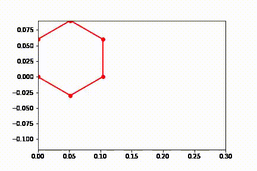
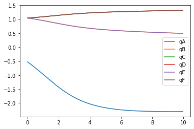
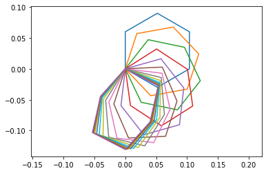
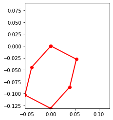

# System Dynamics
## Team 2
## Kevin Julius, Romney Kellogg, Sanchit Singhal, Siddhaarthan Akila Dhakshinamoorthy


## 0. Dynamics Figure:

### Dimensioned Figure:


### Dynamics Figure:


#### Above the kinematic modeling was performed by seperating the sarrus linkage into 2 2-bar linkages (AB and ED) with a constant distance lc between their endpoints (pBC and pDC).

## 1. Scale:


```python
%matplotlib inline
```


```python
import pynamics
from pynamics.frame import Frame
from pynamics.variable_types import Differentiable,Constant
from pynamics.system import System
from pynamics.body import Body
from pynamics.dyadic import Dyadic
from pynamics.output import Output,PointsOutput
from pynamics.particle import Particle
import pynamics.integration
import sympy
import numpy
import matplotlib.pyplot as plt
plt.ion()
from math import pi
from math import degrees, radians
from pynamics.constraint import Constraint
import scipy.optimize
```


```python
# Initializing Pynamics
system = System()
pynamics.set_system(__name__,system)
# Defining Link Constants
lAi=.060 #all in m
lBi=.060
lCi=.060
lDi=.060
lEi=.060
lFi=.060

lA = Constant(lAi,'lA',system)
lB = Constant(lBi,'lB',system)
lC = Constant(lCi,'lC',system)
lD = Constant(lDi,'lD',system)
lE = Constant(lEi,'lE',system)
lF = Constant(lFi,'lF',system)

#mass calculated using density of corregated paper and volume
a=.06 #m
b2=.04 #m
c=.004 #m
rho=689 #kg/m^3
m=a*b2*c*rho

mA = Constant(m,'mA',system) #in kg
mB = Constant(m,'mB',system)
mC = Constant(m,'mC',system)
mD = Constant(m,'mD',system)
mE = Constant(m,'mE',system)
mF = Constant(m,'mF',system)

g = Constant(9.81,'g',system)
b = Constant(0,'b',system)
k = Constant(0,'k',system)

preload1 = Constant(0*pi/180,'preload1',system)
preload2 = Constant(0*pi/180,'preload2',system)
preload3 = Constant(0*pi/180,'preload3',system)
preload4 = Constant(0*pi/180,'preload4',system)
preload5 = Constant(0*pi/180,'preload5',system)
preload6 = Constant(0*pi/180,'preload6',system)

```

## 2. Define Inertias & Kinematic Defining:


```python
#6 equal size links have same Ixx,Iyy,Izz
Ixx=(1/12)*m*(b2**2+c**2)
Iyy=(1/12)*m*(a**2+c**2)
Izz=(1/12)*m*(a**2+b2**2)


Ixx_A = Constant(Ixx,'Ixx_A',system)  #in kg*m^2
Iyy_A = Constant(Iyy,'Iyy_A',system)
Izz_A = Constant(Izz,'Izz_A',system)
Ixx_B = Constant(Ixx,'Ixx_B',system)
Iyy_B = Constant(Iyy,'Iyy_B',system)
Izz_B = Constant(Izz,'Izz_B',system)
Ixx_C = Constant(Ixx,'Ixx_C',system)
Iyy_C = Constant(Iyy,'Iyy_C',system)
Izz_C = Constant(Izz,'Izz_C',system)
Ixx_D = Constant(Ixx,'Ixx_D',system)
Iyy_D = Constant(Iyy,'Iyy_D',system)
Izz_D = Constant(Izz,'Izz_D',system)
Ixx_E = Constant(Ixx,'Ixx_E',system)
Iyy_E = Constant(Iyy,'Iyy_E',system)
Izz_E = Constant(Izz,'Izz_E',system)
Ixx_F = Constant(Ixx,'Ixx_F',system)
Iyy_F = Constant(Iyy,'Iyy_F',system)
Izz_F = Constant(Izz,'Izz_F',system)
```


```python
tinitial = 0
tfinal = 1
fps = 30
tstep = 1/fps
t = numpy.r_[tinitial:tfinal:tstep]
```


```python
tol = 1e-12
```


```python
# Defining State Variables and their derivatives
qA,qA_d,qA_dd = Differentiable('qA',system)
qB,qB_d,qB_dd = Differentiable('qB',system)
qC,qC_d,qC_dd = Differentiable('qC',system)
qD,qD_d,qD_dd = Differentiable('qD',system)
qE,qE_d,qE_dd = Differentiable('qE',system)
qF,qF_d,qF_dd = Differentiable('qF',system)

```


```python
# Declaring Frames
N = Frame('N')
A = Frame('A')
B = Frame('B')
C = Frame('C')
D = Frame('D')
E = Frame('E')
F = Frame('F')
```


```python
# Placing Newtonian Frame
system.set_newtonian(N)
```


```python
# Establishing Frame Rotation Relationships
A.rotate_fixed_axis_directed(N,[0,0,1],qA,system)
B.rotate_fixed_axis_directed(A,[0,0,1],qB,system)
C.rotate_fixed_axis_directed(B,[0,0,1],qC,system)
D.rotate_fixed_axis_directed(C,[0,0,1],qD,system)
E.rotate_fixed_axis_directed(D,[0,0,1],qE,system)
F.rotate_fixed_axis_directed(E,[0,0,1],qF,system)
```


```python
# Defining Point Locations based on kinematics of the system
pNA = 0*N.x+0*N.y+0*N.z
pAB = pNA + lA*A.x
pBC = pAB + lB*B.x
pCD = pBC + lC*C.x
pDE = pCD + lD*D.x
pEF = pDE + lE*E.x
pFtip= pEF + lF*F.x
```


```python
#Center of Masses
pAcm=pNA+lA/2*A.x
pBcm=pAB+lB/2*B.x
pCcm=pBC+lC/2*C.x
pDcm=pCD+lD/2*D.x
pEcm=pDE+lE/2*E.x
pFcm=pEF+lF/2*F.x
```


```python
points = [pNA,pAB,pBC,pCD,pDE,pEF,pFtip]
```


```python
statevariables = system.get_state_variables()
```


```python
# Initial "Guess" for state values
initialvalues = {}
initialvalues[qA]=-30*pi/180
initialvalues[qA_d]=0*pi/180
initialvalues[qB]=60*pi/180
initialvalues[qB_d]=0*pi/180
initialvalues[qC]=60*pi/180
initialvalues[qC_d]=0*pi/180
initialvalues[qD]=60*pi/180
initialvalues[qD_d]=0*pi/180
initialvalues[qE]=60*pi/180
initialvalues[qE_d]=0*pi/180
initialvalues[qF]=60*pi/180
initialvalues[qF_d]=0*pi/180
ini = [initialvalues[item] for item in statevariables]
```


```python
#Establihsing Dependant and Independant states
qi = [qA]
qd = [qB,qC,qD,qE,qF]
```


```python
# Reformating Constants
constants = system.constant_values.copy()
defined = dict([(item,initialvalues[item]) for item in qi])
constants.update(defined)
```


```python
#Angular Velocities
wNA = N.getw_(A)
wAB = A.getw_(B)
wBC = B.getw_(C)
wCD = C.getw_(D)
wDE = D.getw_(E)
wEF = E.getw_(F)

```


```python
IA = Dyadic.build(A,Ixx_A,Iyy_A,Izz_A)
IB = Dyadic.build(B,Ixx_B,Iyy_B,Izz_B)
IC = Dyadic.build(C,Ixx_C,Iyy_C,Izz_C)
ID = Dyadic.build(D,Ixx_D,Iyy_D,Izz_D)
IE = Dyadic.build(E,Ixx_E,Iyy_E,Izz_E)
IF = Dyadic.build(F,Ixx_F,Iyy_F,Izz_F)

#Bodys?
BodyA = Body('BodyA',A,pAcm,mA,IA,system)
BodyB = Body('BodyB',B,pBcm,mB,IB,system)
BodyC = Body('BodyC',C,pCcm,mC,IC,system)
BodyD = Body('BodyD',D,pDcm,mD,ID,system)
BodyE = Body('BodyE',E,pEcm,mE,IE,system)
BodyF = Body('BodyF',F,pFcm,mF,IF,system)
```

## 3. Add Forces:


```python
#Adding Spring Forces
system.add_spring_force1(k,(qA-preload1)*N.z,wNA) 
system.add_spring_force1(k,(qB-preload2)*A.z,wAB)
system.add_spring_force1(k,(qC-preload3)*B.z,wBC)
system.add_spring_force1(k,(qD-preload4)*C.z,wCD)
system.add_spring_force1(k,(qE-preload5)*E.z,wDE)
system.add_spring_force1(k,(qF-preload6)*F.z,wEF)

#Adding Dampers
system.addforce(-b*wNA,wNA)
system.addforce(-b*wAB,wAB)
system.addforce(-b*wBC,wBC)
system.addforce(-b*wCD,wCD)
system.addforce(-b*wDE,wDE)
system.addforce(-b*wEF,wEF)
```


    <pynamics.force.Force at 0x212ebac6ca0>


```python
#Gravity in -z direction
system.addforcegravity(-g*N.y)
```

## 4. Add Constraints:


```python
# Constraint 1:
eq_vector=pFtip-pNA
# Constraint 2:
eq_vector2 = pCD-pBC
# Constraint 3:
eq_vector3= pBC-pNA
```


```python
eq = []
# pFtip and pNA have to be on the same point
eq.append((eq_vector).dot(N.x))
eq.append((eq_vector).dot(N.y))
# pDC and pBC must have the same y coordinate in the F frame
eq.append((eq_vector2).dot(F.y))
# pNA-pBC must have the same x coordinate in the F frame 
eq.append((eq_vector3).dot(F.x))
```


```python
# Substituting Constants(Link Lengths) In Kinematic Model
eq = [item.subs(constants) for item in eq]
```


```python
# Taking Derivative of equation constraints
eq_d=[(system.derivative(item)) for item in eq]
eq_dd=[(system.derivative(item)) for item in eq_d]
```

## 5. Solution:


```python
#get system dyamics
f,ma = system.getdynamics()
```

    2021-02-28 20:23:23,283 - pynamics.system - INFO - getting dynamic equations
    


```python
#solve for acceleration
func1,lambda1 = system.state_space_post_invert(f,ma,eq_dd,return_lambda = True)
```

    2021-02-28 20:23:24,428 - pynamics.system - INFO - solving a = f/m and creating function
    2021-02-28 20:23:24,443 - pynamics.system - INFO - substituting constrained in Ma-f.
    2021-02-28 20:23:31,328 - pynamics.system - INFO - done solving a = f/m and creating function
    2021-02-28 20:23:31,328 - pynamics.system - INFO - calculating function for lambdas
    


```python
#integrate
states=pynamics.integration.integrate(func1,ini,t,rtol=tol,atol=tol, args=({'constants':system.constant_values},))
```

    2021-02-28 20:23:31,350 - pynamics.integration - INFO - beginning integration
    2021-02-28 20:23:31,351 - pynamics.system - INFO - integration at time 0000.00
    2021-02-28 20:23:42,899 - pynamics.system - INFO - integration at time 0000.19
    C:\Anaconda3\lib\site-packages\scipy\integrate\odepack.py:247: ODEintWarning: Excess work done on this call (perhaps wrong Dfun type). Run with full_output = 1 to get quantitative information.
      warnings.warn(warning_msg, ODEintWarning)
    2021-02-28 20:23:49,142 - pynamics.integration - INFO - finished integration
    


```python
#Plot
plt.figure()
artists = plt.plot(t,states[:,:6])
plt.legend(artists,['qA','qB','qC','qD','qE','qF'])
```


    <matplotlib.legend.Legend at 0x212ec4544c0>


    

    


```python
#Energy
KE = system.get_KE()
PE = system.getPEGravity(pNA) - system.getPESprings()
energy_output = Output([KE-PE],system)
energy_output.calc(states)
energy_output.plot_time()
```

    2021-02-28 20:23:49,569 - pynamics.output - INFO - calculating outputs
    2021-02-28 20:23:49,587 - pynamics.output - INFO - done calculating outputs
    


    

    


```python
#Motion
points = [pNA,pAB,pBC,pCD,pDE,pEF,pNA]
points_output = PointsOutput(points,system)
y = points_output.calc(states)
points_output.plot_time(20)
```

    2021-02-28 20:23:49,749 - pynamics.output - INFO - calculating outputs
    2021-02-28 20:23:49,755 - pynamics.output - INFO - done calculating outputs
    


    

    


```python
from matplotlib import animation, rc
from IPython.display import HTML
points_output.animate(fps = fps,movie_name = 'render.mp4',lw=2,marker='o',color=(1,0,0,1),linestyle='-')
HTML(points_output.anim.to_html5_video())
```



    

    


### Unlike the triple pendulum example this sarrus linkage is a loop mechanism. When it falls the linkage extends and swings until it breaks the simulation when fully extended (most likely due to the multiple constraints on the saurus linkage). This falling is only a symptom of the floating top point that would be fixed in a more accurate dynamics simulation that is not trying to fulfill this assignments goals. Adding some damping seems to solve this problem as seen below.


## 6. Tuning:

### The value of the dampers on each joint was set to b=.05 to obtain the following results of slowing down the fall and reducing the expansion of the saurus linkage allowing a stable fall.

### Plot of state variables, since the sarrus linkage is symetrical three variable lines are layered on top of eachother.




### Below is the motion plot of the mechanism 



### Below is the animation and final stable position of the mechanism





```python

```
