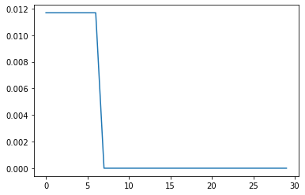

# System Dynamics
## Team 2
## Kevin Julius, Romney Kellogg, Sanchit Singhal, Siddhaarthan Akila Dhakshinamoorthy


## 0. Dynamics Figure:

### Dimensioned Figure:


### Dynamics Figure:


#### Above the kinematic modeling was performed by seperating the sarrus linkage into 2 2-bar linkages (AB and ED) with a constant distance lc between their endpoints (pBC and pDC).

## 1. Scale:


```python
%matplotlib inline
```


```python
import pynamics
from pynamics.frame import Frame
from pynamics.variable_types import Differentiable,Constant
from pynamics.system import System
from pynamics.body import Body
from pynamics.dyadic import Dyadic
from pynamics.output import Output,PointsOutput
from pynamics.particle import Particle
import pynamics.integration
import sympy
import numpy
import matplotlib.pyplot as plt
plt.ion()
from math import pi
from math import degrees, radians
from pynamics.constraint import Constraint
import scipy.optimize
```


```python
# Initializing Pynamics
system = System()
pynamics.set_system(__name__,system)
# Defining Link Constants
lAi=.060 #all in m
lBi=.060
lCi=.060
lDi=.060
lEi=.060
lFi=.060

lA = Constant(lAi,'lA',system)
lB = Constant(lBi,'lB',system)
lC = Constant(lCi,'lC',system)
lD = Constant(lDi,'lD',system)
lE = Constant(lEi,'lE',system)
lF = Constant(lFi,'lF',system)

#mass calculated using density of corregated paper and volume
a=.06 #m
b2=.04 #m
c=.004 #m
rho=689 #kg/m^3
m=a*b2*c*rho

mA = Constant(m,'mA',system) #in kg
mB = Constant(m,'mB',system)
mC = Constant(m,'mC',system)
mD = Constant(m,'mD',system)
mE = Constant(m,'mE',system)
mF = Constant(m,'mF',system)

g = Constant(9.81,'g',system)
b = Constant(0,'b',system)
k = Constant(0,'k',system)

preload1 = Constant(0*pi/180,'preload1',system)
preload2 = Constant(0*pi/180,'preload2',system)
preload3 = Constant(0*pi/180,'preload3',system)
preload4 = Constant(0*pi/180,'preload4',system)
preload5 = Constant(0*pi/180,'preload5',system)
preload6 = Constant(0*pi/180,'preload6',system)

```

## 2. Define Inertias & Kinematic Defining:


```python
#6 equal size links have same Ixx,Iyy,Izz
Ixx=(1/12)*m*(b2**2+c**2)
Iyy=(1/12)*m*(a**2+c**2)
Izz=(1/12)*m*(a**2+b2**2)


Ixx_A = Constant(Ixx,'Ixx_A',system)  #in kg*m^2
Iyy_A = Constant(Iyy,'Iyy_A',system)
Izz_A = Constant(Izz,'Izz_A',system)
Ixx_B = Constant(Ixx,'Ixx_B',system)
Iyy_B = Constant(Iyy,'Iyy_B',system)
Izz_B = Constant(Izz,'Izz_B',system)
Ixx_C = Constant(Ixx,'Ixx_C',system)
Iyy_C = Constant(Iyy,'Iyy_C',system)
Izz_C = Constant(Izz,'Izz_C',system)
Ixx_D = Constant(Ixx,'Ixx_D',system)
Iyy_D = Constant(Iyy,'Iyy_D',system)
Izz_D = Constant(Izz,'Izz_D',system)
Ixx_E = Constant(Ixx,'Ixx_E',system)
Iyy_E = Constant(Iyy,'Iyy_E',system)
Izz_E = Constant(Izz,'Izz_E',system)
Ixx_F = Constant(Ixx,'Ixx_F',system)
Iyy_F = Constant(Iyy,'Iyy_F',system)
Izz_F = Constant(Izz,'Izz_F',system)
```


```python
tinitial = 0
tfinal = 1
fps = 30
tstep = 1/fps
t = numpy.r_[tinitial:tfinal:tstep]
```


```python
tol = 1e-12
```


```python
# Defining State Variables and their derivatives
qA,qA_d,qA_dd = Differentiable('qA',system)
qB,qB_d,qB_dd = Differentiable('qB',system)
qC,qC_d,qC_dd = Differentiable('qC',system)
qD,qD_d,qD_dd = Differentiable('qD',system)
qE,qE_d,qE_dd = Differentiable('qE',system)
qF,qF_d,qF_dd = Differentiable('qF',system)

```


```python
# Declaring Frames
N = Frame('N')
A = Frame('A')
B = Frame('B')
C = Frame('C')
D = Frame('D')
E = Frame('E')
F = Frame('F')
```


```python
# Placing Newtonian Frame
system.set_newtonian(N)
```


```python
# Establishing Frame Rotation Relationships
A.rotate_fixed_axis_directed(N,[0,0,1],qA,system)
B.rotate_fixed_axis_directed(A,[0,0,1],qB,system)
C.rotate_fixed_axis_directed(B,[0,0,1],qC,system)
D.rotate_fixed_axis_directed(C,[0,0,1],qD,system)
E.rotate_fixed_axis_directed(D,[0,0,1],qE,system)
F.rotate_fixed_axis_directed(E,[0,0,1],qF,system)
```


```python
# Defining Point Locations based on kinematics of the system
pNA = 0*N.x+0*N.y+0*N.z
pAB = pNA + lA*A.x
pBC = pAB + lB*B.x
pCD = pBC + lC*C.x
pDE = pCD + lD*D.x
pEF = pDE + lE*E.x
pFtip= pEF + lF*F.x
```


```python
#Center of Masses
pAcm=pNA+lA/2*A.x
pBcm=pAB+lB/2*B.x
pCcm=pBC+lC/2*C.x
pDcm=pCD+lD/2*D.x
pEcm=pDE+lE/2*E.x
pFcm=pEF+lF/2*F.x
```


```python
points = [pNA,pAB,pBC,pCD,pDE,pEF,pFtip]
```


```python
statevariables = system.get_state_variables()
```


```python
# Initial "Guess" for state values
initialvalues = {}
initialvalues[qA]=-30*pi/180
initialvalues[qA_d]=0*pi/180
initialvalues[qB]=60*pi/180
initialvalues[qB_d]=0*pi/180
initialvalues[qC]=60*pi/180
initialvalues[qC_d]=0*pi/180
initialvalues[qD]=60*pi/180
initialvalues[qD_d]=0*pi/180
initialvalues[qE]=60*pi/180
initialvalues[qE_d]=0*pi/180
initialvalues[qF]=60*pi/180
initialvalues[qF_d]=0*pi/180
ini = [initialvalues[item] for item in statevariables]
```


```python
#Establihsing Dependant and Independant states
qi = [qA]
qd = [qB,qC,qD,qE,qF]
```


```python
# Reformating Constants
constants = system.constant_values.copy()
defined = dict([(item,initialvalues[item]) for item in qi])
constants.update(defined)
```


```python
#Angular Velocities
wNA = N.getw_(A)
wAB = A.getw_(B)
wBC = B.getw_(C)
wCD = C.getw_(D)
wDE = D.getw_(E)
wEF = E.getw_(F)

```


```python
IA = Dyadic.build(A,Ixx_A,Iyy_A,Izz_A)
IB = Dyadic.build(B,Ixx_B,Iyy_B,Izz_B)
IC = Dyadic.build(C,Ixx_C,Iyy_C,Izz_C)
ID = Dyadic.build(D,Ixx_D,Iyy_D,Izz_D)
IE = Dyadic.build(E,Ixx_E,Iyy_E,Izz_E)
IF = Dyadic.build(F,Ixx_F,Iyy_F,Izz_F)

#Bodys?
BodyA = Body('BodyA',A,pAcm,mA,IA,system)
BodyB = Body('BodyB',B,pBcm,mB,IB,system)
BodyC = Body('BodyC',C,pCcm,mC,IC,system)
BodyD = Body('BodyD',D,pDcm,mD,ID,system)
BodyE = Body('BodyE',E,pEcm,mE,IE,system)
BodyF = Body('BodyF',F,pFcm,mF,IF,system)
```

## 3. Add Forces:


```python
#Adding Spring Forces
system.add_spring_force1(k,(qA-preload1)*N.z,wNA) 
system.add_spring_force1(k,(qB-preload2)*A.z,wAB)
system.add_spring_force1(k,(qC-preload3)*B.z,wBC)
system.add_spring_force1(k,(qD-preload4)*C.z,wCD)
system.add_spring_force1(k,(qE-preload5)*E.z,wDE)
system.add_spring_force1(k,(qF-preload6)*F.z,wEF)

#Adding Dampers
system.addforce(-b*wNA,wNA)
system.addforce(-b*wAB,wAB)
system.addforce(-b*wBC,wBC)
system.addforce(-b*wCD,wCD)
system.addforce(-b*wDE,wDE)
system.addforce(-b*wEF,wEF)
```


    <pynamics.force.Force at 0x212ebac6ca0>


```python
#Gravity in -z direction
system.addforcegravity(-g*N.y)
```

## 4. Add Constraints:


```python
# Constraint 1:
eq_vector=pFtip-pNA
# Constraint 2:
eq_vector2 = pCD-pBC
# Constraint 3:
eq_vector3= pBC-pNA
```


```python
eq = []
# pFtip and pNA have to be on the same point
eq.append((eq_vector).dot(N.x))
eq.append((eq_vector).dot(N.y))
# pDC and pBC must have the same y coordinate in the F frame
eq.append((eq_vector2).dot(F.y))
# pNA-pBC must have the same x coordinate in the F frame 
eq.append((eq_vector3).dot(F.x))
```


```python
# Substituting Constants(Link Lengths) In Kinematic Model
eq = [item.subs(constants) for item in eq]
```


```python
# Taking Derivative of equation constraints
eq_d=[(system.derivative(item)) for item in eq]
eq_dd=[(system.derivative(item)) for item in eq_d]
```

## 5. Solution:


```python
#get system dyamics
f,ma = system.getdynamics()
```

    2021-02-28 20:23:23,283 - pynamics.system - INFO - getting dynamic equations
    


```python
#solve for acceleration
func1,lambda1 = system.state_space_post_invert(f,ma,eq_dd,return_lambda = True)
```

    2021-02-28 20:23:24,428 - pynamics.system - INFO - solving a = f/m and creating function
    2021-02-28 20:23:24,443 - pynamics.system - INFO - substituting constrained in Ma-f.
    2021-02-28 20:23:31,328 - pynamics.system - INFO - done solving a = f/m and creating function
    2021-02-28 20:23:31,328 - pynamics.system - INFO - calculating function for lambdas
    


```python
#integrate
states=pynamics.integration.integrate(func1,ini,t,rtol=tol,atol=tol, args=({'constants':system.constant_values},))
```

    2021-02-28 20:23:31,350 - pynamics.integration - INFO - beginning integration
    2021-02-28 20:23:31,351 - pynamics.system - INFO - integration at time 0000.00
    2021-02-28 20:23:42,899 - pynamics.system - INFO - integration at time 0000.19
    C:\Anaconda3\lib\site-packages\scipy\integrate\odepack.py:247: ODEintWarning: Excess work done on this call (perhaps wrong Dfun type). Run with full_output = 1 to get quantitative information.
      warnings.warn(warning_msg, ODEintWarning)
    2021-02-28 20:23:49,142 - pynamics.integration - INFO - finished integration
    


```python
#Plot
plt.figure()
artists = plt.plot(t,states[:,:6])
plt.legend(artists,['qA','qB','qC','qD','qE','qF'])
```


    <matplotlib.legend.Legend at 0x212ec4544c0>


    

    


```python
#Energy
KE = system.get_KE()
PE = system.getPEGravity(pNA) - system.getPESprings()
energy_output = Output([KE-PE],system)
energy_output.calc(states)
energy_output.plot_time()
```

    2021-02-28 20:23:49,569 - pynamics.output - INFO - calculating outputs
    2021-02-28 20:23:49,587 - pynamics.output - INFO - done calculating outputs
    


    

    


```python
#Motion
points = [pNA,pAB,pBC,pCD,pDE,pEF,pNA]
points_output = PointsOutput(points,system)
y = points_output.calc(states)
points_output.plot_time(20)
```

    2021-02-28 20:23:49,749 - pynamics.output - INFO - calculating outputs
    2021-02-28 20:23:49,755 - pynamics.output - INFO - done calculating outputs
    


    

    


```python
from matplotlib import animation, rc
from IPython.display import HTML
points_output.animate(fps = fps,movie_name = 'render.mp4',lw=2,marker='o',color=(1,0,0,1),linestyle='-')
HTML(points_output.anim.to_html5_video())
```


<video width="432" height="288" controls autoplay loop>
  <source type="video/mp4" src="data:video/mp4;base64,AAAAIGZ0eXBNNFYgAAACAE00ViBpc29taXNvMmF2YzEAAAAIZnJlZQAAMoptZGF0AAACrgYF//+q
3EXpvebZSLeWLNgg2SPu73gyNjQgLSBjb3JlIDE2MSByMzA0OCBiODZhZTNjIC0gSC4yNjQvTVBF
Ry00IEFWQyBjb2RlYyAtIENvcHlsZWZ0IDIwMDMtMjAyMSAtIGh0dHA6Ly93d3cudmlkZW9sYW4u
b3JnL3gyNjQuaHRtbCAtIG9wdGlvbnM6IGNhYmFjPTEgcmVmPTMgZGVibG9jaz0xOjA6MCBhbmFs
eXNlPTB4MzoweDExMyBtZT1oZXggc3VibWU9NyBwc3k9MSBwc3lfcmQ9MS4wMDowLjAwIG1peGVk
X3JlZj0xIG1lX3JhbmdlPTE2IGNocm9tYV9tZT0xIHRyZWxsaXM9MSA4eDhkY3Q9MSBjcW09MCBk
ZWFkem9uZT0yMSwxMSBmYXN0X3Bza2lwPTEgY2hyb21hX3FwX29mZnNldD0tMiB0aHJlYWRzPTkg
bG9va2FoZWFkX3RocmVhZHM9MSBzbGljZWRfdGhyZWFkcz0wIG5yPTAgZGVjaW1hdGU9MSBpbnRl
cmxhY2VkPTAgYmx1cmF5X2NvbXBhdD0wIGNvbnN0cmFpbmVkX2ludHJhPTAgYmZyYW1lcz0zIGJf
cHlyYW1pZD0yIGJfYWRhcHQ9MSBiX2JpYXM9MCBkaXJlY3Q9MSB3ZWlnaHRiPTEgb3Blbl9nb3A9
MCB3ZWlnaHRwPTIga2V5aW50PTI1MCBrZXlpbnRfbWluPTI1IHNjZW5lY3V0PTQwIGludHJhX3Jl
ZnJlc2g9MCByY19sb29rYWhlYWQ9NDAgcmM9Y3JmIG1idHJlZT0xIGNyZj0yMy4wIHFjb21wPTAu
NjAgcXBtaW49MCBxcG1heD02OSBxcHN0ZXA9NCBpcF9yYXRpbz0xLjQwIGFxPTE6MS4wMACAAAAR
Q2WIhAAz//727L4FNf2f0JcRLMXaSnA+KqSAgHc0wAAAAwAAeB0oXug4SqvQwAAdGP8DnfmAoywA
jDJXI0w6qaHhYV00yXKm+4nLK7fEZbWa/MHDiCA9wu68mO4eFEnAxdf5gQAzCEZ0YDORiVKiWkv4
uJPgtWNwEsM+h6lSAaHexTe+LG2lxUJPMZiQ+5ZwepbJIXXnZuJtI3LwmP08iLaishiz05EsvqlL
py4+4exbTkCIZyyUsKalS2dBjw/h6t+Q2qIjEbb/wIlA9lzYF+Vxr3kqlw4gPFi2O/Vs6s754X7l
i1B0ZJyl76p+MgAc91PhOgXCK9CMNDhlY44UvZ2TDRt5tca3BmEgeuKkHqMzfFg4GFKWdkE2hFGt
zWmSUdmfZuOgB7xuZzBLyOkWzgXOZd6qI6V91LFef4mBWobnJc5UwuWkrfemJ8NeZntkNdYaN/Dm
+H1YacQxSPCu6sUOtB2srSJGLRUq8UowsKWQJoiVbKQHqtNljWUQ0hP1jTshUq8cJpy4daTPaW0v
bcTb1TZ2BL0wVyT7micZopeLilAmDc7+mqZ6Wyf4+qWaJN0AXOzrFGWqVln5wBypH9OGUDUEQsjA
F50z4QxY+7sCYW6RI6MY4qPimF4mUkUMQOvELzW1yj6upVT6pDsgkYO9Py3d5g3gqR0vMhq5bSP/
tqWE4/0BN7a4Wwn6xu+hA92WQanV/s3V/cX6+44YQQa6ttt5ZH6+LOSvwQ1N4tZ2aGuO1G2a961K
zAUPLydFGUhJXaDx2VSmsFYfIhlJArRdVHNFXSQexkQYYp+XmslqBsDuhx6u4FUkcto1GzmZIpW/
Zsqu+vQiojnhbLIcvETVJHY/GdgqvWWi6K9hKTz0BvtTAkkOOmpR9SWgW96Xj6GoviHiqcjna62U
kwE7gCsrxmeqnQ+mJfG/BsZ/jmxej2GhBaQvC0p23z79m0n0LHj/127AfdhuWDL1Pjd7tsM+iYIZ
k5pVsyJ6rtbYAcCwNs9ITmBnlmU0ygoTpoxSnQc0YAtUhU4HUA6BIPeEKA/yeXmN33VRYUbwfYmw
GdgHQtG0GcJTND2uX+TTA/Vo2BKJHk82NXjCXqHGjKxykb9kgbYrtw9peOBUovejjTTffu3bN048
5N/hhHxPZ/+J0Zgy/9fqvvi055pRsBFO8DTcw+C6WZ2MIz/heW386x5VPLItc/RVgk59OzCHlPNz
UVkWWduhSYN7S1b/Kdsi86HY0klS/BtXdcXJS4H4/CroYpNcZVL7Pdi4sVJVpOyHdE5uXCrTYPim
buoGtyb5KaNfMuIaw2LZYVMFKcirwx0s/B/EDj9LAQhPPLzMr1+LbsN3ZO78HOJyADAoe+xcmeSo
qRauRS8f113Z9V9XshgObA4eRrgndyUSXOzZzhXQAaqsUBMgXXZl1XNSy/plOv7X06/ijFmkVr1g
WvQLXZO7LPUesqWazU0xgrt3z+KJaPqWtIE79RlXJl5eT+5MvI8v3fFLp1tPAEisBxRQKcKuq+qm
zVmXRIh35JaX4DE2xcmDsdDZqKIGvRDUngyO3m3UTqD4yE/c70/EFJuA2GEfJMgrEo+mxjhs4rwH
gyIyl9yPyV+yNNCtZBcCLTAjHjIBwRuGwLa9/Rq7UwCAslKzDq3Pu9pu00AlPxCgJMPUAc3mKRKn
ZmwGzcLroWjYwayrvRElUHftI0SMp/jb6lSwlDhlZK5aoAZMXmVb35ZxcFOx8YRnHanpaqj94hZ0
0T0PD/+KevIXTGNCm0xcrr0GOwTMkcboVD2oz5fDIsX+zIqpbtWlaFIC+gKWx3m3Va2eRWOhxffu
FfkdnjgKW7R3Sp0ZikacNPJTSb5DtbWKNDDw3DCmNXaANeB8iqESOtTjArI0hMmdlGPKcEHLaQ1E
sICzxj/Rac+Xqa5A1x1YFOjCA/KOVT2dB1+fv9pDMjnaZjt0aOw7lFpwLpIUfeugfSMD3nR+ekZj
udj9BsU1vj3eiKqL+3rcSxYZ5iTKFeJwv0OiK9XwhB2oy8iVoqctYl9Hzw3nZiipntuwq10vtnfa
Tk44542xrg/V7/K4U6OTuENOppM/igIiYQ4ltW2vJorNRrLWVrTHFrVOD19jDChAOSN8eZgQ1BY/
393hPj/ALEfpY1zaiPBEdHr18KzQrdDV/wluxsld3tRsHSA49pKpdQPRnX9oT94g0gP+wiwhSE4Z
KJEABBL4M5ZMgu7Pexuy70E9gEKNJ+Lu0i33k79j3CJu5sqk3HDx/tBlYDP9dzis4buRyYizo9pV
04Uhws/OcztAGaOsgYkRyrbFGAPMS+5fr1MnlXWS6Y33PgjAK8mNQ8KPvjTiZvEthWhD0/6+n4rl
tMiFuxNlcZry/VVXMmYx36H4x/pQ900hhyQz31LZhdoZPwtmMAxiGwR884thpmEo7ej9dp369mb+
T15sVHQFOCeElxA1efRzY3rg95rUE2OVHB3REb97iXD6bPlxFCmRhoPDrwe8auBBocQZxqGqagUB
CsqBbquup9QUMEGJQILvw4lZ3BjyMhFfYh6w6uFGkSUuycp9c6UxlWf9z8RBWABmKi3A+b+h0kGU
v0lJ1rqIfdDGdoFi22bVEiGMy3lm0Zw6Jb5eW4qddY61iDf2zYVvNM+6M+H5FjB+aEm3FG1fpexs
okgaMIw2eV3p51A7wpZJvA3H70gmTTJdZ85STfCfca4Zee0DdPQGiOuLOYBb2PU9lJwBSW0qOXMH
Ph7G7pYTPx+erkpKeaJS5/Az3R87LwUhrxcUboaU45cleYluVeHdNenJia9G+xrlrwclU8+dO5hO
WiwSNPgEFQAC/Uyh9pxmJDU6ZyL5IB0T/W+9ajr6fib/SXxJTH1skW6q7WIXcd3bw2yTTPiX9EJ7
dWoVRieuW6RLB8b2WOzcJMVIYKWDEPJEknrEzWHAu3PHsJg4KcXxLz980iQ8PF8X3ADJnqjMhtm8
p4YzSRy8A0Rc7xsQhoBlc/vPyUAeKEGJrG0zdCXRxcB1tEJYE1qaJQXMqAW41ioIX9ZuMdQ1+Bsf
2nctiwR2J8XR4qMOt8i6HEezZfu4oASTZ5DWDV0/ooUr+LmLz5qWxGmpA8na/5V0L9q/wAAWSRd3
PpPYZNGNlgDzbIbpxpMIzFyYeR4awcj9tq4f9erokAzX5ZAQ0AyifvNTQJOXupzty3+Xy9SbP/gF
QELMABoAy7H+Yljk65Z2GpUqtHnRim7nqrzBhG80nyptwjL2Zs5TgOra8R9WoCRpMvX35zfyk0jy
i9FBtdOoAiUXNO9m9AluUSSQxGxdxf/u8lJwI7iKZie4HVOq952d1NfViHuVBR02ODx/dBcHlgic
rfIhuac+5w42mgbbSaNx8I9q8Iaq3T5eT9l4s5u4JSNBPJAEVSdD6s4CBOIKMeouXxROhm1//t7r
lppCP7gdK1icc8PwRYanc8/2a6dBdHSIv4QKlJEGIPFM+WnSZhfpqBwH4EdG5UG7CaeT40tDsa52
riRVL0VbC3htGjXuRzHbrQZqQAwg/Gvetr014oKEMnMu+h5w2ppA/rtg6iauu3OtR2sSE+rvY3fQ
Elvbftv6ld/FeZ7hLrwLZgZXnkpXSptnmcMTsT9zDGmPWPTGkJAqxI6VF3ZYIgvV/zs+h7j8Ms1h
aSBfa2uppKbJfpKCjem65TO0HhdiF3MJjq71RjXaDt+mqvdFquUhoqkiWsSqGHRjUt5Qzuszc8/d
V6yjt+zAEDbLETg5WPPyDS/BMAe7JABShEzb4/3BsuGjkvtBXhpxZnEbERWjcYxZOfdfBuLfDJGZ
fT4ChK+1daHKxjnNKeGzntkZr/vW7qLulxxtsFxDzEA4Hxu+C6Im1FBdP2El7uUz+eEtOE+/ziHK
PSCiiyA859UlNc+jT7XgLtAzFmoGymX2V+wvAVMen86SLisEOFipnGV/owOcdXdTPZL+U0gMIzzY
QQgHMJVUNXY3C6c/XmiMnaWBoQ8UoDV9CpiNib0hsFb2FpMSPpNZoK0axUuQMO0xaAoaYgLZe1q4
Ey5lm2gfHPM37FTRsir4U40QhjfUaU01MBvsaT6CCdEE4w/g0bZRwVQABpKy8xYlzh7Hne+gEdJU
d1PA8FV2dWNMtJkgpGTvJLZ1JvGOnaLP9zmD2MDHw5QziQK3onJZTkwMvhscGBeO0SRpn6/H5jFl
q/OYMF8nqml4AnjJTJykOM3W7P0ExBjjhJpohzaeAgEPFeVmlH0mPkzxDrMpxPAK1eJPudi6RRiA
2Ge75ZtFEtNl4uJBm32Mb0xp/6Jnp1dVKj2/yWAKYs1KSUcgxkt/ULEvDtj92eGEq5Z5dl1mxFbQ
uG0YXARXWMGSAx42V8hOdKfDbZf/4Egl53U11x42hm9mOaF2XXzySFTpGsAZ2Av0s3/3ARTYu19N
od7mu/mHVv2utK45CTtVfhFWVH4BRGHits+E0EMf/Meh2dBCms6jNNU4bysHCE2hQfB2d2rGF2/O
7JeRA7IIOo3ix/0Rf/nAPEU8pb3l0E+mifXdge3AODlhdHM/OzsxmiNVdgERVMfMWbxqlrwJu12p
BTcTFhT0DJatT5pEt9Dl7L0krve9rsUlf6+a3+xNMM/0bb4MD73k12wmBdqR+8PHzZ4kV8c7kBP0
nqzQUEdPPKfA31UZtGzfnWJE4MKAxLaL6OM9Z3fi61bjOkYUjdioW0X0OR5fwL5jhUcKxrOzwy76
zsOrYHj8UIfHXv8G6XDHrwJUcPhEdMhzSwGNx+NB8Puc1egkzVAK57T0ViAAceExttLgjR0maPXm
ce8nr3KFkeYebc7b5URr+fb1Bw6wAN9XqDZZkChnrW34tuZ1nyEvtxzLur8qQZYHKnWB+w7iMxVj
S0wDxxlmyGXh3ILz5QIXgVHhcXFwTSr07+OpBPVdjGLkf+ColK9qpB8BkJGK7u8rZb/Z5BRVSWXG
3kvl4LVS+HUTQ9jwICMsqc7JxDPxmmfy1YhKZBNoZBtQfUFhqBHFpO5r8ordB/K8H7SrKeVAKnk4
AS1HKxK/PAHSbokRbhFtvW+5qSBvgWbSxBmaoMOPh6qcxFacRte41oUDms8nJcmNcb7qos2GiFJo
U3rnpHlgZ+phpXJgtvYQcnWnzFTy/ZucwUkiW0Ffl176veZbUllRvQkkm3W3n6AnZkFM52YcyGLL
uOGWAWMIHxQL5THo9aha/sfrf885116DbaaFcIsFHdbxRkEDPc3RHcKo2Tlty4AZIS8P8PnFw4T9
U9fECwjHln0hexv01yQ/ov4P2nWFQ/Ub+3k4ZM3k+4TTiu4tgfE7Rd4CfwxTp/vMqzrSJReYm/OB
/UyHpJ3g+WNu9CgbWW6iXfYQam0/NVEhPe/fEnXgo+NrZYkt/wsg2b9Re3mHJ6TM/roXVlNdSBY4
iyoOkWLUi6jPeMoecKPS7TGA12FFSKdGxOxl8iODfBj7y9NFjqHCZzy5Tw7focTc3t7vko4YYOdP
XKIA7lplX7YkDSb2RaP7utEY2yzdKEp9Di9ENro3Ou+nVJfwkiH//xPf1F4MnilNxjtbSOkhsxi8
kKKSZ43hrT5cSmHO6Ja6YdcZlC5lO2GOgq2dMVBSNWvUnOGfPORwtrGAAM1x2tzY87td2sf0shbX
MWO5bKp94DGPtlO+DggUW0jVRRW9MPGADKAueD77TSAYcNeWBAY6bqDYpvG+71pkqFwdMN1esr1K
9hclIPiAl2BH61zHA8Z9kZnOju3WhWXgPcs/DJluICgGoJnpHm2clvPAixQKTKCuEjhjgoYq3syi
hlcnQ417tkmBoiR/vswExnnQ5TEIZXnz8FI1dxSXXxMzDKtNMDcTnSOX6QA3ir+zCv9yBjZh2XxL
qt8GM8FLjipC9Z7mCFN+w3PgAAADADxKTJzrJLjlgQAAArlBmiFsQ3/+p4QB285lAW+g3dTQWstp
jhikCG+BLCu57qhyJv9Gtqa5E9dQ21izfYtpGkptJV3L6Y06fM6qoQWIML4GTke7dV0wiq0pgTnN
9aQg67dR3TKMvWYxUP6NQZzT8KjK0RJk/Qhln5wTQ0ooEmf34mB67pjMfNCkBP4RS7B/whGzN1nF
Wm7tEgb4tkrYZxSvMnc6XpwjJRR4zEgKyDEXzrlk3nn4Z/QZmxSv+2ThXoB5tnSkTs77I40U6KKf
oQ/4LqkQ3BCl/VmAJJBXrLeoyMV2t79MO8UTVOOuXIowhUXO+Awz3+2NdxCTMmRwHUHeqdp53Bs5
FFEZg9Tlpj9+2JHbbQRe/66Hh65ojP7fvQdjPasOlZW7hY73O+WpDKAcOviD9L4AB4GtDsnFm1EP
ez3dUqpgmaSSNAdFKdlc2f/54NGpkp6NcXqhfsX9Ttr3Oo6hxLCCrKQ9vc01P893ZKAnFzj7NUG8
Ta+Y8gxZK8t+FxgM/6/Z95Ol/OccRam6M1SDyIrLOkBpSj3QJLzmcufjDWduhg7mtIvwI4f5q1cX
XJPkUgDiDYPjdyvw0h/5TYVU4yHuzkPc2IhUeCg+aSEj/7mZjlkOujk/s77RqN/XJkB/nrzi7f7u
28TeAArz7WJ8GZR9Ez/WrwiLnYHnpkfhCnq62Rwa/O3EvPyD9k6qrjqFCWheJfCss/YmAYNa1FKT
Hga96t4PgYm0LGQFtzsxLGEMjC831EOzKPLUknxnPAc1H2Acn2tv4aVvYYnS61xwfnLPyAog9IC4
hBOimskqjRHmVp7URoQc5me1+pMcOrAC8S+HJzoBa/gSWXBAFKdL9aE3p+xGGsQSNq5lKjzz1VMv
bLJdkqLL4TYGaXYnvbOsOKiuf8edxsKu9fita8Ual1asr3s1r4vA1oT48sx8zHLAAAAE9UGaRDwh
kymEN//+p4QBxvAVewXJcKlAWto2Qgdc++Eh7bAd+EaatoARB7v9WOYuqp285bs/pY5MBdGKxBbc
SXRtDZKsbV3ftHdVcQF0Xsj7HG7x7pISOtn8UdYd61nKmZOOhxOKcEB9K1PsitmAoWj5I4GCVk8T
aibq05hBCwSI3j2uY1hca/t///aJvMv76s1o1+1vuZAufaPAxf4t4xIj687NsD2tuTA0nPr0mJxc
2bhYDmx2HB8RPuY5XoqfPgneidxyxkiOObLSPi5cNhr9klHqtPAwLr0ZWg4LsdRdlyjPU6jtb4br
NEfT+k5RpZywg1tTUAM9Afpoc16P34A3yqY1wk+sRqkf2N/MnauNjomQ90itYluiafS1CC6J2j4d
LYL3pfAY9VF7fd4b9A/c9Cc/rh3sKvSzGO/7zkDoc58Qql18u66+3mG0hnMoKFTFZqu8RpQLYMrU
l+Gbxj8/xpELjY3Mrry7TReBe5XUU6KuK1mocurvaNURNGO3d7ynUch/zFDK+5GieEchRl1SrtLT
LPswvFrLaVnSd8X34PSAFivo7loZ1arXVJwV0nYxV7r6/MpipqBXtHnMUNb+t1ZyTm7xVwAlHtD6
5vcGB6mLB2i+kfiEp5w5sOAAqlcFFFTLYSbsHKXH7MaPcEiT6jnbtL68eaxNK4nfKtYt99fb/MBr
HTYTeK+EHAGvveM0cb38X77Gyf6pPWnNJ7eq5j4N9rXfDMCSA+QmUFQZvAUKzDHx7oh7Ei8YywIM
Ean2iePgVbu5cHVFT4kCOoqwVAHeMCg7PaLZ4d1sZDsN/11e6ZRFiGRPUQnziBm+n2KVIIIx7110
AAaI5drnDDUa4WBlNF3UjL3vJMQS5inwYcF6TWlEh8muM5e/UnVp7XUJrJKwHIVtMzc7NE6Own8I
3du48/nBNnAmJchaUSFR14LxNHq4zopli9Z1iNV/LnA+gquMowSoDD3RtY8SmX4NCL7glqHQeN2J
ut5nyhRUh22Jr4J9yjAaBRLf3yVc2/qcuDgGmmo1yj5qSRNiHfRJIe+O9mmtmYHkkkwrIKloCCZY
cHCbT8LBV8AtLrpRJJlZm48Xgmc9uygyJudGcrT4xKTnPZVPTLUDHdUh9449SxmuLmCxewAdcqqW
QEA9b7eWzduosRoB9/ff+DRX1CXnuvNwglUKXvowRUqHPknVugesQLEwa/KuIQkeWeBoomx+j5jG
P6J5hCnvdsuXMRGIp/Qv5IToTzterO7au8X8T1Et8ad5neMr2EnvoZEev1reLU72D6HV3hiNgAA5
0+sGc/sTOlr8S+txz1QDta6pVEOC626LRf3ebcE/bLXn+D2N3f3u9KfUiJ9vU+CRVQf0vyC1a5DY
NJXOHWMjcmRvkEKj30BnF/x4uq8iUWdZQO1N+4/M8kKy2tTswF9ce+8BrN8f1P1+/Av8k1XJ7LDK
YBgsLTg008nFiMhWzFp7cNbzdM94XQbezM+ZfMlI2GpOoGWDAVSIUljtlyXA7qWdUAWaomlzoD1r
XU+B/p0c8L6/4kQDq/jO4BXvbbOJyPNn3LvnG3xbHBvxkufWd+2Ir6U7mmqSCRPZhR18cJKgFI3A
ypC/ve7INsnKecgw1M1Lsaayz8WOGppMmmtfl+pADcGn3QD9/rvNvuTVoL4R7++eM3DICOYN5Gdz
RqjLGTaY8cct1wAAA61BnmJqU8K/Au+TNBFVbKt6QAhTypze87JCU4W7fRKO6Lt5UT+TIEC/6xeQ
8roElzrG3kOUjpme7UV9k/NZ9v6ZEHEl1DY4c9tBhLOO8pyAf74PsBuyrDNwflbVAHgNHPj3QZWV
UMuWnlUCFp1GLoRi/cNsCuw3ry8Q0C32qVu1jjTCfHpS7EdHWle5+ttkijnRNAW6fVQob/STmz+m
8AAQvif11QIo6n3pV8WbWVOyIYzmXNl5MhoePW8D6BocmDFFtA/8VsZtPQxfp9/wmSfcCGmuAkTf
n1562BCzI6o9D7hgv6fplAgKQuOKTWdh4ZXlXACmK668dDtVMgbojvv3kfdUA1pXGkMR+BNT5XTk
9QcnFEu2/qCCIIKvm2WopH/WG95E6ww0fnn+MMXPSbDP/0KdCQlC/QtczRGphzrczJ1yRbYjpm8N
iP4ZFgLanJsZHqHmiUBEktuXP84V8rPjOMw/+cIJKmLmPBua/Ia4KwmOYf776ZnBzaDfl257OvLx
HP5/omu6E/Ked6AnXlw2WzXD6MPz2YqzLMPLkBzxaRV5wliivpBTAfmRS5GWASA5ezkBUmwl57oB
Q8M7A0Jx9SH5M9WFJqXTeNTvlqcAV/E1cJiP+z7BQFrLRpmbkUkpQHnnT4hIEqty9vHvPVdaYGhJ
Ltj18sTTzoAxczfN6wLs0KaJYwBD9pIBRbxpOdEOc+33hSeQMt3jPB6E27dRpbf4QCgoCRSOdQFr
F4frTpvqaWtFGaMWAI7EW+S7P5QhW8HuYi5pELceb8znQA8qZ7BxSmMkkK8fDmKqGWVOCLa4srDb
ZhK1NaKJDHxnUI+uSLP5qpDmtUq9SUou7UtjwPff9g+a0C3aeIpxo3y1gdgEtKPOVFwiCc7zdY+o
DYCMACQgUAnoqVGaeo2R75SwjV1IuwY59WPLvGfPXRkrP8IytjTBhYptMc2NQ/mTRmoGiXdmq7dF
qKrTne/TpHIvuHu1bcRWYpcLGOK/BnJqBge48FLXattdSuCZlOOOXosRlOJMJTYIWSLttCqptMa6
vsD6VbsdGhQ5U1toFY3OHTn3k9Q2Rwf3+pZT1CaaO/TIMAMB+xbsTChsaBgMxux33QJxxbc8rIQJ
gUWYo4CIg6BbzFVXOEWFFGbNIyx6GRBeodR9hBuDRVmjdm4wdAkS/hezM9C8KqO3iI4YdB65flYC
ggf9NDKoCEGQm32oWBKIzok7C9qezhtUTE9C5Oyaot8vh+7tx+dJzhQAIAAABNEBnoNqQn8BpBMZ
3GJ5OafuBmqbAAtdLuxM3qUrGVRq5MNXD9J/wvq9couXbMjexAnv+U90mPnWOZqsykRIlN9o4CtV
WLC3yJvij+3oGrM4RjtvX2M0UnqePbJy/zzkn1GLUVzPOhOlcFBEMC/ithTTGbn2ITNzSnGJgjBR
q8kh5YyyWYeHxsBv7F5LUZ+MOLeKqkS56XXlASGclkR82F1OncDl0Odi2wx9ojcExXM2r99ubeC4
Hh4JGmOfVdDLF7mFaJ4xsLc73VMVtnSKIDG4C37ZAwV21KYsX/y678wect86ucPmxmpEzxx5IJX/
9rYe8ChaeUEZ8UbeIs3/I3SHMFBFvO3Dz1xBOwxrMODWCPHZAClt+5oL2ocT+BQyEeSZnDeEred1
A2loNAZPlKerJauODQFItun6Cx0lT0ZMCn/+tCQNlpcf6JB7pO+7YY+KE2xulxufkILK8mrUexKk
xelA4a8CCmoGvxYNa7KIbbNhlkU00IACWbjEmtjaCOg/UGWbkqqddkCmSaSgyUQDzR6Us8EJlTEc
MD7giZd0W0It47jXUfhRdjyeUAmTbeMb9CR1EOIIcPovbDhzrHNQVEa4NAgvpDAXH6mRecvW5MjP
boI6OBGRSwPHjcEJuRQkbs88ucbyllDpaPMWU6CmOeSmgTmKw9GizPthY+ZYhA3XsN2acmT04RRe
WpvzeCjI6ct9Mo8nmxjqD9Z4BmX24/FVSXOEK213sQML6KmWfycp0LhtZLwjUSNyRliyTUaHOrsm
e48Ao0IEBqG6v5oFA3Kk90mx9LNvwpKDAlCVzwZ/boVPKqe2BnNlzufvTy/0CKn0MKn0CJT/OWuK
lHXsSIs/ryHIX4mI/G4AU/c/mg3jxYS8dvack5aML/R0EtTamSm/kfwHLdLjM13Pstn8Q+FPBStN
6selz427Zjt4cmB++AQbJ7rqn0sNULfoOZzaIDJqojmGv6kaDPgYlbh9KMO2e+hpmJ4QsLai4/2K
f2APhRwYuFvwwozk9ttGk/oopZJ3hfmgrob39tEkz7cFYZHxEsz7Tkd3mMa35wcayRHloZkxCbN5
QUyBT5dO+o3a8r4l3k9KqGl5fSgWkPqrhVGK92Xptm1UuVn7CaHQmuGHD9UxyC5SbA4jNjDV7UmT
cMON3KpXOWJVcohURbS/ksDVwvQoIcYXNjN5lCtQxVc7EqDfJgMPrSl7MAMPtmzzvW7PpxOFnZ+c
kyCB1p3O5xbL4vJquOL+WAjdjTNQt0kFnpJN2EjWtiqavuMPMGvMA5/EExg4lEgW2WhJ0etpliL5
R5N8Qoe62fP49slq8BqF4h5KSLmiueQ2TTZbuHAxTWwKMgdtgV2hSU+wVvNFr7Pm4qwze7P9ebVS
YR3hPBhbvg3DlGmrAZi++f2hxM8EcQPQl5BmPIB8rqfjhYisI+k468S3US6j0rj4sWMG0fu47Cch
lWmMWRV+PsEDLzRhjqHithVsq8tIMG0qN+GTpCZfkAJ8DNxPBse6h/czu+a1g6SGSZg2oXstwLjV
Ap4bRZhrScLvr8xut800319KDDY6pM+0PkhrVrt4cGL/HEa0ODAAy6cg59WmH9T0YHxT6rITmLpl
m5dHth+L+ds7coSPjosKlU6gBDeLfzeU74EAAATDQZqFSahBaJlMCG///qeEAZHzXXY87UmbUPqy
Ntk5XZ4Iw6XM7yAHWovQAt65CXNAsDNCUwvtp/sgFITqHq9TccHxNBt9rV9ehBvbSroWjYmSL5px
rCmV39gRUETbmh4R9fMTN4JRFwT4fPXSaoI/HDaoGs3jo1OhHmxfd1YFI7YLkrJufanxQApvhJ0i
wjZBHOxRh5EhPVstZns4WfCnsCFa/IvWeXRlHlIAhaXrxW6B/d2LoAqCgzV/KykhWiUyKZb2lm3K
4fCv8PPO1b6etPcleKEetI5ubAhFPE3JWHAIBXAzWjiAYC+p2wkmF74Zc3rsl4Tf+1GuYGTnNxl0
+Ravqk3iJMoT+a6Z+DK4ow/eU9F4SY6dZvzfeV6MBEqWqZoD9MFOXD5nIpkCvTY9GWuvrSXCT0Es
pa/tBt/1cugtosz8e1IHkX5vuFaQ87dMp7+fNyL8y/4gqchSp/O8zs0SFdF2LpbQxc1vvuS3zaPO
CVG8NLhCD6TOAZ1Eeu9grY8aj2xMR4TvRxYU870Om/reH9vrLqfsiFb9/MojlZggOzT1evda3aow
5iSA0vUfdyXF47lt0TXLuMKfBK/KazFFbzauSBLL5FxiRwy5wgVaCv1YtuetbFXyYNdVZaLWFu9X
ehMoOpwx4BxnjaGXKPlRd+wdUWDE5Bk0f74u7b19xHF1VmEQQ930bApteoZHkElF+CQnim/nAfgv
xoKPRZcQJu6VqutIdIBonYe4dnwKAkg4n0rN116SyqAX/PFJgAtYm7dB/Z/8DlBd5kkTyQ5vMu3d
8XDLCBOpQOwR/2l0orrKT0dNWhA7R2w6hzmo9m4GqEn2JvKBAdoQobyfl4WyhJznevcJTBX1V42a
9153cHyX7Z05khn3idZiVb1e6LXIDV2xiTGJIIKz+0es7gV8NjknfoojYOsyOXn271p+CKxgLgKJ
+rBt8inV8RQhJSFGuMSjLpLHheOAoJNDKFNNP21LZz+2QgsJW2EHmHiAqs6TgWs5PU6zRdmj7jIz
T9KfLO4GQS1Z0QSlY6STpQGsD1LRcQ0MPmnhuDGkDPX6Ey8OUSjf8qW/6X7G3unr7K/tRg8Y+LJ3
YP3jlTZqBliT8prlN13JhJY5JXaPiggLyYYSMTn/eDf4/3PbNUUaciai8f7ALACJjusXcDrXCJP3
Z0k6x5sO7HGTW7Ddf6aEzkkKPxcpcs7NJ/TF7PzR5OpsDsFQho5GChiEoPfdzvB7AcdrpKOFI8Lb
rmeXQgNeEx72Xv4ZwsD6t5ovVmTOnS3M/+jUtEn1gy/4xn9fDxi9R/ZZapFJSTQ7KtuUvXJ8e/Q0
CjfsGCZ+r7wigYkKoucSVkSIv/axcnPVKYp1wJTmWgJ59G2TS53OR+Iawa9hEOa65MCPNMSMzFrA
d0O+Z3ndq35t1ag0JpcYWmKX7QKlk7U8KiFEDLtmdmQrPYslTAVRI5ruZ3RExVgHW9ipiXoRaCEc
WsgH0leNsTGtx4zRGO6s2Z/DDUag1Se7TvvcB1aOejl5P1mX3vI7OyO/EqSmpHSEwwdGdGk0ZgW1
lcdjW01TUQg8IBfy+GwtIFrPlRzwMH7WtekVu1ZpTlQdxYvkm3c3JmC43bNaQdw5NLAYcQAAAxxB
mqlJ4QpSZTAhv/6nhAAaf2U/BY6yQU5JUxf4F0YQB0NHMspKnssMvOKsZSjsewWIkEmBYQYjtSsu
/5pvIacucD3gVBOMx9OgwaxayHYxVvsCZJDY0jazCb7EwvclcC1G0QqmKnLrEfxBESiTn+s1KLb8
+0gyX5bSI+ekF8VsqJxhclfI82f7DeEknAgwdba4j7Yw9HysC4JEmk4jvB6t+gZ9nvadlhCJBQxa
l+y2gb8OoGqOLsUEgJigMHdtOj1fFl6QOBzwL0ab7O7VHbFzu0CXdP6IyShybqMcR06smzTbn5Jv
JrV+72pgZm9wcbVeIWiPDgRBjYD2W4cvZMbVJc4fUeDGLeBk58Mcm0kVMMs86LFz8tyIWmDVjfdA
Izgw76Rc3YgIuBsDFFCyrLvXGwCjTS9MGcsbEU1mcwOzMJqoFXc9kIy/yy468oNrn1yRS4QTejd/
yoN5zo0y7OGs8wHU3LJX+1l4o1pY+2SdSCAcosZWV2yPepIDj3qGh80klZgdtgktKNZCqE6LvNTM
C4R8IZ8n1fKYvDGHNOw4YMcsrpH6xarAlDimMSTXsfvYFCVGZkYgq4j3pg/Wc9LYfWL2syuoLUq+
vhrQYWEq7rkVtibhS0oc4shH1Cgz/TKeSUf7ZKfZDB/NRD85otX6pPz4gvi+oUWdLXxk1lRRDOU1
ZDkuJuY2wR6VxTxnfqZeplQvS2Kjz0JUogSTnDUzBS6sMcL4Y6j1eRuG+E80O6JxSm2lhRbqUABk
ioQukWlroOhmWSJG0DgKeE6i4bVS0jjygAkkWi2Y/Pff8vYWPZVXJYeCY5HvtO1MAQjGiWQ6u4yC
64wbIQUwE9JTwysst5yAfnimVAGIe8rTV4NGjUDTzg+wA7OcTJmaRJodd4RPe4mY84e0UEWH5AKb
CGM2VxZro9i15ZWDHnqUs9RNqgv6eyWoTMKQAOi0plm/clbPBNG5DZslCmszduUJAepNZM4irqPZ
+ZAp3VmUgr1qP/8ayrHKEnGjld7KNYCepaO99x044YG0CQImAUeHmqcSNsG2hpsbyoWbnBD/AAAA
PUGex0U0TCv/Au82J1esl8qJNB8BHtRhNZZzbc4PMVCOE2GAribgiT36gIymzXVLYqdWS+P14y/X
xDcjqrkAAAPtAZ7mdEJ/AGb86lsnpqcfUuXiVBuvsEY9yABDrSoV21lxZZPGtdXRJUjJN3i6B27A
opeYEJPvnzOdXCtcjAEPl0WwTKwMOe2JKcrdISXlPjvzSDOvcJQLNDuEzo0tYDGR7lS9nGXUd5SA
qcjaFyfgbao6TuUw7chVX1/X2TiQk/wXlWWW8OXw0IiDur5jAfPM/4P3KLuOZVKOIrLafhr3EXeG
4khC8ahyBoSnEun1++oVxKyOxGq+BiHeHpuYYh+QD+0no4xkvq3HRxxYmeZqByNnLWSy5Bsx3GZR
MUi3WSWMxQI3cKMnaRVJQvNeqjqw8kB4UG4RiKvggO/33WuxDzcBjR3NhTTDj+j+UsS2+8rOjcRe
QP2FkeTmpgzFR/ZHY9qJ+QOAAaCzG2kLO93PdiQuwlNZf4EnE1Vd8TO62LTtUwYVjQDzQCscRg9Y
6a3lqbiatTTvb7vXNnk4f5CTnkjNZ85dCswHTz9sPno1QwpNBG4lqERZr9TrF/S3GYKjE4h0HbKj
LTWLqpl2P/4i9w0gvy6bhBHJC9mV9umojLHPHaEFL/Hr+gyGW8x+/vYdyIePRTk2UgYwYvk6velz
kjgkYiwPRUx5Bx/kXjD1tx23ssms8ld3TIEHTyf45c0tJCJY6xLaEyzFo1p4nXkjxHtefqfQjR/U
Y/Ov0B7a3eEJ+/MY3UIhMT7JYuViCitXGfZAinVc6KMAZ9MKs601FnldPATNX6pYPklUcttbW/Ns
EwICMVr29vEMd6tIXETsojFFOO0UgfYKGb7LTYGvewClJkoddoTgDCGpbVLpG/7pPPen2pHHolZF
6eoL7kytOEi4XXbOH/7l6PYccW8foL6tRdBdb6pDJ7zOTkDmhQ7hZXFblL/ECuvBezpAhSVI4xK8
HvNHPhxaLlS9slrkmsojyNcLio9///CY7QTea0PQinRzdpYyf9DUQDm1TTbFBEWJ3AeRRgSFV3qj
N37F1aW+pB2GDMtOmCdVmwlTxb5reNUken6hufz+IdjRpmrHcM8u1QEM0dQdWQBA1EU0F7doyeJn
7EMuC6q7nYvp1uFKbuQR85GBElmvG0k9mtWGuWH26j5zhuJnqygeJ9zt4DtFMMCO6T6DKVAMECn6
Z2Lej9usXtFCyAtesuhF4CG6ZPY4sfwUhKWk5rvfTUfkK1GvVlgoYJTi/FGhzkr0P3GwyB+l1oU2
5DQ1kEP+EC6h1USViYUpqnaACmTVFY+XxRPAM897iF1g8/G32VHfRAg9/XP/TDcE47UY//Ykr8kX
IFrb4zpyovQ3yuj0Pr+qUOPpg5ZZumO5ub9AiubEMyQGT/uyML6JZg/4KO2XAAAAGgGe6GpCfwBn
HjpnT9gKWyAMx/5YofWIyeVgAAAAHkGa7UmoQWiZTAhv//6nhAAADS2obTLWI7BlRdpK+wAAACBB
nwtFESwr/wLvkyL7uKwV6DW2EUVeD+flsqHK4j/p3QAAABkBnyp0Qn8AZvzqWyegFLMxeIwd8IhP
ButRAAAAFAGfLGpCfwBnHjpnT9gKWyAMttCBAAAAFEGbMUmoQWyZTAhv//6nhAAAAwHdAAAAHEGf
T0UVLCv/Au+TIvu4rBXoNbYRRV2b2zTcgYEAAAATAZ9udEJ/AGb86lsnoBSzMXhabgAAABQBn3Bq
Qn8AZx46Z0/YClsgDLbQgAAAABRBm3VJqEFsmUwIb//+p4QAAAMB3QAAABxBn5NFFSwr/wLvkyL7
uKwV6DW2EUVdm9s03IGAAAAAEwGfsnRCfwBm/OpbJ6AUszF4Wm4AAAAUAZ+0akJ/AGceOmdP2Apb
IAy20IEAAAATQZu5SahBbJlMCGf//p4QAAAHTAAAABxBn9dFFSwr/wLvkyL7uKwV6DW2EUVdm9s0
3IGBAAAAEwGf9nRCfwBm/OpbJ6AUszF4Wm8AAAAUAZ/4akJ/AGceOmdP2ApbIAy20IAAAAAUQZv9
SahBbJlMCE///fEAAAMARcEAAAAcQZ4bRRUsK/8C75Mi+7isFeg1thFFXZvbNNyBgAAAABMBnjp0
Qn8AZvzqWyegFLMxeFpvAAAAFAGePGpCfwBnHjpnT9gKWyAMttCBAAAEim1vb3YAAABsbXZoZAAA
AAAAAAAAAAAAAAAAA+gAAAPoAAEAAAEAAAAAAAAAAAAAAAABAAAAAAAAAAAAAAAAAAAAAQAAAAAA
AAAAAAAAAAAAQAAAAAAAAAAAAAAAAAAAAAAAAAAAAAAAAAAAAAAAAAIAAAO0dHJhawAAAFx0a2hk
AAAAAwAAAAAAAAAAAAAAAQAAAAAAAAPoAAAAAAAAAAAAAAAAAAAAAAABAAAAAAAAAAAAAAAAAAAA
AQAAAAAAAAAAAAAAAAAAQAAAAAGwAAABIAAAAAAAJGVkdHMAAAAcZWxzdAAAAAAAAAABAAAD6AAA
BAAAAQAAAAADLG1kaWEAAAAgbWRoZAAAAAAAAAAAAAAAAAAAPAAAADwAVcQAAAAAAC1oZGxyAAAA
AAAAAAB2aWRlAAAAAAAAAAAAAAAAVmlkZW9IYW5kbGVyAAAAAtdtaW5mAAAAFHZtaGQAAAABAAAA
AAAAAAAAAAAkZGluZgAAABxkcmVmAAAAAAAAAAEAAAAMdXJsIAAAAAEAAAKXc3RibAAAALdzdHNk
AAAAAAAAAAEAAACnYXZjMQAAAAAAAAABAAAAAAAAAAAAAAAAAAAAAAGwASAASAAAAEgAAAAAAAAA
AQAAAAAAAAAAAAAAAAAAAAAAAAAAAAAAAAAAAAAAAAAAABj//wAAADVhdmNDAWQAFf/hABhnZAAV
rNlBsJaEAAADAAQAAAMA8DxYtlgBAAZo6+PLIsD9+PgAAAAAHHV1aWRraEDyXyRPxbo5pRvPAyPz
AAAAAAAAABhzdHRzAAAAAAAAAAEAAAAeAAACAAAAABRzdHNzAAAAAAAAAAEAAAABAAAA8GN0dHMA
AAAAAAAAHAAAAAIAAAQAAAAAAQAACAAAAAACAAACAAAAAAEAAAQAAAAAAQAACgAAAAABAAAEAAAA
AAEAAAAAAAAAAQAAAgAAAAABAAAKAAAAAAEAAAQAAAAAAQAAAAAAAAABAAACAAAAAAEAAAoAAAAA
AQAABAAAAAABAAAAAAAAAAEAAAIAAAAAAQAACgAAAAABAAAEAAAAAAEAAAAAAAAAAQAAAgAAAAAB
AAAKAAAAAAEAAAQAAAAAAQAAAAAAAAABAAACAAAAAAEAAAoAAAAAAQAABAAAAAABAAAAAAAAAAEA
AAIAAAAAHHN0c2MAAAAAAAAAAQAAAAEAAAAeAAAAAQAAAIxzdHN6AAAAAAAAAAAAAAAeAAAT+QAA
Ar0AAAT5AAADsQAABNUAAATHAAADIAAAAEEAAAPxAAAAHgAAACIAAAAkAAAAHQAAABgAAAAYAAAA
IAAAABcAAAAYAAAAGAAAACAAAAAXAAAAGAAAABcAAAAgAAAAFwAAABgAAAAYAAAAIAAAABcAAAAY
AAAAFHN0Y28AAAAAAAAAAQAAADAAAABidWR0YQAAAFptZXRhAAAAAAAAACFoZGxyAAAAAAAAAABt
ZGlyYXBwbAAAAAAAAAAAAAAAAC1pbHN0AAAAJal0b28AAAAdZGF0YQAAAAEAAAAATGF2ZjU4LjY4
LjEwMA==
">
  Your browser does not support the video tag.
</video>


    

    


### Unlike the triple pendulum example this sarrus linkage is a loop mechanism. When it falls the linkage extends and swings until it breaks the simulation when fully extended (most likely due to the multiple constraints on the saurus linkage). This falling is only a symptom of the floating top point that would be fixed in a more accurate dynamics simulation that is not trying to fulfill this assignments goals. Adding some damping seems to solve this problem as seen below.


## 6. Tuning:

### The value of the dampers on each joint was set to b=.05 to obtain the following results of slowing down the fall and reducing the expansion of the saurus linkage allowing a stable fall.

### Plot of state variables, since the sarrus linkage is symetrical three variable lines are layered on top of eachother.


### Below is the motion plot of the mechanism 


### Below is the animation and final stable position of the mechanism


```python

```
