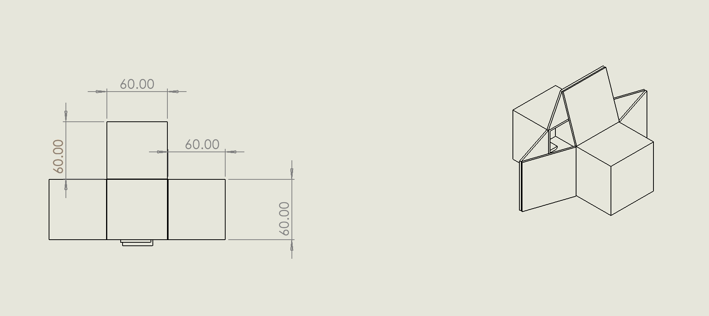
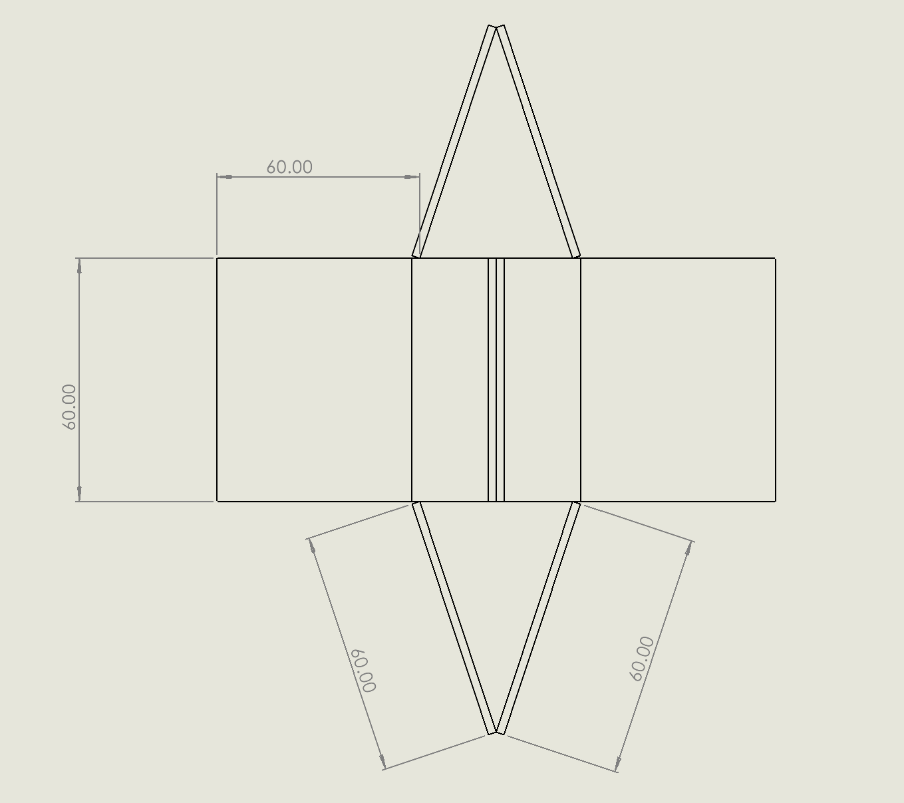
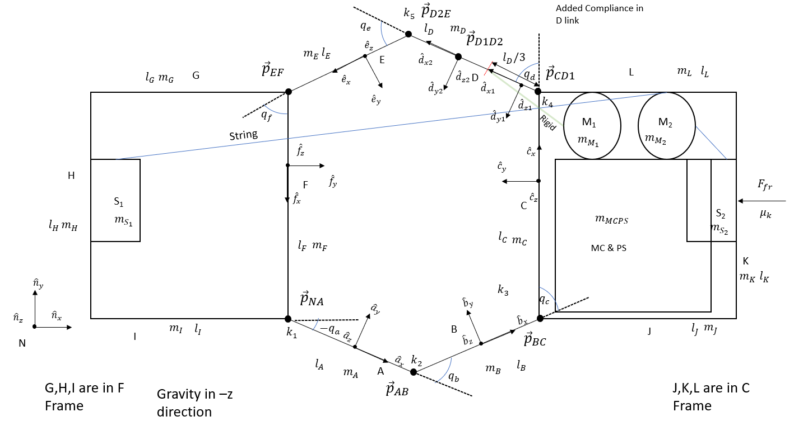
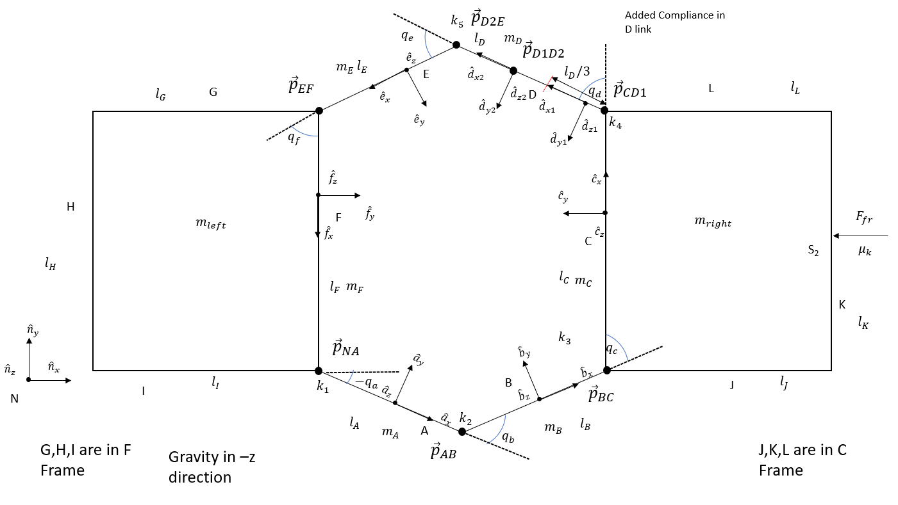
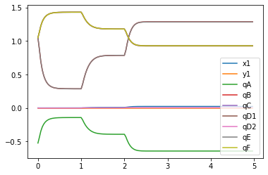
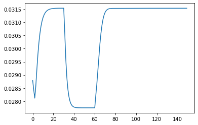
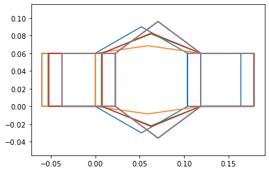
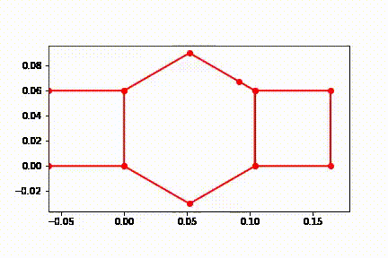
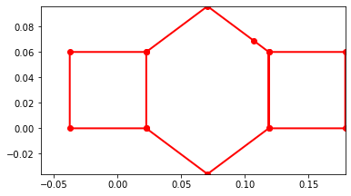

# System Dynamics II
## Team 2
## Kevin Julius, Romney Kellogg, Sanchit Singhal, Siddhaarthan Akila Dhakshinamoorthy


## 1. Robot Figures:

### 1.1 Dimensioned Figure:
Below is a dimensioned figure of the solidworks model of the robot.




### 1.2 Dynamics Figure:
Below are 2 figures. The first of which is a detailed diagram of the dynamics of the system, the second of which is a simplified diagram showing what aspects of the dynamics were modeled. 







```python
%matplotlib inline
```


```python
#Importing Libraries
import pynamics
from pynamics.frame import Frame
from pynamics.variable_types import Differentiable,Constant,Variable
from pynamics.system import System
from pynamics.body import Body
from pynamics.dyadic import Dyadic
from pynamics.output import Output,PointsOutput
from pynamics.particle import Particle
import pynamics.integration
import pynamics.tanh

import sympy
import numpy
import matplotlib.pyplot as plt
plt.ion()
from math import pi

from math import degrees, radians
from pynamics.constraint import Constraint
import scipy.optimize
```

## 2. Constants

### 2.1 Link Lengths:

All link lengths in the saurus linkage are the same length of 60mm or 0.06m. lDi1 (.02m) and lDi2 (.04m) are lengths that makeup link D, that has been given a virtual joint that will be discussed below.


```python
# Initializing Pynamics
system = System()
pynamics.set_system(__name__,system)
# Defining Link Constants
lAi=.060 #all in m
lBi=.060
lCi=.060
lDi1=.015
lDi2=.045
lEi=.060
lFi=.060

lA = Constant(lAi,'lA',system)
lB = Constant(lBi,'lB',system)
lC = Constant(lCi,'lC',system)
lD1 = Constant(lDi1,'lD1',system)
lD2 = Constant(lDi2,'lD2',system)
lE = Constant(lEi,'lE',system)
lF = Constant(lFi,'lF',system)

```

### 2.2 Rigid Body Lengths:

The below lengths makeup the two endcaps on the left and right side of the robot housing mechanical and electrical components. Left Endcap = G>H>I, Right Endcap =  J>K>L


```python
lGi=.060 #all in m
lHi=.060
lIi=.060
lJi=.060
lKi=.060
lLi=.060

lG = Constant(lGi,'lG',system)
lH = Constant(lHi,'lH',system)
lI = Constant(lIi,'lI',system)
lJ = Constant(lJi,'lJ',system)
lK = Constant(lKi,'lK',system)
lL = Constant(lLi,'lL',system)
```

### 2.3 Link Masses:

Below are the dimensions of each link of .06mx.06mx.004m. These measurements were used to calculate volume and multiplied by the density of the cardstock to determine the mass of each link. Once again link D has been split into two masses that will be discussed further below.


```python
#mass calculated using density of cardstock and volume
a=.06 #m
b2=.06 #m
c=.004 #m
rho=689 #kg/m^3
m=a*b2*c*rho


#links
mA = Constant(m,'mA',system) #in kg
mB = Constant(m,'mB',system)
mC = Constant(m,'mC',system)
mD1 = Constant(m/4,'mD1',system)
mD2 = Constant(3*m/4,'mD2',system)
mE = Constant(m,'mE',system)
mF = Constant(m,'mF',system)
```

### 2.4 Component and Endcap Lumped Masses:

Below are the masses of the endcaps and all components within each side summed into a lump mass on each side. This simplification can be performed because the components on each rigid end of the robot should not experience rotation, therefor their moment of inertia will be irrelevant to the motion of the robot.

Table of Masses:

| Item | Mass(kg) |
| --- | --- | 
| Overall System | .1101 |
| Endcap x2 | .00121 |
| Saurus Links x6 | .0003 |
| Power Supply + Microcontroller | .045 | 
| Motor 1 | .009 |
| Motor 2 | .009 |
| Stopper 1 | .0033 |
| Stopper 2 | .0041 |


```python
#other parts
endcap=.00121
psmc=.045
motor=.009
stop1=.0033
stop2=.0041
mlefts=endcap+stop1
mrights=endcap+motor+stop2+motor+psmc
mleft = Constant(mlefts,'mleft',system)
mright = Constant(mrights,'mright',system)
```

### 2.5 Joint Stiffness:

These values were calculated using motion tracking of a prototype joint that will be used in the construction fo the system. The method that these values were calculated can be seen further in the damping.pdf document

It is important to include joint stiffness because each joint has an inherent elasticity to it that needs to be modeled.

Unfortantely data was collected, but was the joint stiffness value was unable to be calculated from the data after attempting different methods.


```python
k = Constant(.01,'k',system)
```

### 2.6 Joint Damping:

These values were calculated using motion tracking of a prototype joint that will be used in the construction fo the system. The method that these values were calculated can be seen further in the damping.pdf document

It is important to include this because each joint has an inherent damping to it that needs to be modeled to calculate energy lost through the joints in the system.

Unfortantely data was collected, but was the damping value was unable to be calculated from the data after attempting different methods.


```python
b = Constant(0.001,'b',system)
```

### 2.7 Adding Compliance:

Compliance was added to link D because it is to be actuated by a rigid link connected to the motor. This will cause link D to likely experience more force than the other links and a good candidate to study the effect of compliance on the system.

One can see further calculations within the ComplianceRK.ipynb document.

The damping constant was found to be 0/negligable
The stiffness/spring constant was found to be 6.05656 N/m

The location that the link was to be placed at was found to be .25 along the length of the beam which was represented in the constants defined above. lD=.06 lD1=lD*.25=.015 lD2=lD-lD2=.045


```python
bD = Constant(0,'bD',system)
kD = Constant(6.05656,'kD',system)
```

### 2.8 Preloading:

The system is to be fold to be relaxed at the current initial condition so all preload values were set to zero.

If an alternative initial condition was used for the rotational states, these preloads would be altered to represent the change in those states from the current initial position states.


```python
preload1 = Constant(0*pi/180,'preload1',system)
preload2 = Constant(0*pi/180,'preload2',system)
preload3 = Constant(0*pi/180,'preload3',system)
preload41 = Constant(0*pi/180,'preload41',system)
preload42 = Constant(0*pi/180,'preload42',system)
preload5 = Constant(0*pi/180,'preload5',system)
preload6 = Constant(0*pi/180,'preload6',system)
```

## 3. Defining Frames and State/Differential Variables

### 3.1 Defining Time Frame, Time Step, and Integration Tolerance:

The time frame is set to end once the system has maintained a Steady State. Time step is set to be 1 step per frame at 30 frames a second (1/30).
Integration Tolerance is set to 1e-4 to keep some integration accuracy, while allowing a quicker integration time. 


```python
tinitial = 0
tfinal = 5
fps = 30
tstep = 1/fps
t = numpy.r_[tinitial:tfinal:tstep]
tol = 1e-4
```

### 3.2 Establishing State Variables and Their Derivatives:

Below a state variable and their derivatives are created for each link/frame. Link D has an added virtual joint for compliance requiring two differential variables.

Additional variables x1 and y1 (and their derivatives) are created to break free from the Newtonian Frame and create a moving system. These measure the distance of the joint of links A and F (pNA) from the origin in the Nx and Ny direction.


```python
# Defining State Variables and their derivatives
x1,x1_d,x1_dd = Differentiable('x1',system)
y1,y1_d,y1_dd = Differentiable('y1',system)
qA,qA_d,qA_dd = Differentiable('qA',system)
qB,qB_d,qB_dd = Differentiable('qB',system)
qC,qC_d,qC_dd = Differentiable('qC',system)
qD1,qD1_d,qD1_dd = Differentiable('qD1',system)
qD2,qD2_d,qD2_dd = Differentiable('qD2',system)
qE,qE_d,qE_dd = Differentiable('qE',system)
qF,qF_d,qF_dd = Differentiable('qF',system)
```

### 3.3 Creating Frames and Their Relationships:
Below the Newtonian frame is declared along with one frame for each link within the saurus linkage A-F. Liink D once again has two frames due to the virtual joint within link D

Afterwards the Newtonian frame is set.

Sequentially after the Newtonian frame the frames are defined by a z rotation equal to each state variable.
A is rotated qA from N

B is rotated qB from A

C is rotated qC from B
"
D1 is rotated qD1 from C

D2 is rotated qD2 from D1

E is rotated qE from D2

F is rotated qF from E


```python
# Declaring Frames
N = Frame('N')
A = Frame('A')
B = Frame('B')
C = Frame('C')
D1 = Frame('D1')
D2 = Frame('D2')
E = Frame('E')
F = Frame('F')

```


```python
# Placing Newtonian Frame
system.set_newtonian(N)
```


```python
# Establishing Frame Rotation Relationships
A.rotate_fixed_axis_directed(N,[0,0,1],qA,system)
B.rotate_fixed_axis_directed(A,[0,0,1],qB,system)
C.rotate_fixed_axis_directed(B,[0,0,1],qC,system)
D1.rotate_fixed_axis_directed(C,[0,0,1],qD1,system)
D2.rotate_fixed_axis_directed(D1,[0,0,1],qD2,system)
E.rotate_fixed_axis_directed(D2,[0,0,1],qE,system)
F.rotate_fixed_axis_directed(E,[0,0,1],qF,system)
```

## 4. Defining Robot Kinematic Relationships and Masses

### 4.1 Defining Location of Saurus Linkage Points using Kinematic Relationships
Here the point/joint locations are defined.

The point NA is defined by a displacement x1 and y1 from the origin.

The points that follow are all defined by the previous point and the lenght and orientation of each link in the order:

pNA> (Link A) >pAB> (Link B) >pBC> (Link C) >pCD1> (Link D1) >pD1D2> (Link D2) >pD2E> (Link E) >pEF> (Link F) > pFtip = pNA


```python
# Defining Point Locations based on kinematics of the system
pN = 0*N.x+0*N.y+0*N.z
pNA = x1*N.x+y1*N.y
pAB = pNA + lA*A.x
pBC = pAB + lB*B.x
pCD1 = pBC + lC*C.x
pD1D2 = pCD1 + lD1*D1.x
pD2E = pD1D2 + lD2*D2.x
pEF = pD2E+ lE*E.x
pFtip= pEF + lF*F.x
points = [pNA,pAB,pBC,pCD1,pD1D2,pD2E,pEF,pFtip]
```

### 4.2 Defining Location of Links Forming Rigid Endcap:

Below are the points defining the corner of the two rigid end caps. These are defined by: 

Left: pEF> (Link G) >pGH> (Link H) >pHI> (Link I) >pNA

Right: pBC> (Link J) >pJK> (Link K) >pKL> (Link L) >pCDD1

These links do not have frames as they are rigidly defined by the F and C frames for the left and right endcap respectively.


```python
# Points used for graphical representation end caps holding components
pGH = pEF-lG*F.y
pHI = pGH+lH*F.x
pJK = pBC-lJ*C.y
pKL = pJK+lK*C.x
```

### 4.3 Defining Center of Mass of Saurus Linkage Links:

Here the center of masses are defined for each link to be at the center of each link.


```python
#Center of Masses of Links
pAcm=pNA+lA/2*A.x
pBcm=pAB+lB/2*B.x
pCcm=pBC+lC/2*C.x
pD1cm=pCD1+lD1/2*D1.x
pD2cm=pD1D2+lD2/2*D2.x
pEcm=pD2E+lE/2*E.x
pFcm=pEF+lF/2*F.x
```

### 4.4 Defining Center of Mass of Lumped Masses:

Below the center of masses of the components within and links composing the endcaps are placed at the center of the left and right endcap boxes. This is an approximation, but as long as the center of mass is within the boxes and these masses are't experiencing large amount of rotation this approximation should hold true.


```python
#Center of Masses Each Endcap Holding Components
pmright=(pNA+pEF)*.5-.03*F.y
pmleft= (pBC+pCD1)*.5-.03*F.y
```

### 4.5 Creating Particles Using Center of Masses and Masses:

Particles masses were used to model all bodies in the system to limit complexity and computation time. This idealization should have little effect on results due to the incredibly small moment of inertia of the links, and the lack of rotation of the large masses in each end cap (saurus linkage leads to linear actuation of both lumped masses).

Below how the moment of inertia would be calculate for each link is listed, but these rotational inertias were not implemented in the final model due to the use of particles because of their small size shown below. (Izz was shown because it would be the most impactful moment, since it is along the links only axis of rotation).


```python
#6 equal size links have same Ixx,Iyy,Izz
Ixx=(1/12)*m*(b2**2+c**2)
Iyy=(1/12)*m*(a**2+c**2)
Izz=(1/12)*m*(a**2+b2**2)
```


```python
Izz
```


    5.952959999999999e-06


```python
PA = Particle(pAcm,mA,'PA',system)
PB = Particle(pBcm,mB,'PB',system)
PC = Particle(pCcm,mC,'PC',system)
PD1 = Particle(pD1cm,mD1,'PD1',system)
PD2 = Particle(pD2cm,mD2,'PD2',system)
PE = Particle(pEcm,mE,'PE',system)
PF = Particle(pFcm,mF,'PF',system)

Pright= Particle(pmright,mright,'Pright',system)
Pleft=  Particle(pmleft,mleft,'Pleft',system)
```

### 4.6 Defining Valid Initial Condition of System:

Below is a defined valid initial condition for the system, this was retrieved from angle measurements within the solidworks model of the system and confirmed using the kinematics code within the zip folder this was submitted alongside.

The system starts at rest at the origin x1,x1_d=0, y1,y1_d=0

An additional initial condition was added that not in the solidworks model of qD2/qD2_d = 0 because the virtual joint will begin alined like the original link D.


```python
statevariables = system.get_state_variables()
# Initial "Guess" for state values
initialvalues = {}
initialvalues[x1]=0
initialvalues[x1_d]=0
initialvalues[y1]=0
initialvalues[y1_d]=0
initialvalues[qA]=-30*pi/180
initialvalues[qA_d]=0*pi/180
initialvalues[qB]=60*pi/180
initialvalues[qB_d]=0*pi/180
initialvalues[qC]=60*pi/180
initialvalues[qC_d]=0*pi/180
initialvalues[qD1]=60*pi/180   
initialvalues[qD1_d]=0*pi/180
initialvalues[qD2]=0*pi/180   
initialvalues[qD2_d]=0*pi/180
initialvalues[qE]=60*pi/180
initialvalues[qE_d]=0*pi/180
initialvalues[qF]=60*pi/180
initialvalues[qF_d]=0*pi/180
ini = [initialvalues[item] for item in statevariables]
```

### 4.7 Defining Angular Velocities based on Frame Relationships:

Here the angular velocities are defined similarly to how each frame is related to eachother.

A is rotated at angular velocity wNA from N

B is rotated at angular velocity wAB  from A

C is rotated at angular velocity wBC from B
"
D1 is rotated at angular velocity wCD1 from C

D2 is rotated at angular velocity wD1D2 from D1

E is rotated at angular velocity wD2E from D2

F is rotated at angular velocity wEF from E


```python
#Angular Velocities
wNA = N.getw_(A)
wAB = A.getw_(B)
wBC = B.getw_(C)
wCD1 = C.getw_(D1)
wD1D2 = D1.getw_(D2)
wD2E = D2.getw_(E)
wEF = E.getw_(F)

```

## 5. Adding Forces:

### 5.1 Creating Joint Stiffness/Spring Forces:

Spring forces are added to each joint to model the inherent elasticity and energy storage of each joint, this is calculated using the displacement of the state q"" minus the preload applied initially.

A different spring force is applied between the virtual joint between D1 D2 to mimic the inherent stiffness and compliance of the material.


```python
#Adding Spring/Joint Stiffness Forces
system.add_spring_force1(k,(qA-preload1)*N.z,wNA) 
system.add_spring_force1(k,(qB-preload2)*A.z,wAB)
system.add_spring_force1(k,(qC-preload3)*B.z,wBC)
system.add_spring_force1(k,(qD1-preload41)*C.z,wCD1)
system.add_spring_force1(k,(qE-preload5)*D2.z,wD2E)
system.add_spring_force1(k,(qF-preload6)*E.z,wEF)
#Virtual Joint Stiffness
system.add_spring_force1(kD,(qD2-preload42)*D1.z,wD1D2)
```


    (<pynamics.force.Force at 0x212f35ecca0>,
     <pynamics.spring.Spring at 0x212f35c9460>)


### 5.2 Creating Joint Damping Forces:

Below the damping forces are added for each joint proportional to the angular velocity of each joint.

There is a separate damping value for the virtual joint wD1D2 used when applying the damping force.


```python
#Adding Dampers
system.addforce(-b*wNA,wNA)
system.addforce(-b*wAB,wAB)
system.addforce(-b*wBC,wBC)
system.addforce(-b*wCD1,wCD1)
system.addforce(-bD*wD1D2,wD1D2)
system.addforce(-b*wD2E,wD2E)
system.addforce(-b*wEF,wEF)
#Adding Damper for Virtual Joint
system.addforce(-bD*wD1D2,wD1D2)
```


    <pynamics.force.Force at 0x212f3830370>


### 5.3 Adding Time Dependent Static Friction Force on Stoppers: (Actuator 1)

Here the stoppers raising and lowering causing static static friction are simulated by a large force damping the system at the stoppers locations. The static friction of the rubber on the stoppers will be high enough to prevent movement so this model should true.

For the code there is a force applied at the midpoint of pNA and PEF restricting movement until cutoff time tswitch. Then this force is released and a force is added at the then (fully extended) midpoint of pBC and pCD1 restricting movement.

This is used in combination with the torques discussed further below to create a "snake-like" rectilinear movement by:

Left Grabbing >Extending > Right Grabbing > Contracting

This is to be controlled by a motor actuating a string pulling up and down the stopped, but this would be difficult to model in this 2-D simulation, and wouldn't impact the robots motion.


```python
#Add static Friction force
bfrs= Constant(1000,'bfrs',system)

v1=((pNA+pEF)*.5).time_derivative(N,system)


tswitch = system.t-1
on = (tswitch+abs(tswitch))/(2*tswitch+1e-3)
off= abs(1-on)

v2 = ((pBC+pCD1)*.5).time_derivative(N,system)

system.addforce(-bfrs*v1*off,v1)
system.addforce(-bfrs*v2*on,v2)
```


    <pynamics.force.Force at 0x212f38297c0>


### 5.4 Adding Time Dependent Motor Torque: (Actuator 2)

Below are the motor torques applied to the system at point wCD1. Torque begins at t=0, expanding the linkage. Then the torque stops at time t=1 (tswitch) and reverses at time t=2 (tswitch2), contracting the linkage. 

A motor will interface with with link D using a rigid link attached to a slider on link D (Depicted in the Dynamic Figure Portion at the begining of this Document). This would allow actuation of the link via the motor rotation. Link D was made a compliant linkage due to the force this interface will apply on the linkage requiring compliance in the model. 

The interfacing of this actuated rigid link with link D was not modeled due to the difficulty of placing a slider along the linkage. A torque applied at the joint pCD1 with added compliance should be a suitible model for this actuation.

A torque constant was selected that fully extended the linkage and fell within the specs of the selected motor (Max torque .24 N*m)


```python
#Add motor force
Torque= Constant(.03,'Torque',system)

tswitch2 = system.t-2
on2 = (tswitch2+abs(tswitch2))/(2*tswitch2+1e-3)
off2= abs(1-on2)

system.addforce(Torque*N.z*off,wCD1)
system.addforce(-Torque*N.z*on2,wCD1)
```


    <pynamics.force.Force at 0x212f3749910>


### 5.5 Adding Directionally Dependent Kinetic Friction:

Below is the force of kinetic friction applied for each end cap dragging against the ground as the system is extending and retracting.

uk was found to be 0.3057 using methods found in the motor_powerSupply_Friction.pdf document.

Friction force for both end caps is calculated and shown below, but unfortunately was unable to be implemented due to running into computional problems, but the small force would likely have limited effect on this system.


```python
#Add kinetic friction force
uk=Constant(.3057,'uk',system)
Ffrright=9.81*uk*mrights
Ffrleft=9.81*uk*mlefts
#system.addforce(-uk*.25*pBC*off*N.x,v1)
#system.addforce(-uk*.25*pBC*on*-N.x,v1)
```


```python
Ffrright
```


    0.6701211⋅uk


```python
Ffrleft
```


    0.0442431⋅uk


### 5.6 Gravity's Role:

Because gravity is in the z plane of this model and has no effective impact on the motion of the model it was removed from the system. Gravity however was used to calculate the normal force external to the model and consequentially kinetic friction force.

#Gravity in -z direction
system.addforcegravity(-g*N.z)

## 6. Adding Constraints

### 6.1 Closing the Loop Using pFtip=pNA Constraints (Closing the Loop)

This constraint requires that the distance between pFtip and pNA is zero in the N.x and N.y directions. This closes the loop of the system and makes pFtip and pNA be coinciding.


```python
eq = []
eq.append((pFtip-pNA).dot(N.y))
eq.append((pFtip-pNA).dot(N.x))
```

### 6.2 C and F Parrallel Constraints

These constraints force C.x and F.x to be parrallel to the N.y axis. This is an idealized condition, but the model continiously ran into singularities and calculalation issues when making C.x and F.x parralel directly. 

With further testing, this constraint would be changed to C.x.dot(F) with another constraint to limit the degrees of freedom to 3 (saurrus linkage extension and (x,y) position).


```python
eq.append(C.x.dot(N.x))
eq.append(F.x.dot(N.x))
```

### 6.3 pNA and pBC Equal Y Component Constraints

This final constraint prevents the right half of the saurrus linkage from shifting up and down with the applied torque by restricting the movement of pBC up and down in the C.x direction from pNA.

#### Both this constraint and the constraints in 6.2 would not be placed in a 3-D simulation/real world model as they would be represented by a 3rd set of 2 links above the linkage applying these 3 constraints inherently.


```python
eq.append((pNA-pBC).dot(C.x))
```

### 6.4 Creating Constraint Derivatives

Derivatives of constraints to be used when solving for acceleration.


```python
eq_d=[(system.derivative(item)) for item in eq]
eq_dd=[(system.derivative(item)) for item in eq_d]
```

## 7. Solution:

### 7.1 Getting F and ma from System Dynamics

F,ma are retrieved from the system.


```python
#get system dyamics
f,ma = system.getdynamics()
```

    2021-03-22 12:31:12,821 - pynamics.system - INFO - getting dynamic equations
    

### 7.2 Getting Acceleration Equation by Dividing F by m

State acceleration function and lamdas are retrieved by dividing F by an inverted m.


```python
#solve for acceleration
func1,lambda1 = system.state_space_post_invert(f,ma,eq_dd,return_lambda = True)
```

    2021-03-22 12:31:18,425 - pynamics.system - INFO - solving a = f/m and creating function
    2021-03-22 12:31:18,517 - pynamics.system - INFO - substituting constrained in Ma-f.
    2021-03-22 12:32:06,487 - pynamics.system - INFO - done solving a = f/m and creating function
    2021-03-22 12:32:06,487 - pynamics.system - INFO - calculating function for lambdas
    

### 7.3 Integrating Accleration to Find System States

State acceleration function is integrated to determine system states.


```python
#integrate
states=pynamics.integration.integrate(func1,ini,t,rtol=tol,atol=tol, args=({'constants':system.constant_values},))


```

    2021-03-22 12:32:06,564 - pynamics.integration - INFO - beginning integration
    2021-03-22 12:32:06,566 - pynamics.system - INFO - integration at time 0000.00
    2021-03-22 12:33:16,364 - pynamics.system - INFO - integration at time 0001.00
    2021-03-22 12:34:24,858 - pynamics.system - INFO - integration at time 0001.15
    2021-03-22 12:35:36,290 - pynamics.system - INFO - integration at time 0002.00
    2021-03-22 12:36:38,241 - pynamics.integration - INFO - finished integration
    

### 7.4 Plotting State Values 

System State values are plotted x1 and y2 in m and qA,qB,qC,qD1,qD2,qE,qF in radians


```python
#Plot
plt.figure()
artists = plt.plot(t,states[:,:9])
plt.legend(artists,['x1','y1','qA','qB','qC','qD1','qD2','qE','qF'])
```


    <matplotlib.legend.Legend at 0x212f90810a0>


    

    


### 7.5 Plotting Total System Energy over Time

Total system energy is calculated by retrieving kinetic energy and potential energy from the system then summing them.

This is then plotted in Joules against each frame of the system.

System Energy is seen increasing due to work input by Acuator 2 actuating the linkage and decreasing due to the damping in each joint.


```python
#Energy
KE = system.get_KE()
PE = system.getPEGravity(pNA) - system.getPESprings()
energy_output = Output([KE-PE],system)
energy_output.calc(states)
energy_output.plot_time()
```

    2021-03-22 12:36:39,334 - pynamics.output - INFO - calculating outputs
    2021-03-22 12:36:39,667 - pynamics.output - INFO - done calculating outputs
    


    

    


### 7.6 Plotting Motion via Frames

Here the frames of the system are plotted over the time the system is simulated. The plot is made by lines between the points previously defined in the order pEF,pGH,pHI,pNA,pAB,pBC,pCD1,pKL,pJK,pBC,pCD1,pD1D2,pD2E,pEF,pFtip.

One can see the extending and grabbing and contracting in this diagram, but is easier to visualize in the animation within 7.7.


```python
#Motion

points = [pEF,pGH,pHI,pNA,pAB,pBC,pCD1,pKL,pJK,pBC,pCD1,pD1D2,pD2E,pEF,pFtip]

points_output = PointsOutput(points,system)
y = points_output.calc(states)
points_output.plot_time(20)
```

    2021-03-22 12:36:40,166 - pynamics.output - INFO - calculating outputs
    2021-03-22 12:36:40,369 - pynamics.output - INFO - done calculating outputs
    


    

    


### 7.7 Plotting Motion via Animation

Below the animation and final position of the robot is shown. Here one can see the robot extend switch stoppers then contract similar to a snake's rectilinear locomotion.

The compliant link D is noticable and shows how a link deforming may effect performance, especially if more virtual joints were applied to the system. This may indicate that we need to add another layer of material to the linkage, and will be tested in prototyping. 

It is also noticable how the system contracts twice, the first contraction is due to the removal of the applied torque allowing the system to "spring" back into its relaxed followed by the applied torque in reverse, contracting the system further.


```python
from matplotlib import animation, rc
from IPython.display import HTML
points_output.animate(fps = fps,movie_name = 'render.mp4',lw=2,marker='o',color=(1,0,0,1),linestyle='-')
HTML(points_output.anim.to_html5_video())
```




    

    


### 7.8 Additional Plots of Energy Decreasing when Actuators are off and Initial Velocity is Given

Initial Angular Velocity wNA=5rad/s

Here the natural damping of the system is shown via the energy decrease in the total energy plot when an initial angular velocity is applied with actuators off.

States Plot with Actuators Off(y: m for x1,y1 rad for qA-F, x: time s)


Total Energy Plot with Actuators Off (y: Joules x: Frames)


Animation with Initial Velocity and No Actuators On


### 7.9 Equation of States and Derivatives (Commented Out)

Here are the equations describing each state and their derivatives commented out to reduce computation time.


```python
#eq
```


```python
#eq_d
```


```python
#eq_dd
```

## 8. Discussion

### 8.1 Model Assumptions, Idealizations, and Limitations

There are quite a few assumptions made within this model, but are well-grounded and should leave this model to accurately depict movement in real-world application. The primary limitation of this model is that it is mostly represented in 2 dimensions, this requires constraints to be used instead of links for the 3rd set of 2 linkages that form a 1 degree of freedom saurus linkage. The 2-D simulation also makes it difficult to simulate the snake robot traversing uphill, which is one of the primary uses of rectilinear locomotion in snakes.

Some other assumptions that should yield very little consequence when compared to real-world performance. These include the lumped masses and particle modeling. The lumped masses should not differ from a simulation using precisely defined masses, as their locations would not effect the dynamics as long as they are located on the correct side of the saurrus linkage. This also applies to their inertias because the ends of the robot should not be turning for the rotational inertias to impact the dynamics. The links however do rotate, but their rotational inertias are negligible due to how light the links are and how slow they are rotating. Other assumptions include assuming static friction would hold, no compliance in 5 of the links, and multiple assumptions made during the collection of damping and stiffness data collection.


### 8.2 Discussion of Difficulties
Two issues were unable to be resolved after being able to overcome other difficulties that appeared throughout the creation of this simulation. The damping and stiffness values were unable to be calculated due to difficulties translating the collected data into the damping and stiffness values.

Another issue was running into computation difficulties when implementing kinetic friction. The kinetic friction was calculated, but adding the time dependant component ended up taking the simulation a very long time to run (>20mins) and could be resolved in the future by optimizing the model with 2 3 bar linkages as opposed to the 1 6 bar linkage currently used. 

### 8.3 Discussion of Results

One of the main results that can be seen in this experiment is one of the main trials to face when using foldable robotics, the effect compliance in materials used. It can be seen that the angles of each side of the saurus linkage are different and the point in the middle (pD2E) is closer to the center than the opposite side (pAB). This could cause the robot to tilt slightly and start moving in a path that is not straight. This means that special attention will need to be paid attention to link stiffness when constructing the prototype.

Another main result that can be seen is the inherent elasticity and damping of each joint in the system. These joints lose some energy due to damping and cause quite a bit of movement due to elasticity (springiness) that will need to be factored in when planning the movement or programing the actuator control for the system. 

Lastly, the animation displays that we were able to successfully simulate the rectilinear motion we were attempting to model using foldable robotics principles and dynamics calculations. This simulation will be useful to test what-if scenarios in case we wanted to see how different materials or adding different masses to the system might affect it without constructing or altering a prototype each time.

### 8.4 Future Plans for Simulations

In the future, a fully functional prototype will be constructed to compare to the results of this simulation. To assist with this simulation will also be optimized to run faster using multiple chains of frames as opposed to a single chain from A to F. With a more optimized simulation more compliance in linkages will be added to determine the effect of compliance on every link in the system will have. Also hopefully the interface of the actuators with their actuated components robot will be improved. 

## 9. Bibliography

[1] D.Aukes, “Approximating compliant beams with the pseudo-rigid-body model,”egr557. Accessed: March. 19, 2021 [Online]. Available: https://egr557.github.io/modules/compliance/generated/prbm.html

[2] D.Aukes, “Cantilever Beams,”egr557. Accessed: March. 19, 2021 [Online]. Available: https://egr557.github.io/modules/compliance/cantilever-beams.html 

[3] D.Aukes, “Euler-Bernoulli Beams,”egr557. Accessed: March. 19, 2021 [Online]. Available: https://egr557.github.io/modules/compliance/generated/euler-bernoulli-beams/euler-bernoulli-beams.html 

[4] “Servo Motor SG-90 Basics, Pinout, Wire Description, Datasheet,” Components101. [Online]. Available: https://components101.com/motors/servo-motor-basics-pinout-datasheet. [Accessed: 20-Mar-2021]. 
