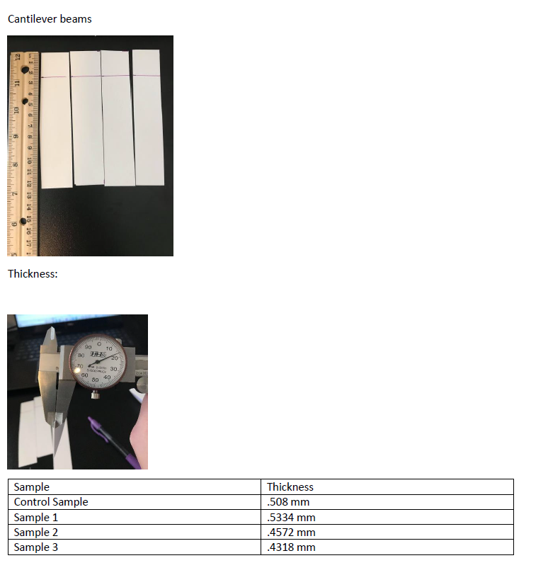
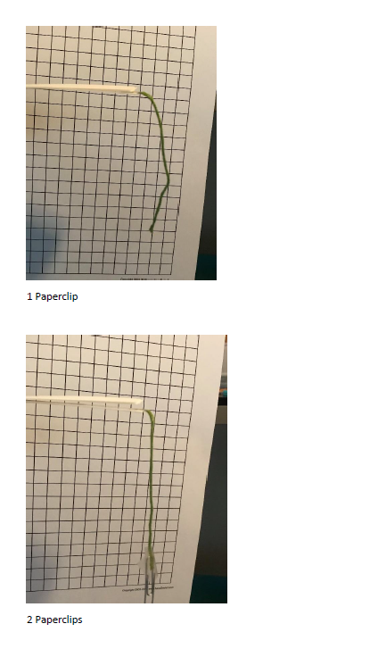
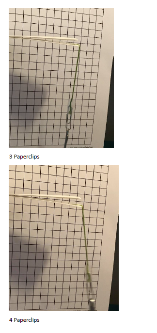
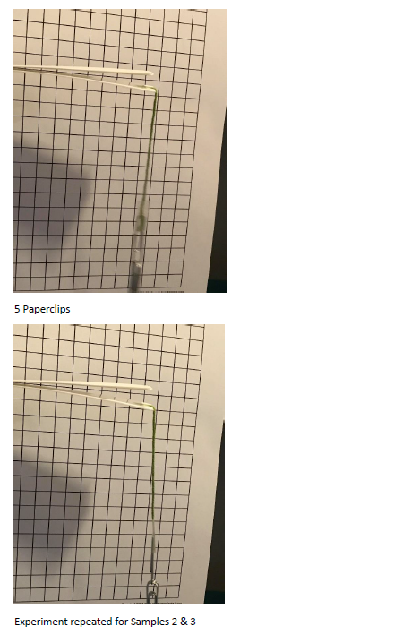
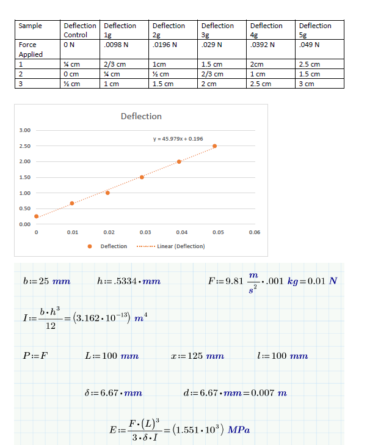
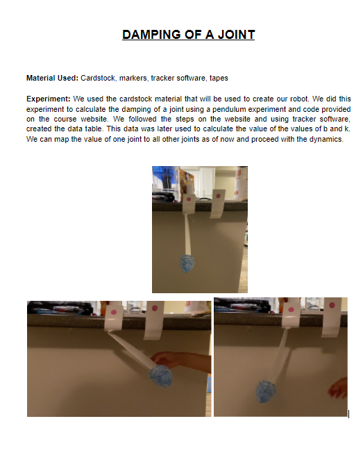
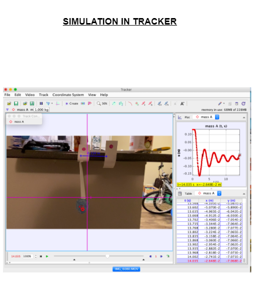
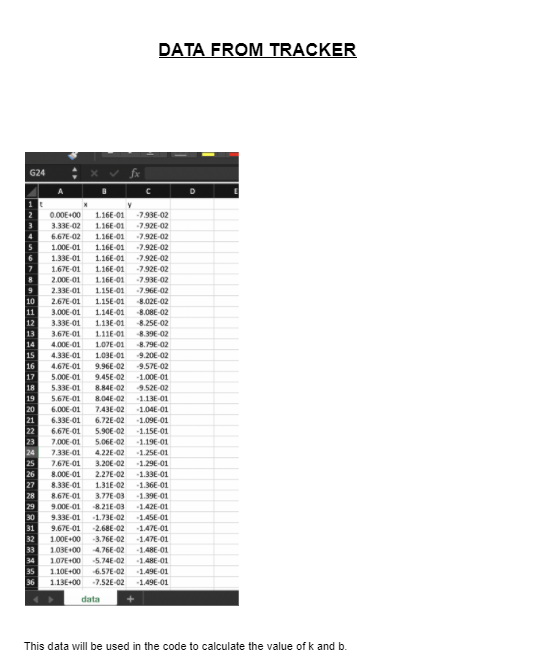
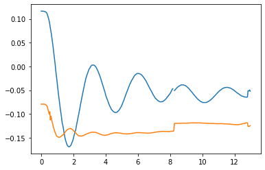

## Motor Selection

1b) Motor Selection

 

SG90 Specification


    ●	Rotation : 0°-180°


    ●	Weight of motor : 9gm


    ●	Operating Voltage : +5 V


    ●	Stall Current : 350 mA


    ●	Stall Torque : 2.5 kg . cm = 0.24 N.m


    ●	Speed : 0.12s / 60° = 82.8 rpm


    ●	Power : Torque * Speed / 9.5488 = 2.08 kW

This motor was selected due to the requirement of having a very lightweight actuator which did not lack the torque to move the entire load of the robot.


## Power Supply Selection


1c) Power Supply Selection:

 

Given the stall current of the motors being used, a power supply capable of supplying far more than 350 mA is required. An Alkaline 9v battery is chosen as the power supply for the system which satisfies this requirement and has enough battery capacity to sustain the robot to operate for a reasonable span of time.

 

 

 

 

 

 

 

 

 

 
## Static Friction Calculation
 

Static Friction Calculation:

 

The Angle of Repose experiment was conducted to determine the static friction coefficient of the cardstock on a smooth surface. The platform having the cardstock is lifted slowly with increasing angle to find that critical angle at which the paper starts sliding down.

 

Trial 1:


Coefficient of Static Friction : 0.3141


 

Trial 2 :

Coefficient of Static Friction : 0.4575

 

Trial 3 :


Coefficient of Static Friction : 0.3803

Average Coefficient of Static Friction : 0.38399

 

---------------------------------------------------------------------------------------------

 

Average Coefficient of Static Friction : 0.3057

 

Approximation : The coefficient of kinetic friction could be determined during the same Angle of Repose experiment where the angle corresponding to when the cardstock slips down the inclined surface at constant velocity is noted. An angle of ~17 degrees let the cardstock slip down in an approximately constant velocity. Thus coefficient of kinetic friction = tan (17) = 0.3057

## Compliance Calculation Using Two-Beam Method

```python
import sympy
```


```python
q = sympy.Symbol('q')
d = sympy.Symbol('d')
L = sympy.Symbol('L')
P = sympy.Symbol('P')
h = sympy.Symbol('h')
b = sympy.Symbol('b')
E = sympy.Symbol('E')
x = sympy.Symbol('x')
```


```python
subs = {}
#subs[k]=1000
subs[P]=.0098
subs[L]=.100
subs[b]=.025
subs[h]=.005
subs[E]= 1.551e9
subs[x]=.5
```


```python
I = b*h**3/12
d1 = P*L**3/3/E/I
d1.subs(subs)
```


$\displaystyle 8.08768536428111 \cdot 10^{-6}$


```python
q1 = P*L**2/2/E/I
q1.subs(subs)
```


$\displaystyle 0.000121315280464217$


```python
k1 = P*L*(1-x)/(sympy.asin(P*L**2/(3*E*I*(1-x))))
k1.subs(subs)
```


$\displaystyle 3.02929686179011$


```python
d2 = L*(1-x)*sympy.sin(P*L*(1-x)/k1)
d2.subs(subs)
```


$\displaystyle 8.08768536428111 \cdot 10^{-6}$


```python
q2 = P*L*(1-x)/k1
```


```python
q2.subs(subs)
```


$\displaystyle 0.000161753707990983$


```python
k2 = 2*E*I*(1-x)/(L)
```


```python
k2
```


$\displaystyle \frac{E b h^{3} \left(1 - x\right)}{6 L}$


```python
q3 = P*L*(1-x)/k2
```


```python
q3.subs(subs)
```


$\displaystyle 0.000121315280464217$


```python
d3 = L*(1-x)*sympy.sin(P*L*(1-x)/k2)
d1.subs(subs)
```


$\displaystyle 8.08768536428111 \cdot 10^{-6}$


```python
d3.subs(subs)
```


$\displaystyle 6.06576400833212 \cdot 10^{-6}$


```python
del subs[x]
```


```python
error = []
error.append(d1-d2)
error.append(q1-q2)
error= sympy.Matrix(error)
error = error.subs(subs)
error

```


$\displaystyle \left[\begin{matrix}0\\0.000121315280464217 - \operatorname{asin}{\left(\frac{8.08768536428111 \cdot 10^{-5}}{1 - x} \right)}\end{matrix}\right]$


```python
import scipy.optimize
```


```python
f = sympy.lambdify((x),error)
```


```python
def f2(args):
    a = f(*args)
    b = (a**2).sum()
    return b
```


```python
sol = scipy.optimize.minimize(f2,[.25])
sol
```


          fun: 1.816962570090524e-10
     hess_inv: array([[1]])
          jac: array([-3.87618667e-09])
      message: 'Optimization terminated successfully.'
         nfev: 2
          nit: 0
         njev: 1
       status: 0
      success: True
            x: array([0.25])


```python
subs[x]=sol.x[0]
```


```python
d2.subs(subs)


```


$\displaystyle 8.08768536428111 \cdot 10^{-6}$


```python
q2.subs(subs)
```


$\displaystyle 0.000107835805066077$


```python
k2.subs(subs)
```


$\displaystyle 6.05859375$


```python

```


```python

```
## Cantilever Beams Material Experiment











## Solidworks Bending FEA


## Joint Damping Data Collection








## Joint Damping Calculations

```python
import pynamics
from pynamics.frame import Frame
from pynamics.variable_types import Differentiable,Constant
from pynamics.system import System
from pynamics.body import Body
from pynamics.dyadic import Dyadic
from pynamics.output import Output,PointsOutput
from pynamics.particle import Particle
import pynamics.integration
import numpy
import matplotlib.pyplot as plt
plt.ion()
from math import pi

import logging
import pynamics.integration
import pynamics.system
import numpy.random
import scipy.interpolate
import scipy.optimize
#import cma
import pandas as pd
import numpy
import matplotlib.pyplot as plt
import scipy.interpolate as si


```


```python
system = System()
pynamics.set_system(__name__,system)

lA = Constant(1,'lA',system)
lB = Constant(1,'lB',system)
lC = Constant(1,'lC',system)

mA = Constant(1,'mA',system)
mB = Constant(1,'mB',system)
mC = Constant(1,'mC',system)

g = Constant(9.81,'g',system)
b = Constant(1e1,'b',system)
k = Constant(1e1,'k',system)

preload1 = Constant(0*pi/180,'preload1',system)
preload2 = Constant(0*pi/180,'preload2',system)
preload3 = Constant(0*pi/180,'preload3',system)

Ixx_A = Constant(1,'Ixx_A',system)
Iyy_A = Constant(1,'Iyy_A',system)
Izz_A = Constant(1,'Izz_A',system)
Ixx_B = Constant(1,'Ixx_B',system)
Iyy_B = Constant(1,'Iyy_B',system)
Izz_B = Constant(1,'Izz_B',system)
Ixx_C = Constant(1,'Ixx_C',system)
Iyy_C = Constant(1,'Iyy_C',system)
Izz_C = Constant(1,'Izz_C',system)

tol = 1e-12

tinitial = 0
tfinal = 10
fps = 30
tstep = 1/fps
t = numpy.r_[tinitial:tfinal:tstep]

qA,qA_d,qA_dd = Differentiable('qA',system)
qB,qB_d,qB_dd = Differentiable('qB',system)
qC,qC_d,qC_dd = Differentiable('qC',system)

initialvalues = {}
initialvalues[qA]=-45*pi/180
initialvalues[qA_d]=0*pi/180
initialvalues[qB]=0*pi/180
initialvalues[qB_d]=0*pi/180
initialvalues[qC]=0*pi/180
initialvalues[qC_d]=0*pi/180

statevariables = system.get_state_variables()
ini = [initialvalues[item] for item in statevariables]

N = Frame('N')
A = Frame('A')
B = Frame('B')
C = Frame('C')

system.set_newtonian(N)

A.rotate_fixed_axis_directed(N,[0,0,1],qA,system)
B.rotate_fixed_axis_directed(A,[0,0,1],qB,system)
C.rotate_fixed_axis_directed(B,[0,0,1],qC,system)

pNA=0*N.x
pAB=pNA+lA*A.x
pBC = pAB + lB*B.x
pCtip = pBC + lC*C.x

pAcm=pNA+lA/2*A.x
pBcm=pAB+lB/2*B.x
pCcm=pBC+lC/2*C.x

wNA = N.getw_(A)
wAB = A.getw_(B)
wBC = B.getw_(C)

IA = Dyadic.build(A,Ixx_A,Iyy_A,Izz_A)
IB = Dyadic.build(B,Ixx_B,Iyy_B,Izz_B)
IC = Dyadic.build(C,Ixx_C,Iyy_C,Izz_C)

BodyA = Body('BodyA',A,pAcm,mA,IA,system)
BodyB = Body('BodyB',B,pBcm,mB,IB,system)
BodyC = Body('BodyC',C,pCcm,mC,IC,system)

system.addforce(-b*wNA,wNA)
system.addforce(-b*wAB,wAB)
system.addforce(-b*wBC,wBC)

system.add_spring_force1(k,(qA-preload1)*N.z,wNA) 
system.add_spring_force1(k,(qB-preload2)*N.z,wAB)
system.add_spring_force1(k,(qC-preload3)*N.z,wBC)

system.addforcegravity(-g*N.y)
```


```python

eq = []
# eq.append(pCtip.dot(N.y))
eq_d=[(system.derivative(item)) for item in eq]
eq_dd=[(system.derivative(item)) for item in eq_d]

f,ma = system.getdynamics()


```

    2021-03-19 23:04:28,290 - pynamics.system - INFO - getting dynamic equations
    


```python
unknown_constants = [b,k]
known_constants = list(set(system.constant_values.keys())-set(unknown_constants))
known_constants = dict([(key,system.constant_values[key]) for key in known_constants])
```


```python
func1,lambda1 = system.state_space_post_invert(f,ma,eq_dd,return_lambda = True,constants = known_constants)

```

    2021-03-19 23:04:28,464 - pynamics.system - INFO - solving a = f/m and creating function
    2021-03-19 23:04:28,749 - pynamics.system - INFO - substituting constrained in Ma-f.
    2021-03-19 23:04:28,868 - pynamics.system - INFO - done solving a = f/m and creating function
    2021-03-19 23:04:28,869 - pynamics.system - INFO - calculating function for lambdas
    


```python
def run_sim(args):
    constants = dict([(key,value) for key,value in zip(unknown_constants,args)])
    states=pynamics.integration.integrate(func1,ini,t,rtol=tol,atol=tol,hmin=tol, args=({'constants':constants},))
    return states
```


```python
points = [pNA,pAB,pBC,pCtip]

```

#create data


```python
points_output = PointsOutput(points,system)
```


```python
df=pd.read_csv(r'/Users/sanchit/Downloads/data.csv', sep=',')

x = df.x.to_numpy()
y = df.y.to_numpy()
t = df.t.to_numpy()
xy = numpy.array([x,y]).T


fy = scipy.interpolate.interp1d(t,xy.T,fill_value='extrapolate')
fyt = fy(t).T


plt.figure()
plt.plot(t,fyt)
```


    [<matplotlib.lines.Line2D at 0x7f959296e450>,
     <matplotlib.lines.Line2D at 0x7f959296e650>]


    

    


```python
def calc_error(args):
    states_guess = run_sim(args)
    y_guess = points_output.calc(states_guess)
    y_guess = y_guess.reshape((390,-1))
    print(y_guess.shape)
    error = fyt - y_guess
    error **=2
    error = error.sum()
    return error   
```


```python
pynamics.system.logger.setLevel(logging.ERROR)
```


```python
k_guess = [1e2,1e3]
```


```python
method = None
#method = 'CMA'
#method = 'BFGS'

if method is None:
    result = k_guess
elif method == 'CMA':
    es = cma.CMAEvolutionStrategy(k_guess, 0.5)
    es.logger.disp_header()
    while not es.stop():
          X = es.ask()
          es.tell(X, [calc_error(x) for x in X])
          es.logger.add()
          es.logger.disp([-1])
    result = es.best.x
else:
    sol = scipy.optimize.minimize(calc_error,k_guess,method = method)
    print(sol.fun)
    result = sol.x
```


```python
calc_error(result)
```

    2021-03-19 23:04:29,110 - pynamics.integration - INFO - beginning integration
    2021-03-19 23:04:33,853 - pynamics.integration - INFO - finished integration
    2021-03-19 23:04:33,854 - pynamics.output - INFO - calculating outputs
    2021-03-19 23:04:33,922 - pynamics.output - INFO - done calculating outputs
    

    (390, 8)
    


    ---------------------------------------------------------------------------

    ValueError                                Traceback (most recent call last)

    <ipython-input-14-9e227d5729d7> in <module>
    ----> 1 calc_error(result)
    

    <ipython-input-10-4e201c5927ca> in calc_error(args)
          4     y_guess = y_guess.reshape((390,-1))
          5     print(y_guess.shape)
    ----> 6     error = fyt - y_guess
          7     error **=2
          8     error = error.sum()
    

    ValueError: operands could not be broadcast together with shapes (390,2) (390,8) 


```python
calc_error(k_guess)
```

