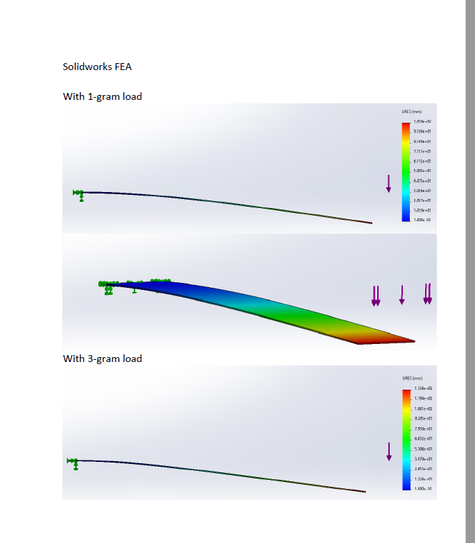
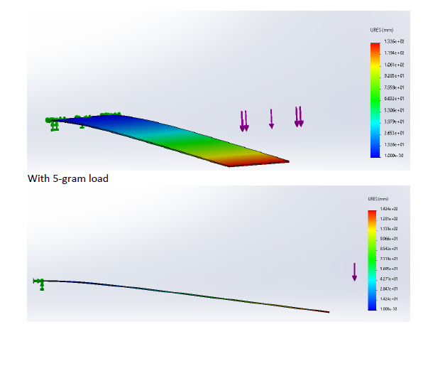
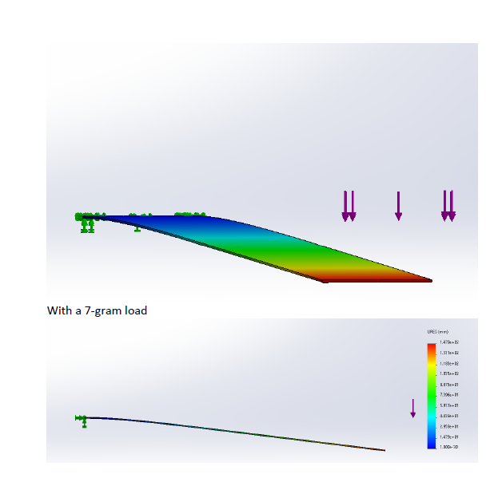
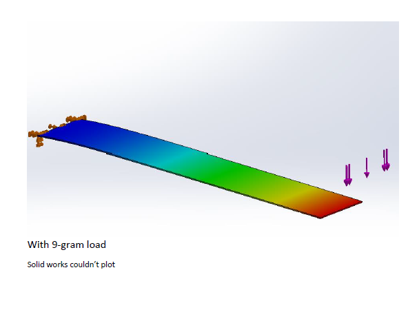

1b) Motor Selection

 

SG90 Specification


    ●	Rotation : 0°-180°


    ●	Weight of motor : 9gm


    ●	Operating Voltage : +5 V


    ●	Stall Current : 350 mA


    ●	Stall Torque : 2.5 kg . cm = 0.24 N.m


    ●	Speed : 0.12s / 60° = 82.8 rpm


    ●	Power : Torque * Speed / 9.5488 = 2.08 kW

This motor was selected due to the requirement of having a very lightweight actuator which did not lack the torque to move the entire load of the robot.

 

1c) Power Supply Selection:

 

Given the stall current of the motors being used, a power supply capable of supplying far more than 350 mA is required. An Alkaline 9v battery is chosen as the power supply for the system which satisfies this requirement and has enough battery capacity to sustain the robot to operate for a reasonable span of time.

 

 

 

 

 

 

 

 

 

 

 

Static Friction Calculation:

 

The Angle of Repose experiment was conducted to determine the static friction coefficient of the cardstock on a smooth surface. The platform having the cardstock is lifted slowly with increasing angle to find that critical angle at which the paper starts sliding down.

 

Trial 1:


Coefficient of Static Friction : 0.3141

 

 

 

 

 

 

 

 

 

 

Trial 2 :

Coefficient of Static Friction : 0.4575

 

Trial 3 :


Coefficient of Static Friction : 0.3803

Average Coefficient of Static Friction : 0.38399

 

---------------------------------------------------------------------------------------------

 

Average Coefficient of Static Friction : 0.3057

 

Approximation : The coefficient of kinetic friction could be determined during the same Angle of Repose experiment where the angle corresponding to when the cardstock slips down the inclined surface at constant velocity is noted. An angle of ~17 degrees let the cardstock slip down in an approximately constant velocity. Thus coefficient of kinetic friction = tan (17) = 0.3057

```python
import sympy
```


```python
q = sympy.Symbol('q')
d = sympy.Symbol('d')
L = sympy.Symbol('L')
P = sympy.Symbol('P')
h = sympy.Symbol('h')
b = sympy.Symbol('b')
E = sympy.Symbol('E')
x = sympy.Symbol('x')
```


```python
subs = {}
#subs[k]=1000
subs[P]=.0098
subs[L]=.100
subs[b]=.025
subs[h]=.005
subs[E]= 1.551e9
subs[x]=.5
```


```python
I = b*h**3/12
d1 = P*L**3/3/E/I
d1.subs(subs)
```


$\displaystyle 8.08768536428111 \cdot 10^{-6}$


```python
q1 = P*L**2/2/E/I
q1.subs(subs)
```


$\displaystyle 0.000121315280464217$


```python
k1 = P*L*(1-x)/(sympy.asin(P*L**2/(3*E*I*(1-x))))
k1.subs(subs)
```


$\displaystyle 3.02929686179011$


```python
d2 = L*(1-x)*sympy.sin(P*L*(1-x)/k1)
d2.subs(subs)
```


$\displaystyle 8.08768536428111 \cdot 10^{-6}$


```python
q2 = P*L*(1-x)/k1
```


```python
q2.subs(subs)
```


$\displaystyle 0.000161753707990983$


```python
k2 = 2*E*I*(1-x)/(L)
```


```python
k2
```


$\displaystyle \frac{E b h^{3} \left(1 - x\right)}{6 L}$


```python
q3 = P*L*(1-x)/k2
```


```python
q3.subs(subs)
```


$\displaystyle 0.000121315280464217$


```python
d3 = L*(1-x)*sympy.sin(P*L*(1-x)/k2)
d1.subs(subs)
```


$\displaystyle 8.08768536428111 \cdot 10^{-6}$


```python
d3.subs(subs)
```


$\displaystyle 6.06576400833212 \cdot 10^{-6}$


```python
del subs[x]
```


```python
error = []
error.append(d1-d2)
error.append(q1-q2)
error= sympy.Matrix(error)
error = error.subs(subs)
error

```


$\displaystyle \left[\begin{matrix}0\\0.000121315280464217 - \operatorname{asin}{\left(\frac{8.08768536428111 \cdot 10^{-5}}{1 - x} \right)}\end{matrix}\right]$


```python
import scipy.optimize
```


```python
f = sympy.lambdify((x),error)
```


```python
def f2(args):
    a = f(*args)
    b = (a**2).sum()
    return b
```


```python
sol = scipy.optimize.minimize(f2,[.25])
sol
```


          fun: 1.816962570090524e-10
     hess_inv: array([[1]])
          jac: array([-3.87618667e-09])
      message: 'Optimization terminated successfully.'
         nfev: 2
          nit: 0
         njev: 1
       status: 0
      success: True
            x: array([0.25])


```python
subs[x]=sol.x[0]
```


```python
d2.subs(subs)


```


$\displaystyle 8.08768536428111 \cdot 10^{-6}$


```python
q2.subs(subs)
```


$\displaystyle 0.000107835805066077$


```python
k2.subs(subs)
```


$\displaystyle 6.05859375$


```python

```


```python

```









