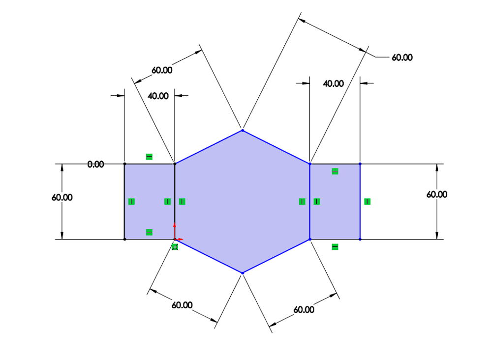

# System Kinematics
## Team 2
## Kevin Julius, Romney Kellogg, Sanchit Singhal, Siddhaarthan Akila Dhakshinamoorthy


## 1. Kinematic Figure:

### Dimensioned Figure:



### Kinematic Figure:


#### Above the kinematic modeling was performed by seperating the sarrus linkage into 2 2-bar linkages (AB and ED) with a constant distance lc between their endpoints (pBC and pDC).

## 2. Prototype Device:


## 3. Kinematic Model Code:

### 3.1 Import Packages


```python
%matplotlib inline
```


```python
import pynamics
from pynamics.frame import Frame
from pynamics.variable_types import Differentiable,Constant
from pynamics.system import System
#from pynamics.body import Body
#from pynamics.dyadic import Dyadic
from pynamics.output import Output,PointsOutput
#from pynamics.particle import Particle
import pynamics.integration
import sympy
import numpy
import matplotlib.pyplot as plt
plt.ion()
from math import pi
from math import degrees, radians
#from pynamics.constraint import Constraint
import scipy.optimize
```

### 3.2 Define Variables and Constants


```python
# Initializing Pynamics
system = System()
pynamics.set_system(__name__,system)
# Defining Link Constants
lAi=.060 #all in m
lBi=.060
lCi=.060
lDi=.060
lEi=.060
lFi=.060

lA = Constant(lAi,'lA',system)
lB = Constant(lBi,'lB',system)
lC = Constant(lCi,'lC',system)
lD = Constant(lDi,'lD',system)
lE = Constant(lEi,'lE',system)
lF = Constant(lFi,'lF',system)
```


```python
# Defining State Variables and their derivatives
qA,qA_d,qA_dd = Differentiable('qA',system)
qB,qB_d,qB_dd = Differentiable('qB',system)
qD,qD_d,qD_dd = Differentiable('qD',system)
qE,qE_d,qE_dd = Differentiable('qE',system)

```

### 3.3 Declare Frames


```python
# Declaring Frames
N = Frame('N')
A = Frame('A')
B = Frame('B')
D = Frame('D')
E = Frame('E')
```


```python
# Placing Newtonian Frame
system.set_newtonian(N)
```

### 3.4 Define Frame Rotations


```python
# Establishing Frame Rotation Relationships
A.rotate_fixed_axis_directed(N,[0,0,1],qA,system)
B.rotate_fixed_axis_directed(A,[0,0,1],qB,system)
E.rotate_fixed_axis_directed(N,[0,0,1],qE,system)
D.rotate_fixed_axis_directed(E,[0,0,1],qD,system)
```

### 3.5 Compose Kinematics


```python
# Defining Point Locations based on kinematics of the system
pNA = 0*N.x+0*N.y+0*N.z
pAB = pNA + lA*A.x
pBC = pAB + lB*B.x

pNE = pNA + lF*N.y
pED = pNE + lE*E.x
pDC = pED + lD*D.x
```


```python
points = [pNA,pAB,pBC,pDC,pED,pNE]
```


```python
statevariables = system.get_state_variables()
```


```python
# Constraint 1 and 2:
eq_vector = pDC-pBC 
# Constraint 3:
eq_vector2= pNA-pBC
```


```python
eq = []
# pDC and pBC must have the same x coordinate (x defined in newtonian frame):
eq.append((eq_vector).dot(N.x))
# pDC and pBC must be a constant distance lC apart (y defined in newtonian frame):
eq.append((eq_vector).dot(N.y)-lC)
# pNA-pBC must have the same y coordinate (y defined in newtonian frame):
eq.append((eq_vector2).dot(N.y))
```


```python
pout=pAB
```

### 3.6 Time Derivatives of Position Vectors


```python
#taking time derivative of position vectors 
eq_d=[(system.derivative(item)) for item in eq]
eq_d = sympy.Matrix(eq_d)
eq_d
```


    ⎡qA_d⋅(lA⋅sin(qA) + lB⋅sin(qA)⋅cos(qB) + lB⋅sin(qB)⋅cos(qA)) + qB_d⋅(lB⋅sin(qA
    ⎢                                                                             
    ⎢qA_d⋅(-lA⋅cos(qA) + lB⋅sin(qA)⋅sin(qB) - lB⋅cos(qA)⋅cos(qB)) + qB_d⋅(lB⋅sin(q
    ⎢                                                                             
    ⎣                                                        qA_d⋅(-lA⋅cos(qA) + l
    
    )⋅cos(qB) + lB⋅sin(qB)⋅cos(qA)) + qD_d⋅(-lD⋅sin(qD)⋅cos(qE) - lD⋅sin(qE)⋅cos(q
                                                                                  
    A)⋅sin(qB) - lB⋅cos(qA)⋅cos(qB)) + qD_d⋅(-lD⋅sin(qD)⋅sin(qE) + lD⋅cos(qD)⋅cos(
                                                                                  
    B⋅sin(qA)⋅sin(qB) - lB⋅cos(qA)⋅cos(qB)) + qB_d⋅(lB⋅sin(qA)⋅sin(qB) - lB⋅cos(qA
    
    D)) + qE_d⋅(-lD⋅sin(qD)⋅cos(qE) - lD⋅sin(qE)⋅cos(qD) - lE⋅sin(qE)) ⎤
                                                                       ⎥
    qE)) + qE_d⋅(-lD⋅sin(qD)⋅sin(qE) + lD⋅cos(qD)⋅cos(qE) + lE⋅cos(qE))⎥
                                                                       ⎥
    )⋅cos(qB))                                                         ⎦


### 3.7 Calculate Jacobian Mapping Input Velocities to Output Velocities


```python
#Establishing Independant and Dependant State (Time Derivatives)
qi = sympy.Matrix([qA_d])
qd = sympy.Matrix([qB_d,qD_d,qE_d])
```


```python
qi
```


    [qA_d]


```python
# Creating A matrix using independant time derivative states
AA = eq_d.jacobian(qi)
# Creating B matrix using dependant time derivative states
BB = eq_d.jacobian(qd)
```


```python
# Calculating Internal Jacobian
J = -BB.inv()*AA
J
```


    ⎡                                                                             
    ⎢                                                                             
    ⎢                                                                             
    ⎢                                                                             
    ⎢  (-lA⋅cos(qA) + lB⋅sin(qA)⋅sin(qB) - lB⋅cos(qA)⋅cos(qB))⋅(-lD⋅sin(qA)⋅sin(qB
    ⎢- ───────────────────────────────────────────────────────────────────────────
    ⎢                                                                             
    ⎢                                                                             
    ⎢                                                                             
    ⎢                                                                             
    ⎢                                                                             
    ⎢                                                                             
    ⎣                                                                             
    
                                                                                  
                                                                                  
                                                                                  
                                                                                  
    )⋅sin(qD)⋅cos(qE) - lD⋅sin(qA)⋅sin(qB)⋅sin(qE)⋅cos(qD) + lD⋅sin(qA)⋅sin(qD)⋅si
    ──────────────────────────────────────────────────────────────────────────────
                                                                                  
                                                                                 -
                                                                                  
                  (-sin(qD)⋅sin(qE) + cos(qD)⋅cos(qE))⋅(lA⋅sin(qA) + lB⋅sin(qA)⋅co
                - ────────────────────────────────────────────────────────────────
                                                         2                     2  
                                           lE⋅sin(qD)⋅sin (qE) + lE⋅sin(qD)⋅cos (q
    
                                                                                  
                                                                                  
                                                                                  
                                                                                  
    n(qE)⋅cos(qB) - lD⋅sin(qA)⋅cos(qB)⋅cos(qD)⋅cos(qE) + lD⋅sin(qB)⋅sin(qD)⋅sin(qE
    ──────────────────────────────────────────────────────────────────────────────
                                      2                                        2  
     lD⋅lE⋅sin(qA)⋅sin(qB)⋅sin(qD)⋅sin (qE) - lD⋅lE⋅sin(qA)⋅sin(qB)⋅sin(qD)⋅cos (q
                                                                                  
    s(qB) + lB⋅sin(qB)⋅cos(qA))   (sin(qD)⋅cos(qE) + sin(qE)⋅cos(qD))⋅(-lA⋅cos(qA)
    ─────────────────────────── - ────────────────────────────────────────────────
                                                                         2        
    E)                                                     lE⋅sin(qD)⋅sin (qE) + l
    
                                                                                  
                                                                                  
                                                                                  
                                                                                  
    )⋅cos(qA) - lD⋅sin(qB)⋅cos(qA)⋅cos(qD)⋅cos(qE) + lD⋅sin(qD)⋅cos(qA)⋅cos(qB)⋅co
    ──────────────────────────────────────────────────────────────────────────────
                          2                                                       
    E) + lD⋅lE⋅sin(qD)⋅sin (qE)⋅cos(qA)⋅cos(qB) + lD⋅lE⋅sin(qD)⋅cos(qA)⋅cos(qB)⋅co
                                                                                  
     + lB⋅sin(qA)⋅sin(qB) - lB⋅cos(qA)⋅cos(qB))   (-lA⋅cos(qA) + lB⋅sin(qA)⋅sin(qB
    ─────────────────────────────────────────── - ────────────────────────────────
                 2                                                                
    E⋅sin(qD)⋅cos (qE)                                                            
    
              -lA⋅cos(qA) + lB⋅sin(qA)⋅sin(qB) - lB⋅cos(qA)⋅cos(qB)               
              ─────────────────────────────────────────────────────               
                     -lB⋅sin(qA)⋅sin(qB) + lB⋅cos(qA)⋅cos(qB)                     
                                                                                  
    s(qE) + lD⋅sin(qE)⋅cos(qA)⋅cos(qB)⋅cos(qD) - lE⋅sin(qA)⋅sin(qB)⋅sin(qE) - lE⋅s
    ──────────────────────────────────────────────────────────────────────────────
     2                                                                            
    s (qE)                                                                        
                                                                                  
    ) - lB⋅cos(qA)⋅cos(qB))⋅(sin(qA)⋅sin(qB)⋅sin(qD)⋅cos(qE) + sin(qA)⋅sin(qB)⋅sin
    ──────────────────────────────────────────────────────────────────────────────
                                                                                  
                                                            - lE⋅sin(qA)⋅sin(qB)⋅s
    
                                                                                  
                                                                                  
                                                                                  
                                                                                  
    in(qA)⋅cos(qB)⋅cos(qE) - lE⋅sin(qB)⋅cos(qA)⋅cos(qE) + lE⋅sin(qE)⋅cos(qA)⋅cos(q
    ──────────────────────────────────────────────────────────────────────────────
                                                                                  
                                                                                  
                                                                                  
    (qE)⋅cos(qD) - sin(qA)⋅sin(qD)⋅sin(qE)⋅cos(qB) + sin(qA)⋅cos(qB)⋅cos(qD)⋅cos(q
    ──────────────────────────────────────────────────────────────────────────────
              2                                     2                     2       
    in(qD)⋅sin (qE) - lE⋅sin(qA)⋅sin(qB)⋅sin(qD)⋅cos (qE) + lE⋅sin(qD)⋅sin (qE)⋅co
    
                                                                                  
                                                                                  
                                                                                  
                                                                                  
    B))   (lA⋅sin(qA) + lB⋅sin(qA)⋅cos(qB) + lB⋅sin(qB)⋅cos(qA))⋅(lD⋅sin(qD)⋅sin(q
    ─── - ────────────────────────────────────────────────────────────────────────
                                                          2                       
                                         lD⋅lE⋅sin(qD)⋅sin (qE) + lD⋅lE⋅sin(qD)⋅co
                                                                                  
    E) - sin(qB)⋅sin(qD)⋅sin(qE)⋅cos(qA) + sin(qB)⋅cos(qA)⋅cos(qD)⋅cos(qE) - sin(q
    ──────────────────────────────────────────────────────────────────────────────
                                                  2                               
    s(qA)⋅cos(qB) + lE⋅sin(qD)⋅cos(qA)⋅cos(qB)⋅cos (qE)                           
    
                                                                                  
                                                                                  
                                                                                  
                                                                                  
    E) - lD⋅cos(qD)⋅cos(qE) - lE⋅cos(qE))   (-lA⋅cos(qA) + lB⋅sin(qA)⋅sin(qB) - lB
    ───────────────────────────────────── - ──────────────────────────────────────
     2                                                                            
    s (qE)                                                                  lD⋅lE⋅
                                                                                  
    D)⋅cos(qA)⋅cos(qB)⋅cos(qE) - sin(qE)⋅cos(qA)⋅cos(qB)⋅cos(qD))                 
    ─────────────────────────────────────────────────────────────                 
                                                                                  
                                                                                  
    
                                                                             ⎤
                                                                             ⎥
                                                                             ⎥
                                                                             ⎥
    ⋅cos(qA)⋅cos(qB))⋅(-lD⋅sin(qD)⋅cos(qE) - lD⋅sin(qE)⋅cos(qD) - lE⋅sin(qE))⎥
    ─────────────────────────────────────────────────────────────────────────⎥
               2                        2                                    ⎥
    sin(qD)⋅sin (qE) + lD⋅lE⋅sin(qD)⋅cos (qE)                                ⎥
                                                                             ⎥
                                                                             ⎥
                                                                             ⎥
                                                                             ⎥
                                                                             ⎦


```python
J.simplify()
J
```


    ⎡            ⎛ lA⋅cos(qA)      ⎞            ⎤
    ⎢           -⎜──────────── + lB⎟            ⎥
    ⎢            ⎝cos(qA + qB)     ⎠            ⎥
    ⎢           ─────────────────────           ⎥
    ⎢                     lB                    ⎥
    ⎢                                           ⎥
    ⎢-lA⋅(lD⋅cos(qD + qE) + lE⋅cos(qE))⋅sin(qB) ⎥
    ⎢───────────────────────────────────────────⎥
    ⎢         lD⋅lE⋅sin(qD)⋅cos(qA + qB)        ⎥
    ⎢                                           ⎥
    ⎢          lA⋅sin(qB)⋅cos(qD + qE)          ⎥
    ⎢          ───────────────────────          ⎥
    ⎣          lE⋅sin(qD)⋅cos(qA + qB)          ⎦


```python
#Dependant Variables in terms of qA_d and qA,qB,qD,qE
qd2 = J*qi
qd2
```


    ⎡                 ⎛ lA⋅cos(qA)      ⎞            ⎤
    ⎢           -qA_d⋅⎜──────────── + lB⎟            ⎥
    ⎢                 ⎝cos(qA + qB)     ⎠            ⎥
    ⎢           ──────────────────────────           ⎥
    ⎢                       lB                       ⎥
    ⎢                                                ⎥
    ⎢-lA⋅qA_d⋅(lD⋅cos(qD + qE) + lE⋅cos(qE))⋅sin(qB) ⎥
    ⎢────────────────────────────────────────────────⎥
    ⎢           lD⋅lE⋅sin(qD)⋅cos(qA + qB)           ⎥
    ⎢                                                ⎥
    ⎢          lA⋅qA_d⋅sin(qB)⋅cos(qD + qE)          ⎥
    ⎢          ────────────────────────────          ⎥
    ⎣            lE⋅sin(qD)⋅cos(qA + qB)             ⎦


```python
subs = dict([(ii,jj) for ii,jj in zip(qd,qd2)])
subs
```


    ⎧            ⎛ lA⋅cos(qA)      ⎞                                              
    ⎪      -qA_d⋅⎜──────────── + lB⎟                                              
    ⎨            ⎝cos(qA + qB)     ⎠         -lA⋅qA_d⋅(lD⋅cos(qD + qE) + lE⋅cos(qE
    ⎪qB_d: ──────────────────────────, qD_d: ─────────────────────────────────────
    ⎩                  lB                               lD⋅lE⋅sin(qD)⋅cos(qA + qB)
    
                                                   ⎫
                                                   ⎪
    ))⋅sin(qB)         lA⋅qA_d⋅sin(qB)⋅cos(qD + qE)⎬
    ───────────, qE_d: ────────────────────────────⎪
                         lE⋅sin(qD)⋅cos(qA + qB)   ⎭


```python
pout
```


    lA*A.x


```python
#Deriving end-effector velocity
vout = pout.time_derivative()
vout
```


    lA*qA_d*A.y


```python
vout = vout.subs(subs) #doesn't do anything because only variable is qA_d
vout = sympy.Matrix([vout.dot(N.x), vout.dot(N.y)])

```


```python
#Final Jacobian Mapping Input Velocities to Output Velocities
J2 = vout.jacobian(qi)
J2
#Simple because the actual end-effector is only 1 link away from the input
#Numeric values plugged in later in the code:
```


    ⎡-lA⋅sin(qA)⎤
    ⎢           ⎥
    ⎣lA⋅cos(qA) ⎦


## 4. Solve for Valid Initial Condition


```python
# Initial "Guess" for state values
initialvalues = {}
initialvalues[qA]=-35*pi/180
initialvalues[qA_d]=0*pi/180
initialvalues[qB]=60*pi/180
initialvalues[qB_d]=0*pi/180
initialvalues[qD]=-60*pi/180
initialvalues[qD_d]=0*pi/180
initialvalues[qE]=30*pi/180
initialvalues[qE_d]=0*pi/180
```


```python
#Establihsing Dependant and Independant states
qi = [qA]
qd = [qB,qD,qE]
```


```python

ini0 = [initialvalues[item] for item in statevariables]
```


```python
# Reformating Constants
constants = system.constant_values.copy()
defined = dict([(item,initialvalues[item]) for item in qi])
constants.update(defined)
```


```python
# Substituting Constants(Link Lengths) In Kinematic Model
eq = [item.subs(constants) for item in eq]
```


```python
# Summing Squares of Constraint Equation Errors
error = (numpy.array(eq)**2).sum()
```


```python
f = sympy.lambdify(qd,error)

def function(args):
    return f(*args)
```


```python
# Guessed Initial Values
guess = [initialvalues[item] for item in qd]
```


```python
# Runing scipy.optimize.minimize to minimize constraint errors to 0 giving a guess that satisfies the constraints
result = scipy.optimize.minimize(function,guess)
if result.fun>1e-3:
    raise(Exception("out of tolerance"))
result.fun
```


    2.4884180099266584e-10


```python
ini = []
for item in system.get_state_variables():
    if item in qd:
        ini.append(result.x[qd.index(item)])
    else:
        ini.append(initialvalues[item])
```


```python
system.get_state_variables()
```


    [qA, qB, qD, qE, qA_d, qB_d, qD_d, qE_d]


```python
#Initial Guess and Optimized Guess:
points = PointsOutput(points, constant_values=system.constant_values)
points.calc(numpy.array([ini0,ini]))
```

    2021-02-27 16:44:52,905 - pynamics.output - INFO - calculating outputs
    2021-02-27 16:44:52,908 - pynamics.output - INFO - done calculating outputs
    


    array([[[ 0.00000000e+00,  0.00000000e+00],
            [ 4.91491227e-02, -3.44145862e-02],
            [ 1.03527590e-01, -9.05749048e-03],
            [ 1.03923048e-01,  6.00000000e-02],
            [ 5.19615242e-02,  9.00000000e-02],
            [ 0.00000000e+00,  6.00000000e-02]],
    
           [[ 0.00000000e+00,  0.00000000e+00],
            [ 4.91491227e-02, -3.44145862e-02],
            [ 9.82901017e-02,  1.16273668e-05],
            [ 9.82803850e-02,  6.00160127e-02],
            [ 4.91345833e-02,  9.44353412e-02],
            [ 0.00000000e+00,  6.00000000e-02]]])


#### Top: Guessed Initial Angles, Bottom: Solved Initial Angles


```python
result.fun
```


    2.4884180099266584e-10


## 5. Plot Using Solved Initial Conditions


```python
#Plotting Initial Guess and Optimized Guess
points.plot_time()
plt.legend(('Initial Guess', 'Optimized Solution')) 
```


    <matplotlib.legend.Legend at 0x1f3a1eed1c0>


    

    


#### The optimized solution satisfies the 3 given constraints unlike initial guess.

## 6. Biomechanics-Based End-Effector Force Estimate


```python
#Y component at end effector due to gravity
m=.6 #kg [1]
fouty=9.81*m #N  
fouty
```


    5.886


```python
#X component at end effector to reach peak acceleration
acceleration=1 #m/s^2 [1]
foutx=.6*acceleration #N
foutx


```


    0.6


```python
#Force at end-effector
Fout=[foutx,fouty]
Fout
```


    [0.6, 5.886]


## 7. Force Required at Input to Satisfy End Effector Force


```python
J2=sympy.Matrix(J2)
J2n=J2.subs([(qA,ini[0]),(lA,lAi)])
J2n
```


    ⎡0.0344145861810628⎤
    ⎢                  ⎥
    ⎣0.0491491226573395⎦


```python
# Fin=J*Fout
J2n=numpy.array(J2n)
Fin=J2n.transpose().dot(Fout)
Fin #in N*m
```


    array([0.309940487669738], dtype=object)


## 8. Estimate Velocity of End-Effector and Calculated Required Input Velocity

Horizontal component of velocity taken as the end effector on a snake does not have a y component of velocity normally, as the snake moves along the ground.


```python
 #Vin=J.inv()*vout Jacobian is not invertable/not square have to use guess and check method
Estimated_vout=0.0803148 #m/s midrange velocity from [1]

```


```python
#Estimated 2.34  rad/s input angular velocity using guess and check method
Vin=2.34 #rad/s
Calculated_vout=J2n*Vin #in m/s
Calculated_vout
```


    array([[0.0805301316636868],
           [0.115008947018174]], dtype=object)


## 9. Calculated Required Power


```python
#Power=Force*Velocity
Pin=Fin*Vin  #in W
Pin
```


    array([0.725260741147187], dtype=object)


# Discussion:

## 1.

How many degrees of freedom does your device have? How many motors? If the answer is not the same, what determines the state of the remaining degrees of freedom? How did you arrive at that number?
   
   This kinematic mechanism has 1 degree of freedom. This degree of freedom will be controlled at point pNA using one motor to adjust the angle qAi, which in turn determines the angles of qBd, qDd, and qEd. This effectively extends and retracts the saurus linkage cause the rectilinear motion similar to a snake.
   
   There are required 3-D components to this mechanism (sarrus linkage) to apply the constraints used in this kinematic model. Inherently the 2-D kinematic figure has 3 degrees of freedom, but these 3-D componenets will restrict the motion of the mechanism to 1 degree of freedom and external motion in only 1 path. 


## 2.

If your mechanism has more than one degree of freedom, please describe how those multiple degrees of freedom will work togehter to create a locomotory gait or useful motion. What is your plan for synchronizing, especially if passive energy storage?

   Additional degrees of freedom will likely be added with additional mechanisms, this will most likely be in the form of a similar sarus linkage to assist in vertical motion and/or horizontal motion. Because the snake-like movement operates in opposite cycles (one linkage extended while the other mechanism is constracted) the synchronizing will be performed by an initial offset in conditions leading to the passive energy storage mechanisms to cause the linkages to move in a cyclic nature (one expanding while the other is contracting). Some testing will need to be performed to deterimine if reliable synchronization can be obtained using two passive energy sources or if one passive energy source can be used to operate both linkages leading to a sudo-1 degree of freedom system.

## 3.

How did you estimate your expected end-effector forces?

We estimated the end effector forces by using the biomechanics specifications of the snake being modeled [1]. The forces decided upon were gravity and ground reaction forces necessary to reach peak acceleration. We knew that the total mass was .6 kg from these specifications, so we used that value for mass and multiplied it by gravity (9.81 m/s^2) to find the force on the end effector in the y direction. To find the force of acceleration we used the peak acceleration, ~1 m/s^2, that we calculated from our biomechanics specifications. We took that value, multiplied it with the total mass and used that as the force in the x direction.

If the robot was given additional points of contact (which it likely will be given) the y-component on this end-effector is likely to decrease, similarly the ground reaction force would likely decrease.

## 4.

How did you estimate your expected end-effector speeds?

During rectilinear motion snakes have constant contact with the ground, so their ground contact point (which in our case is our end effector) doesn't have a y component of velocity. The x component of velocity was estimated to be equivilent to the average ground speed of the snake. This velocity was retrieved from [1] and the mid-range ground velocity was used between .197ft/s-.33ft/s of .2635ft/s converted to .08031m/s. This estimate does have some issues due to the dissimilarities between a Sarrus linkage and a snake's exact form of locomotion due to the y direction movement of the end-effector within the Sarrus linkage.

# Bibliography:


1. H. Marvi, J. Bridges, and D. L. Hu, “Snakes Mimic Earthworms: propulsion using rectilinear travelling waves,” The Royal Society, vol. 10, no. 84, Jul. 2013. 

